<h1 align="center">GROUP 1 - FINAL REPORT</h1>

<h4 align="center">


</h4>

# GROUP 1 - FINAL REPORT

| **Reviewers:** | Name              |
|----------------|-------------------|
|                | Nuno Faria        |
|                | Vitor Pereira     |
|                | Sandro Santos     |

<br>

**NO RELEASE VERSION ON GITHUB**

    NORMAL REPO:
        * DATE: 23/12/2023: 00:10 GMT
        * Github Commit SHA (Secure Hash Algorithm): 2e29da23e8dc863c40d8b2585a9c2da961f55b92

    ACCEPTANCE REPO:
        * DATE: 23/12/2023: 00:10 GMT
        * Github Commit SHA (Secure Hash Algorithm): 0d49b01e5c29e7816ec09a7978b9d85d8424e779

**Github Repositories:**

* <a href="https://github.com/Departamento-de-Engenharia-Informatica/switch-qa-23-project-switch-qa-23-1">Link: Group 1  Normal Repo</a>

* <a href="https://github.com/Departamento-de-Engenharia-Informatica/switch-qa-23-project-acceptancetests-switch-qa-23-1">Link: Group 1 Acceptance Repo</a>

<br>
<hr>

## **1. Exploratory Tests - Functionalities:**

### **A) Missing:**

* ### **A.1) Functionality - My Posts:**

>* **url: <code>http://localhost:3000/</code> http method: GET**

>* Functionality not implemented

<h4 align="center">

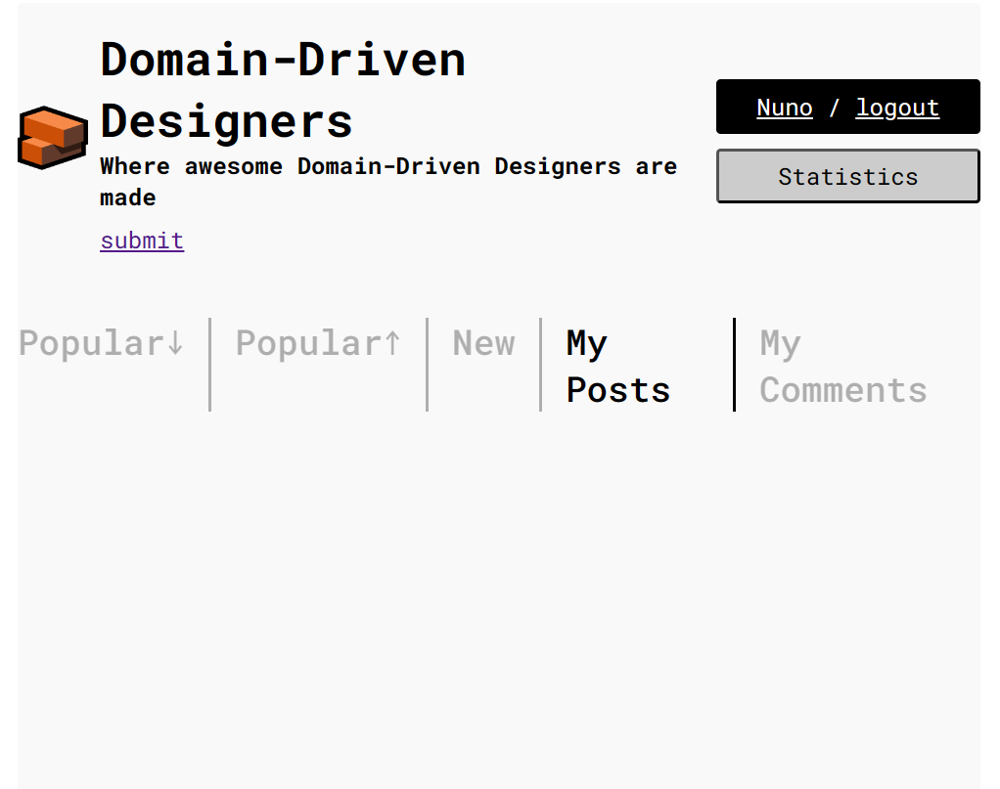

</h4>

* ### **A.2) Functionality - My Comments:**

>* **url: <code>http://localhost:3000/</code> http method: GET**

>* Functionality not implemented

<h4 align="center">

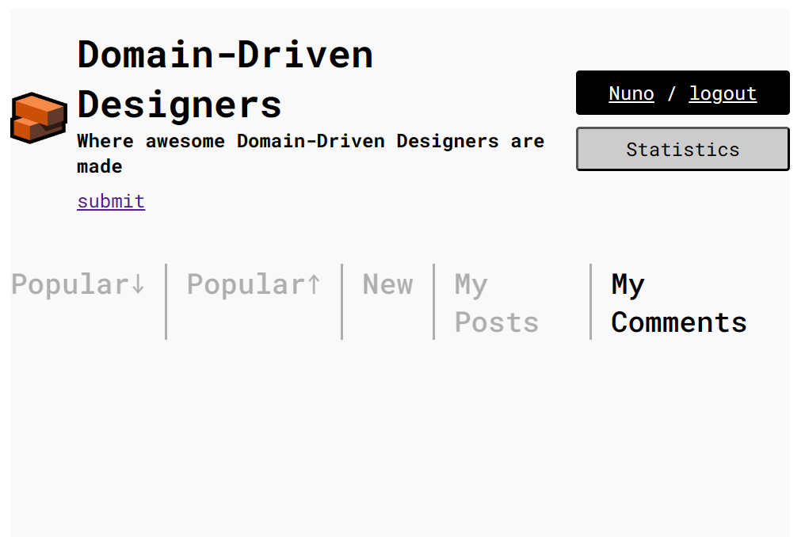

</h4>
<br>

### **B) Needs Fixing:**

* ### **B.1) Functionality - Registration of Member:**

>* **url: <code>http://localhost:3000/join</code> http method: POST**

>* Allows the registation of a new member with empty strings as an input variable for respectively the username and password, as long the empty string´s length is equal or bigger than 2 character and smaller than or equal to 15 characters in the case of the username and a empty string equal or bigger than 6 characters in the case of the password.

### Followed test steps:

* **Pre-conditions:** The database should be empty

#### **Test 1:** Register New Account with Username - Empty String 2 character - AC1

    **Test-Steps:**
        // Arrange:
        Username: "  "
        Email: "test1EmptyString@gmail.com"
        Password: "EmptyString2"

        // Act:
        Invoke the method `users.post`

    **Expected result:**
        // Assert:
        Return Status Code `500`

<br>

<h4 align="center">

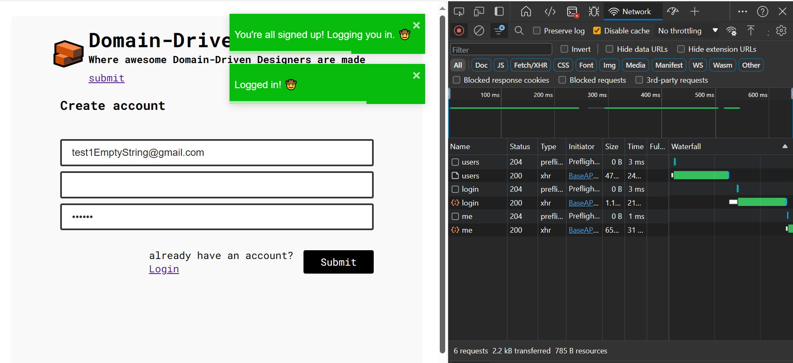

</h4>

<br>

#### **Test 2:** Register New Account with Username - Empty String 15 characters - AC1

    **Test-Steps:**
        // Arrange:
        Username: "               "
        Email: "test2EmptyString@gmail.com"
        Password: "EmptyString2"

        // Act:
        Invoke the method `users.post`

    **Expected result:**
        // Assert:
        Return Status Code `500`

<br>

<h4 align="center">

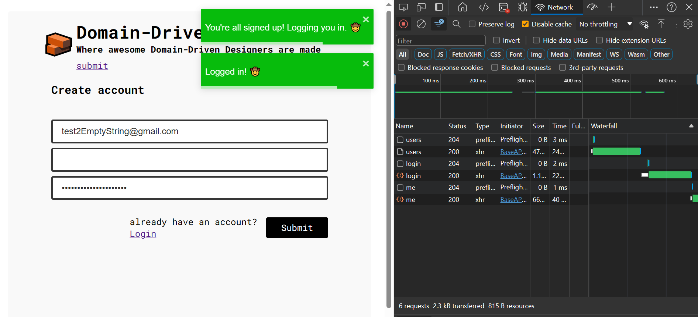

</h4>

<br>

#### **Test 3:** Register New Account with Password - Empty String 6 characters - AC1

    **Test-Steps:**
        // Arrange:
        Username: "EmptyString"
        Email: "test3EmptyString@gmail.com"
        Password: "      "

        // Act:
        Invoke the method `users.post`

    **Expected result:**
        // Assert:
        Return Status Code `500`

<br>

<h4 align="center">

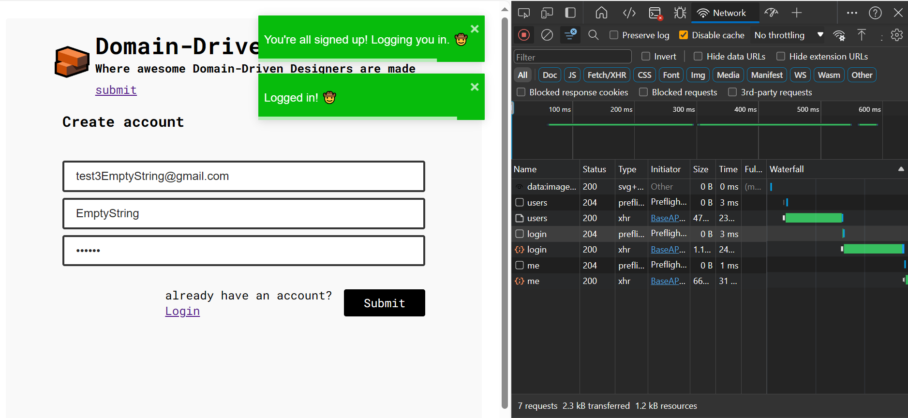

</h4>

<br>
 
### **C) Fails:**

* ### **C.1) Statistics Page**

### Followed test steps:

* **Pre-conditions:** The database should be empty

* Injection of data into the database through the file <code>acc_db_test_env_prep.sql</code> in the folder <code>src\db_test_env_prep\acc_test\acc_db_test_env_prep.sql</code> for thest Enviroment Set-up.

* On the statistics page, four manual tests were performed on the frontend for different dates:

<br>

#### Test Conducted on 30-12-2023 - Input date: January 01 2023

- On this date, there is no available data.

- The following errors were identified:

>- **Post Average:** It does not display an error message indicating the absence of data; it continues to show the default message "please select a date", as depicted in the image.

<h4 align="center">


</h4>

- **Inactive Members Listing:** It displays all users, even though all users account had not not been created by that date. 

<h4 align="center">


</h4>

#### Test Conducted on 30-12-2023 - Input date: October 01, 2023: 

- At this date, the first records are created in the database.

- The following issues occurred:

>- **Inactive Members Listing:** Once again, it displayed all users, despite not having been created by that date (nuno, 123, 123456).

<h4 align="center">

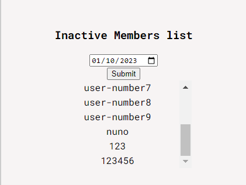

</h4>

#### Test Conducted on 30-12-2023 - Input date: December 29, 2023 

- day when manual testing was carried out on the frontend (present).

- On this day, there was a discrepancy in the **“Top Three Commentators”:**

- Instead of displaying the three users with the most comments, five users were shown, each with 3, 3, 3, 3, and 1 comment(s) respectively. The expected outcome would have to be, presenting the user with 3 additional comments instead of the one with only 1 comment.

<h4 align="center">

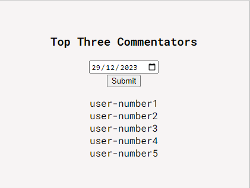

</h4>

- There are no additional criteria for selection beyond the number of comments.

- Additionally, the code should limit the display to 3 users, but 5 are being shown.

````typescript
	/**
	 * @version Sprint-E
	 * @method topThree
	 * @description top three commentators
	 * @param dateFilter
	 * @returns Promise<void>
	 */

	async getTopThreeCommentators(dateFilter: string): Promise<any> {
		const topThreeCom = await this.models.sequelize.query(
			`WITH ranked AS (
				SELECT COUNT(*) AS nr_comments, username, 
					   DENSE_RANK() OVER (ORDER BY COUNT(*) DESC) AS ranking
				FROM comment
				JOIN member ON comment.member_id = member.member_id
				JOIN base_user ON base_user_id = member_base_id
				WHERE DATE(comment.created_at) = :dateFilter 
				GROUP BY comment.member_id, base_user.username
			)
			SELECT nr_comments, username
			FROM ranked
			WHERE ranking <= 3
			LIMIT 5;`,//incorrect should be 3 not 5
			{
				replacements: { dateFilter },
				type: this.models.sequelize.QueryTypes.SELECT,
			},
		);

		return topThreeCom;
	}
}
````
#### Test Conducted on 30-12-2023 - Input date: January 01, 2024:

- On this date, four non-conforming situations were observed compared to the other existing functionalities on the page:

>- **Comment Average:** Displays zero instead of an error message indicating the lack of data.

<h4 align="center">


</h4>

>- **Post Average:** Displays zero instead of an error message.

<h4 align="center">


</h4>

>- **Inactive Members Listing:** Displays all users instead of an error message.

<h4 align="center">


</h4>

>- **Percentage of Posts Without Any Comments:** Displays 100% instead of an error message indicating the absence of data.

<h4 align="center">


</h4>

<h4 align="right">

[**Go Back**](../final-report.md#group---1-report)

</h4>
<br>
<hr>

## **2. Integration / Regression Testing:**

    file path: src\api_test\global.api.test.ts

### Followed test steps:

1. **Pre-conditions:** The database should be empty

2. Command runned in the Terminal:

```bash
npm run test:api
```

### **A) Missing:**

* NOTHING TO COMMENT

### **B) Needs Fixing:**

* NOTHING TO COMMENT

### **C) Fails:**

* [**Test Report - 10 Failed Tests out of 985 Tests**](./pdf/Test%20Report%20global.api.pdf)

>- US 002 - View post -Testing get post byslug - happy path  - Post Post;

>- US 002 - View post -Testing get post byslug - happy path  - Get Post;

>- Test 1.3 - Test toassert that a postwith negative pointsappears on thePopular tab - HappyPath - Get popular posts;

>- Test 4 - Test toassert that on thePopular tab sortingorder changeswhen new posts areadded - Happy Path - Check if posts are present in descendingorder;

>- Test 4 - Test toassert that on thePopular tab sortingorder changeswhen new posts areadded - Happy Path - Check if posts are still present indescending order;

>- Test 4 - GetCommentsAverage: Two users/ Zero comments -Happy Path. - Get Comments Average;

>- Test 1 -Test onlywith 1 user and 1post to assert thatthe posts averagereturn is correct (1)- Happy Path - Get Average posts;

>- Test - Check ifreturns a list ofmembers names, ina descending way(countingcomments) - US 018 Test 3 - Equal tie for a froup ofmembers.;

>- Test - Check ifreturns a list ofmembers names, ina descending way(countingcomments) - US 018 Test 6 - Test to return first placefilled and in second a group of members.;

>- Test - Check ifreturns a list ofmembers names, ina descending way(countingcomments) - US 018 Test 8 - Test to return first and thirdfilled, a group of members in second place.;

<h4 align="right">

[**Go Back**](../final-report.md#group---1-report)

</h4>
<br>         
<hr>

## **3. Functional Acceptance Testing:**


1. **Pre-conditions:** The database should be empty

2. Injection of data into the database through the file <code>src\api_test\sql_Insert\jmeter.sql</code> for Test Enviroment Set-up.

3. Command runned in the Terminal:

```bash
npm run wdio
```

### **A) Missing:**

* NOTHING TO COMMENT

### **B) Needs Fixing:**

* NOTHING TO COMMENT

### **C) Fails:**

* 0 Tests passed, 3 Tests failed , skipped 30 Tests out of 33 Tests overall.

* Due to the lack of information on the project repo, explaining how to set-up the test environment for the Functional Acceptance Tests, with either the execution of the overall features and the jmeter script or with the execution of individual features with the specific US SQL script.

* The outcome is more or less simillar, failing to pass the tests.

<br>

<h4 align="rcenter">

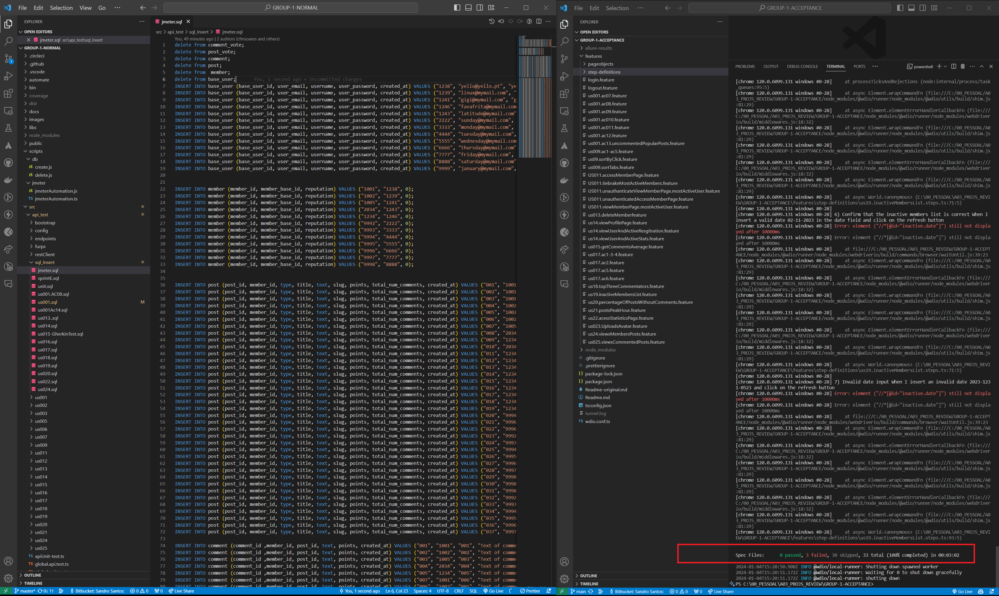

</h4>

<br>
<hr>

## **4. Non Functional Testing:**

### **A) Missing:**

**Automation of Non Functional Tests:**

* Not deployed in the CI Pipeline **(But it all comes down to the team´s initial intention to automate the Non Functional Testing)**.

### **B) Needs Fixing:**

* NOTHING TO COMMENT

### **C) Fails:**

**C.1) JMeter Test File:**

* Fail to run Non Functional Acceptance Tests for any of the Test Case Scenarios 10/ 50 / 100 & 200 Users, due to the non existance of .jmx file with the Jmeter test plan on the project repo.

<h4 align="center">

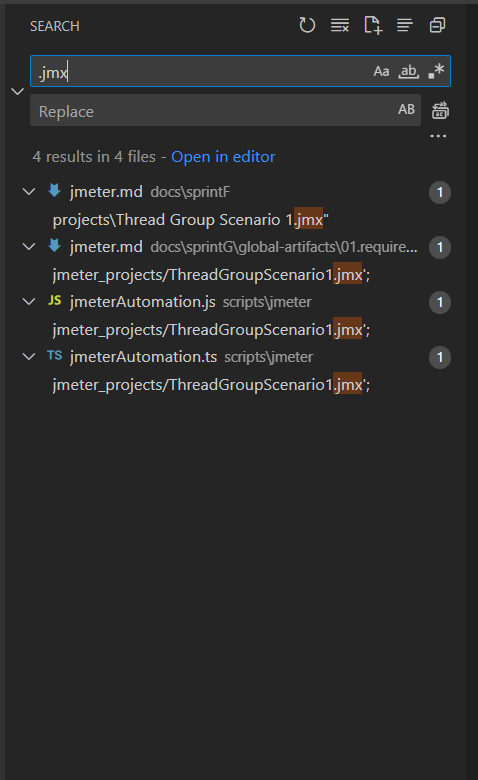

</h4>

**C.2) Automation of Non Functional Tests:**

    file path: scripts\jmeter\jmeterAutomation.js

<br>

* Not possible to run the JMeter application directly through the project or without having it already installed on the local machine.

* Failure in the automation of Non Functional Testing with JMeter

* Automation script declares paths to the Jmeter Test File / Report and JMeter Application outside of the remote repo and points them to local directories that are not included on the project repo.

<h4 align="center">

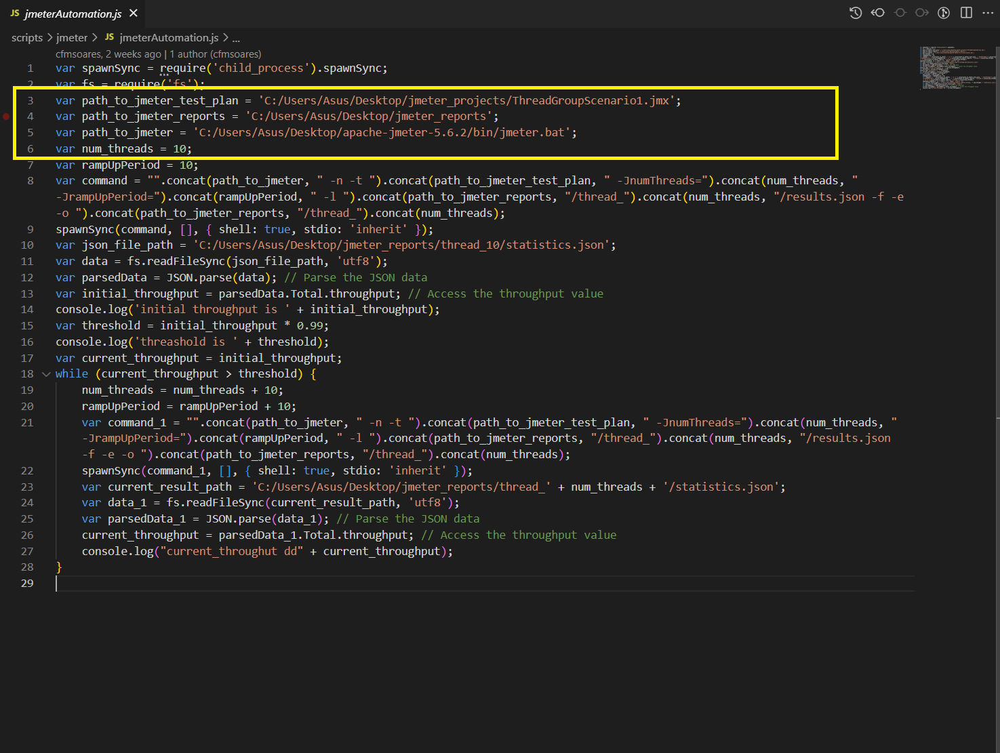

</h4>


<h4 align="right">

[**Go Back**](../final-report.md#group---1-report)

</h4>
<br>
<hr>

## *5. Smoke Testing:**

    file path: `smoke-test.sh`

### **A) Missing**

* Limited range of coverage to only to 2 tests, that test the main page loading.

* It would be nice to have further coverage of additional core functionalities, **preferable but not compulsory**.

<br>

### **B) Needs Fixing**

* NOTHING TO COMMENT

<br>

### **C) Fails**

* Passes while running in the CI Pipeline. But lacks encapsulation, failing when running independently.

<h4 align="center">

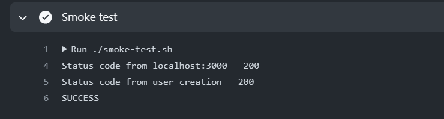

</h4>

<br>

* For the test to the url: <code>http://localhost:5001/api/v1/users/</code> that requires authentication of registered user, returns a status code 409 when 200 would be expected, since the registration of such user is passed only at the pipeline level through the "global.unit.test" file.

<h4 align="center">

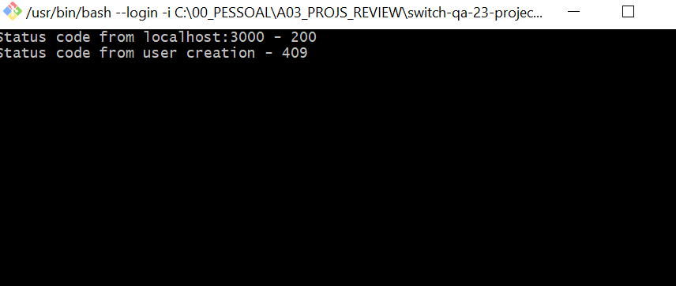

<br>

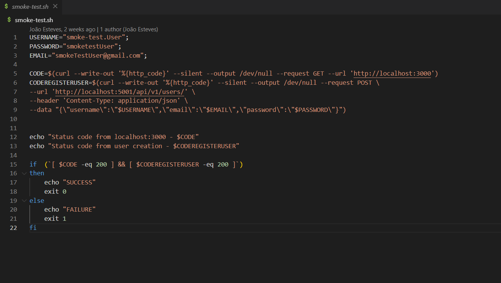

</h4>

<h4 align="right">

[**Go Back**](../final-report.md#group---1-report)

</h4>
<br>
<hr>

## **6. CI - Pipeline**

### **A) Missing**

* NOTHING TO COMMENT

### **B) Needs Fixing**

    file path: .github\workflows\main.yml

* Required to correct in the "main.yml" CI Pipeline the name of the job "unitTests" and the name of the test file <code>global.unit.test.ts</code>.

>* This test file includes a test suite that tests the **integration of just a few of the functionalitites** of the application and therefore are not unit tests, but integration tests.

<h4 align="center">

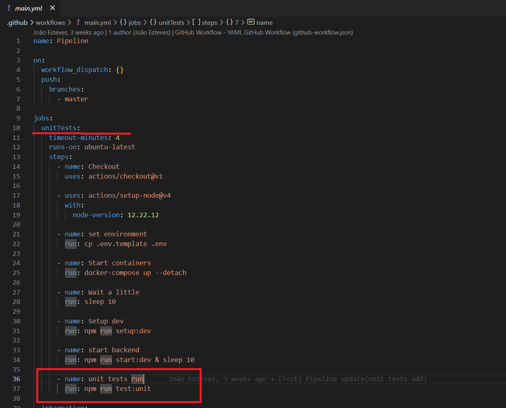

</h4>

* If the intention was to run the Integration/ Regression tests in this pipeline, it should be replaced by the test file <code>global.api.test.ts</code> that tests the integration of all functionalitites developed by the team.

<h4 align="center">

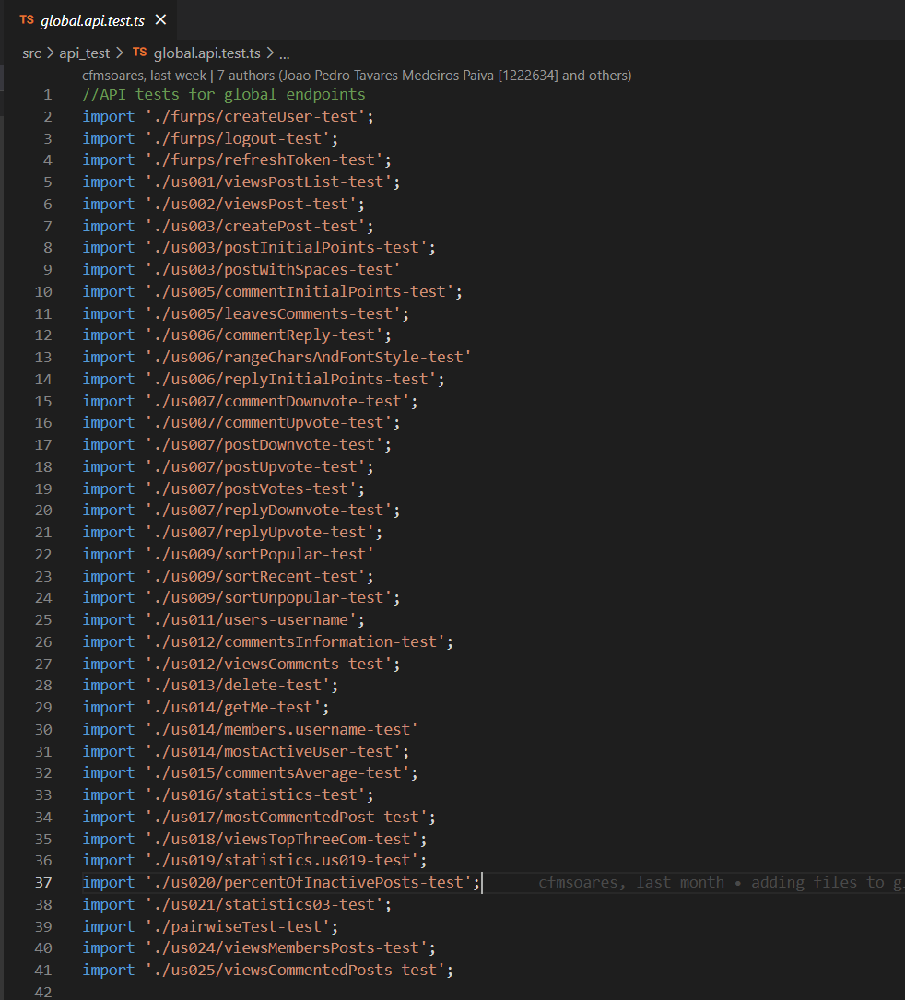

</h4>

* Required to correct in the "main.yml" CI Pipeline the name of the job "integration" , since the test file <code>smoke-test.sh</code> is a smoke test and not an integration test.

>* Smoke tests are primarily concerned with validating the basic functionalities of a system to ensure it's minimally operational, while integration tests focus on the interactions between different components to verify their proper integration. While smoke tests are typically part of the initial testing phase, integration tests occur during the integration phase of the software development life cycle

<h4 align="center">

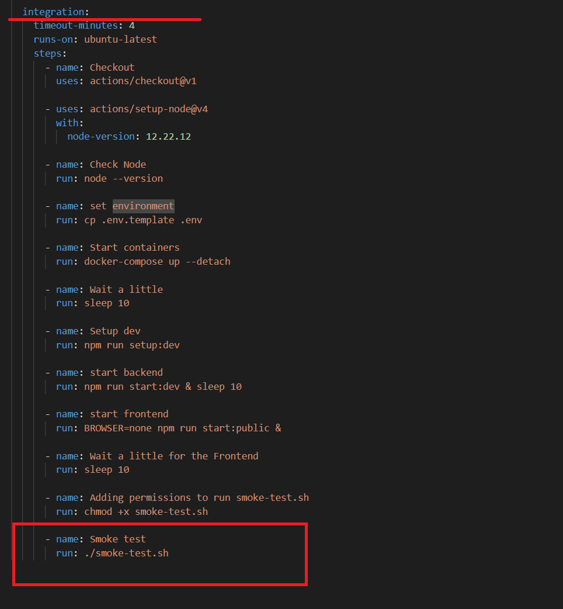

</h4>

### **C) Fails**

* NOTHING TO COMMENT

<h4 align="right">

[**Go Back**](../final-report.md#group---1-report)

</h4>
<br>
<hr>
