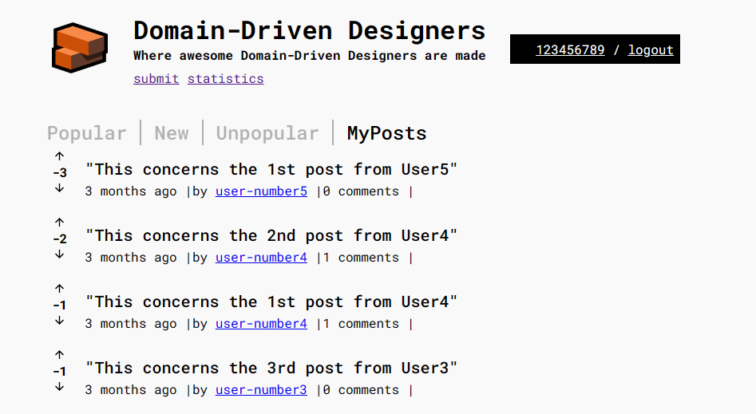
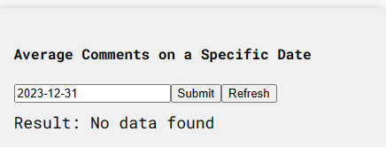
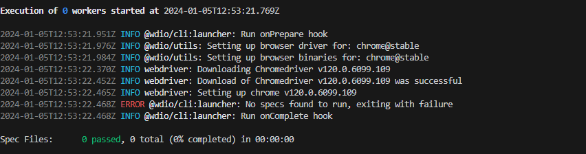
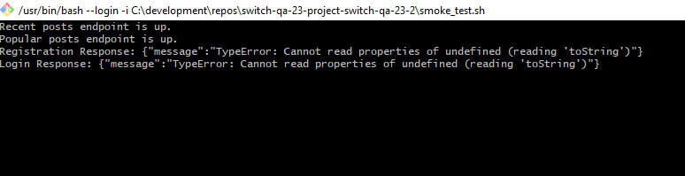
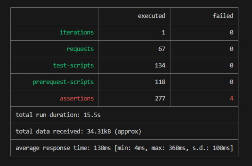

<h1 align="center">GROUP 2 - FINAL REPORT</h1>

<h4 align="center">


</h4>

# GROUP 2 - FINAL REPORT

| **Reviewers:** | Name              |
|----------------|-------------------|
|                | Olga              |

<br>

**Github Repositories:**

* <a href="https://github.com/Departamento-de-Engenharia-Informatica/switch-qa-23-project-switch-qa-23-2">Group 2 Project Repository</a>

* <a href="https://github.com/Departamento-de-Engenharia-Informatica/switch-qa-23-project-acceptancetests-switch-qa-23-2">Group 2 Acceptance Tests Repository</a>

## **1. Documentation:**

### **Missing**

### **Needs Fixing**

 - On <code>docs\sprintF\us024\01.requirements-engineering\readme.md</code> the title should be US24 instead of US 023 - Unpopular posts with less than two days should have the date in green text.

- Use case diagram not updated to the last funcionalities <code>docs\sprintA\global-artifacts\01.requirements-engineering\puml\use-case-diagram.puml</code>


<br>

## **1. Functionalities:**

### **A) Missing:**

* ### **A.1) Functionality - My Posts:**

>* **url: <code>http://localhost:3000/</code> http method: GET**

>* Functionality not implemented

<h4 align="center">



</h4>
<br>

### **B) Needs Fixing:**

* ### **B.1) Functionality - Registration of Member:**

>* **url: <code>http://localhost:3000/join</code> http method: POST**

>* Allows the registation of a new member with empty strings as an input variable for respectively the username and password, as long the empty string´s length is equal or bigger than 2 character and smaller than or equal to 15 characters in the case of the username and a empty string equal or bigger than 6 characters in the case of the password.

### Followed test steps:

* **Pre-conditions:** The database should be empty

#### **Test 1:** Register New Account with Username - Empty String 2 character - AC1

    **Test-Steps:**
        // Arrange:
        Username: "  "
        Email: "test1EmptyString@gmail.com"
        Password: "EmptyString2"

        // Act:
        Invoke the method `users.post`

    **Expected result:**
        // Assert:
        Return Status Code `500`

<br>

<h4 align="center">


</h4>

<br>

#### **Test 2:** Register New Account with Username - Empty String 15 characters - AC1

    **Test-Steps:**
        // Arrange:
        Username: "               "
        Email: "test2EmptyString@gmail.com"
        Password: "EmptyString2"

        // Act:
        Invoke the method `users.post`

    **Expected result:**
        // Assert:
        Return Status Code `500`

<br>

<h4 align="center">


</h4>

<br>

#### **Test 3:** Register New Account with Password - Empty String 6 characters - AC1

    **Test-Steps:**
        // Arrange:
        Username: "EmptyString"
        Email: "test3EmptyString@gmail.com"
        Password: "      "

        // Act:
        Invoke the method `users.post`

    **Expected result:**
        // Assert:
        Return Status Code `500`

<br>

<h4 align="center">


</h4>

<br>

### **C) Fails:**

* ### **C.1) Statistics Page**

### Followed test steps:

* **Pre-conditions:** The database should be empty

* Injection of data into the database through the file <code>acc_db_test_env_prep.sql</code> in the folder <code>src\db_test_env_prep\acc_test\acc_db_test_env_prep.sql</code> for thest Enviroment Set-up.

* On the statistics page, four manual tests were performed on the frontend:

<br>

#### January 04, 2024:

- The test was conducted on the 4th of January 2024, for the input date 2023-12-31.

- The following error was identified:

>- **Average Comments on a Specific Date :** When no data exists for the given date it should display 0 as the average for the date instead of "No data found".

<h4 align="center">



</h4>

<h4 align="right">

[**Go Back**](../final-report.md#group---2-report)

</h4>
<br>
<hr>


## **2. Integration Testing:**


### Followed test steps:

1. **Pre-conditions:** The database should be empty

2. Command runned in the Terminal:

```bash
npm run run-all
```


### **A) Missing:**


- Tests for the User Stories
    - U016 - Average of Posts per day
   

### **B) Needs Fixing:**

* NOTHING TO COMMENT

### **C) Fails:**

* [Test Report - 08 Failed Tests](./PDF/Report-%20Global%20-%20Group2.pdf)

>- 178 Tests Passed
>- 11 Tests Pending
>- 08 Tests Failed

>- US020: Testing Percentage of Posts Without - return 50 given 2 posts and one having no comments;

>- US020: Testing Percentage of Posts Without - return error 500 given wrong date;

>- US020: Testing Percentage of Posts Without - return null given date with no posts;

>- US013:Delete member - Unsuccess attempt to delete user who has created a post;

>- US013:Delete member - Unsucces attempt to delete user who has commented on a post;

>- US005: S005 - visitor (SSD2) views a comment and it's data according to AC1 - SSD2 View comments and their data by seleting the comment timestamp;

>- US013:Delete member - Success delete user;

>- US013:Delete member - Success attempt to log in again with the same credentials;

</h4>

<h4 align="right">

[**Go Back**](../final-report.md#group---2-report)

</h4>
<br>
<hr>

## **3. Functional Acceptance Testing:**

### **Fails**

After running the provided instructions I've run into the following error message:
...



</h4>

<h4 align="right">

[**Go Back**](../final-report.md#group---2-report)

</h4>
<br>
<hr>

## **4. Smoke Testing:**

    file path: `smoke-test.sh`

### **A) Missing**

* Limited range of coverage to only to 3 tests, that test the main page loading.

<br>

### **B) Needs Fixing**

* NOTHING TO COMMENT

<br>

### **C) Fails**

* When running in the  Pipeline and when run independently

<h4 align="center">



</h4>

<h4 align="right">

[**Go Back**](../final-report.md#group---2-report)

</h4>
<br>
<hr>

## **5. Newman/Postman Testing:**

    file path: `newman run '.\DDD Forum.postman_collection.json`

### **A) Missing**

* NOTHING TO COMMENT

<br>

### **B) Needs Fixing**

* NOTHING TO COMMENT

<br>

### **C) Fails**

* When run independently

<h4 align="center">



</h4>

<h4 align="right">

[**Go Back**](../final-report.md#group---2-report)

</h4>
<br>
<hr>

## **6. CI - Pipeline**

### **Missing**


- Add database cleanup before running tests

### **Needs Fixing**

- Pipeline is broken

### **Fails**

FAIL src/api_test/US007/US007-ssd.api.test.ts (14.742 s)
  - (SSD) - Alternative 4 - Member tries to downvote a previously downvote post › SSD4 - Downvote a previously downvoted post

  

</h4>

<h4 align="right">

[**Go Back**](../final-report.md#group---2-report)

</h4>
<br>
<hr>