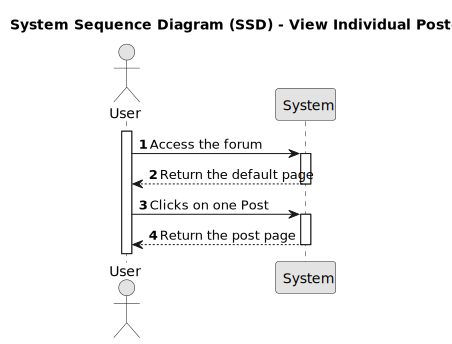

# US002 - View Individual Post

## 1. Requirements Engineering

### 1.1. User Story Description

As a user I would like to see the details of a post.

### 1.2. Customer Specifications and Clarifications 

As a user (member or visitor) it is possible to see the details of a post by clicking on the post. 

### 1.3. Acceptance Criteria

* **AC1:** A "Post" page should appear, when the user clicks on the post title on the "Popular" or "New" pages.

* **AC2:** After the user has been redirected to the "Post" details page he should see:
    - An option to return to the all discussions
    - The Post title
    - An option to submit a new Post
    - The post number of a votes
    - The moment when it was created
    - The username that create the post
    - The post message
    - The number of comments 
    - A textbox where it is possible to leave a commment
    - The post comments are displayed as follows:
        - The reply votes
        - The username that create the comment
        - The moment when the comment was created
        - The comment message
        - The link to reply the comment
        - Each comment reply appears with the same fields as the comment and is indented to the comment it replies to

[Back to all discussions]()

&uarr; **"post title"** 
0 
&darr; [submit]()

 20 minutes ago | by [username]() | 3 comments

The post message...

**Leave a comment**

<input type='text' placeholder='post your reply'></input>

<button>Post comment</button>

&nbsp;&nbsp;&nbsp; &uarr; username | [1 day ago]() 
&nbsp;&nbsp;&nbsp; 0 **"comment title"** 
&nbsp;&nbsp;&nbsp; &darr; [reply]()

* **AC3:** The option to return to the all discussions page should appear on the top left corner. It should be an hyperlink like the following [Back to all discussions]() and the user should be redirected to the discussions page.

* **AC4:** The title of a post should be displayed in bold within double quotes: 
    **"Post title goes here!"**

* **AC5:** The post number of votes are displayed as follow:

    &uarr; 
    0 
    &darr;

    **Note**: 
    - *For members*:
        - The up vote and down vote functionality will be available. (Implemented under US009)
    - *For visitors*, the following message should be display on mouse over:
        - Want to vote? You need to sign up [Here]()

* **AC6:** The option to submit a new post should be like this [submit](). 
    
    **Note**: 
    - *For members*:
        - It should be redirected to the Create a Post (US005).
    - *For visitors*:
        - It should be redirected to the default page.

* **AC7:** The post creation moment should display as: 
    1 minute ago

    55 days ago

* **AC8:** The username should be displayed as follows and the name should be an hyperlink to the member details (US003) page "by [username]()".

    **Note**: The redirect to the member information display will be implemented under US003.

* **AC9:** The number of comments should be display as: 
    0 comments

* **AC10:** The post message be displayed: 
    The post message

* **AC11:** The section to leave comments should have the following title: 
    **Leave a comment**

* **AC12:** A rich text box (bold, italic, underline, link and code) should be available to post a comment.

* **AC13:** There should be a button to post the comment saying: 
    Post comment
    
    After clicking the button it should save the comment.

* **AC14:** When replies to the comment exists, they should be displayed right after.

* **AC15:** The comment replies should display the reply votes as follow:

    &uarr; 
    0 
    &darr;

    **Note**: 
    - *For members*:
        - The up vote and down vote functionality will be available. (Implemented under US010)
    - *For visitors*, the following message should be display on mouse over:
        - Want to vote? You need to sign up [Here]()

* **AC16:** The comment reply username should be displayed as follows : 
    username

* **AC17:** The comment reply creation moment should display as follows and should be an hyperlink to the comment details (US011) page: 
    [1 minute ago]()

    [55 days ago]()

* **AC18:** The comment message be displayed: 
    **The comment message**

* **AC19:** There should be an option to reply to the comment as follows [reply](). When the user clicks it, it should be redirected to Reply a Comment(US008).

* **AC20:** If a reply is to reply it should be indented to his parent.

* **AC21:** Replies to a reply use the same format defined on AC15 to AC19. 

### 1.4. Found out Dependencies

* [US003 - View member info](../../US003/01.requirements-engineering/US003.md)
* [US005 - Create a Post](../../US005/01.requirements-engineering/US005.md)
* [US008 - Reply to comments](../../US008/01.requirements-engineering/US008.md)
* [US009 - Vote on Post](../../US009/01.requirements-engineering/US009.md) 
* [US010 - Vote on a comment](../../US010/01.requirements-engineering/US010.md)
* [US011 - Vote comment details]()

### 1.5 Input and Output Data

**Input data:**
* Post identifier

**Output data:**
* The post details:
    * Number of votes
    * Title
    * Creation moment
    * Username
    * Number of comments
    * Message
    * List of comments:
        * Number of votes
        * Username
        * Creation momment
        * Message
        * List of Replies:
            * Number of votes
            * Username
            * Creation momment
            * Message

### 1.6. System Sequence Diagram (SSD)

### 1.7 Other Relevant Remarks

There are no limit to the amount of comments and replies displayed.
