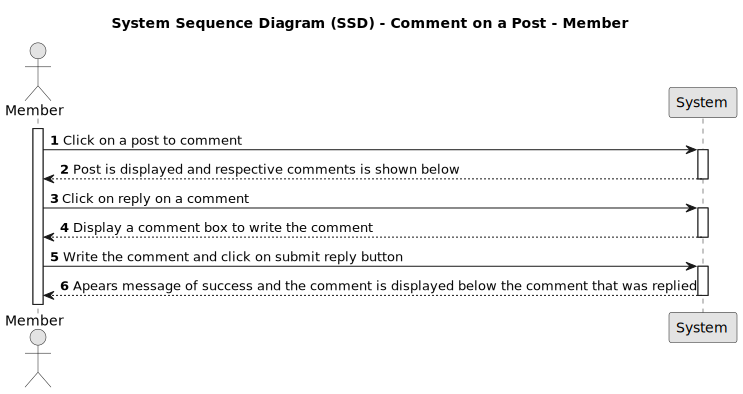

# US008 - Reply to Comments

## 1. Requirements Engineering

### 1.1. User Story Description

As a member I want to repply the coments of a post.

### 1.2. Customer Specifications and Clarifications 

It should be possible to a member to reply to the comments of a post. The reply should be a text, image or code and should be displayed under the comment that is replying to.

### 1.3. Acceptance Criteria


* **AC1:** Should be able to see the posts with the respective comments.
* **AC2:** Should display the comments after selected a post.
* **AC3:** Must be authenticated to be able to reply to the comments.
* **AC4:** With a member role it should be able to reply to the comments.
* **AC5:** Must present a confirmation message after the reply.
* **AC6:** A new reply to comment is created with 0 votes


### 1.4. Found out Dependencies

To be a member, the visitor must have a created account and logged in. US001 [Register New Account](../../US001/01.requirements-engineering/US001.md) 


**Input Data:**

* Typed data:
	* Comment text, image, or code
	


**Output Data:**

* Present a success message
* Display the comments

### 1.6. System Sequence Diagram (SSD)




### 1.7 Other Relevant Remarks

The new coment should be displayed under the comment that is replying to with the respective details and vote counter initialized in one.

### 1.8 Bugs

#### **A - Bug - Reply to comment created with 1 vote**

**A.1 - Description:**

* When creating reply to the comment, it is automatically assigned 1 up vote.

**A.2 - Detailed Description:**

* Every reply to comment is created with already has 1 positive vote related to it,instead of 0 votes. The expected behavior would be to have the reply to comment created with 0 votes.

 
**A.3 - Failed Acceptance Criterias:**

* [AC6](/docs/sprintA/US008/01.requirements-engineering/US008.md#13-acceptance-criteria)

**A.4 - Sequence Diagram**

*

**A.5 - Severity:**

* Medium

**A.6 - Current Behaviour:**

* when the comment is posted, the vote start at 1


**A.7 - Expected Behaviour:**

*  when the comment is posted, the vote should start at zero


**A.8 - Date and Time of Occurrence:**

* September 21, 2023, at 9:00 PM 

**A.9 - Steps to Reproduce the Issue:**
The steps to produce the bug are:

>1. Access the application

>2. Select a post

>3. Select a comment

>4. Type reply a comment in the comments text box.

* **A.10 - Status:**

* **Bug Resolved**


**A.11 - Code Modification in "comment":**


  * These modifications were implemented to ensure that
the reply to the comment is created with zero votes. Now comments are created correctly with zero votes according to the established conditions*

  ```typescript

export class Comment extends Entity<CommentProps> {
// ... (code)
public static create(props: CommentProps, id?: UniqueEntityID): Result<Comment> {
 // ... (code)
  const defaultCommentProps: CommentProps = {
    ...props,
    points: 0, // Setting points initially to 0
    votes: CommentVotes.create([]) // Creating a new empty vote set
    const comment = new Comment(defaultCommentProps, id);

      return Result.ok<Comment>(comment);
    }
  }
}  
```
**A.12 - API Unit Testing**

**A.12.1 - Unit Tests - Prior to Bug Fix**

**1 - Test Specs:**

    - Test File: us008.api.test.ts
    - Expected Result:
      - Reply to a post with a text: Status Code 200
      - Get commentID of a comment of a post:Status Code 200
      - Comment with text a comment of a post: Status Code 200
      - Comment a comment of a post with less than 20 characters (1): Status Code 500
      - Comment a comment of a post with less than 20 characters (19): Status Code 500
      - Comment a comment of a post with 20 characters: Status Code 200
      - Comment a comment of a post with more chars on text (10 000):Status Code 200
      - Comment a comment of a post with more chars on text (10 001): Status Code 500
      - Comment a comment of a post whitout user logged in: Status Code 403

<br>

**2 - Test File Source Code:**
```typescript
      it("US008 Reply to a post", async (): Promise<void> => {
              
        const response = await comments.replyPost(accessToken, slug, "US008 Comment text to a post");
        
        expect(response.status).toBe(200);
  
      });
      

      it("US008 Get commentID of a comment of a post", async (): Promise<void> => {
        
          const response = await comments.getPostComments(slug);
          expect(response.status).toBe(200);
        
          expect(response.data.comments).toBeDefined();
          expect(response.data.comments.length).toBeGreaterThan(0);
        
          const commentI = response.data.comments[0].commentId;
          expect(commentI).toBeDefined();

          commentId = response.data.comments[0].commentId;
       
        
        });
        
        it("US008 Comment a comment of a post", async (): Promise<void> => {

          const response = await comments.replyComment(accessToken, slug, commentId, "US008 Comment text to a comment of a post");
          expect(response.status).toBe(200);

        });

        it("US008 Comment a comment of a post with less chars on text (1) - Must have between 20 and 10 000", async (): Promise<void> => {

          const response = await comments.replyComment(accessToken, slug, commentId, "U");
          expect(response.status).toBe(500);

        });

        it("US008 Comment a comment of a post with less chars on text (19) - Must have between 20 and 10 000", async (): Promise<void> => {

          const response = await comments.replyComment(accessToken, slug, commentId, "U".repeat(19));
          expect(response.status).toBe(200);

        });

        it("US008 Comment a comment of a post with less chars on text (20) - Must have between 20 and 10 000", async (): Promise<void> => {

          const response = await comments.replyComment(accessToken, slug, commentId, "U".repeat(20));
          expect(response.status).toBe(200);

        });

        it("US008 Comment a comment of a post with more chars on text (10 000) - Must have between 20 and 10 000", async (): Promise<void> => {

          const response = await comments.replyComment(accessToken, slug, commentId, "U".repeat(10000));
          expect(response.status).toBe(200);

        });

        it("US008 Comment a comment of a post with more chars on text (10 001) - Must have between 20 and 10 000", async (): Promise<void> => {

          const response = await comments.replyComment(accessToken, slug, commentId, "U".repeat(10001));
          expect(response.status).toBe(500);

        });

        it("US008 Comment a comment of a post while not logged in successfully", async (): Promise<void> => {
        
          const response = await comments.replyComment(accessToken="", slug, commentId, "US008 Comment text to a comment of a post");
          expect(response.status).toBe(403);

        });
```


**3 - Test Report:**


* **A.12.2 - Unit Tests - Post Source Code Changes for Bug Fix**

**1 - Test Specs:**

    - Test File: us008.bug.test.ts
    - Expected Result: 
      - Comment text to a post: Status Code 200
      - Get commentID of a comment of a post: Status Code 200
      - Comment a comment of a post: Status Code 200
      - Comment a comment of a post with zero votes: Status Code 200

<br>


**2 - Test File Source Code:**
  ```typescript
      it("US008-bug Reply to a post", async (): Promise<void> => {

        const response = await comments.replyPost(accessToken, slug, "US008-bug Comment text to a post");

        expect(response.status).toBe(200);

    });


    it("US008-bug Get commentID of a comment of a post", async (): Promise<void> => {

        const response = await comments.getPostComments(slug);
        expect(response.status).toBe(200);

        expect(response.data.comments).toBeDefined();
        expect(response.data.comments.length).toBeGreaterThan(0);

        const commentI = response.data.comments[0].commentId;
        expect(commentI).toBeDefined();

        commentId = response.data.comments[0].commentId;


    });

    it("US008-bug Comment a comment of a post", async (): Promise<void> => {
        const response = await comments.replyComment(accessToken, slug, commentId, "US008-bug Comment text to a comment of a post");
        expect(response.status).toBe(200);
    });
        //zero votes verification test when creating a comment
        it("US008-bug get comment2 points(ok 0 vote)", async (): Promise<void> => {
            const response = await comments.getComment2(slug, "US008-bug Comment text to a comment of a post", 0);
            expect(response.status).toBe(200);
        });
   ```

**3 - Test Report:**


## 2. OO Analysis

### 2.1. Relevant Domain Model Excerpt 
*In this section, it is suggested to present an excerpt of the domain model that is seen as relevant to fulfill this requirement.* 


### 2.2. Other Remarks

*Use this section to capture some aditional notes/remarks that must be taken into consideration into the design activity. In some case, it might be usefull to add other analysis artifacts (e.g. activity or state diagrams).* 

## 3. Design - User Story Realization 

### 3.1. Rationale

**The rationale grounds on the SSD interactions and the identified input/output data.**

| Interaction ID | Question: Which class is responsible for... | Answer  | Justification (with patterns)  |
|:-------------  |:--------------------- |:------------|:---------------------------- |
| Step 1  		 |							 |             |                              |
| Step 2  		 |							 |             |                              |
| Step 3  		 |							 |             |                              |
| Step 4  		 |							 |             |                              |
| Step 5  		 |							 |             |                              |
| Step 6  		 |							 |             |                              |              
| Step 7  		 |							 |             |                              |
| Step 8  		 |							 |             |                              |
| Step 9  		 |							 |             |                              |
| Step 10  		 |							 |             |                              |  


### Systematization ##

According to the taken rationale, the conceptual classes promoted to software classes are: 

 * Class1
 * Class2
 * Class3

Other software classes (i.e. Pure Fabrication) identified: 
 * xxxxUI  
 * xxxxController

## 3.2. Sequence Diagram (SD)

*In this section, it is suggested to present an UML dynamic view stating the sequence of domain related software objects' interactions that allows to fulfill the requirement.* 


## 3.3. Class Diagram (CD)

*In this section, it is suggested to present an UML static view representing the main domain related software classes that are involved in fulfilling the requirement as well as and their relations, attributes and methods.*


# 4. Tests 
*In this section, it is suggested to systematize how the tests were designed to allow a correct measurement of requirements fulfilling.* 

**_DO NOT COPY ALL DEVELOPED TESTS HERE_**

**Test 1:** Check that it is not possible to create an instance of the Example class with null values. 

	@Test(expected = IllegalArgumentException.class)
		public void ensureNullIsNotAllowed() {
		Exemplo instance = new Exemplo(null, null);
	}

*It is also recommended to organize this content by subsections.* 

# 5. Construction (Implementation)

*In this section, it is suggested to provide, if necessary, some evidence that the construction/implementation is in accordance with the previously carried out design. Furthermore, it is recommeded to mention/describe the existence of other relevant (e.g. configuration) files and highlight relevant commits.*

*It is also recommended to organize this content by subsections.* 

# 6. Integration and Demo 

*In this section, it is suggested to describe the efforts made to integrate this functionality with the other features of the system.*

# 7. Observations

*In this section, it is suggested to present a critical perspective on the developed work, pointing, for example, to other alternatives and or future related work.*


