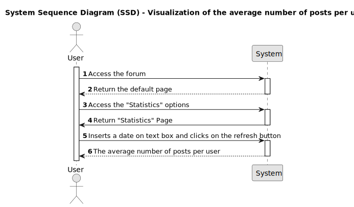
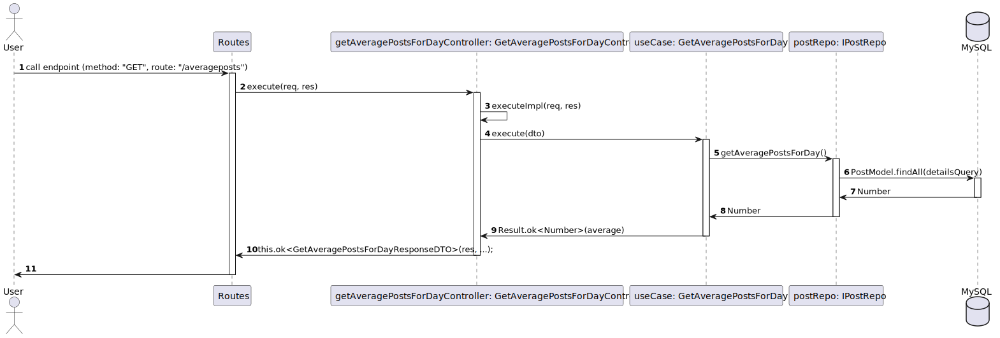

# US015 - As a member, I wish to know the average of posts per user for a specific day 

## 1. Requirements Engineering

### 1.1. User Story Description

As a user I wish to know the average number of posts per user in a specific day.

### 1.2. Customer Specifications and Clarifications 

>* **Question:** What kind of additonal funtionalities would you like to have in the forum?

>* **Answer:**  I want to  the DDD Forum Web Application to have a new functionality to display statistical metrics about the average number posts per user for a specific day

 

>* **Question:** Do you want that functionality to be available to all users?

>* **Answer:** No, only the users that are logged in.

 

>* **Question:** Do you want that information to be displayed in already existant pages/fields and if so, which? or in a new page?

>* **Answer:**  I want the Statistics web page to be a brand new page in the Web Application.

 

>* **Question** Where do you want the access of the brand new "Statistics Web Page" to be located? 

>* **Answer:** I want the access to the "Statistics" web page to be made available through the main page.

 

>* **Question:** On the main page, where do you want the "Statistics" access field to be placed? at the header? In the footer? In the body? on a sidebar? In the menu? or any Other?

>* **Answer:** The access should be placed at the header? at the same level/ next to the Login/Register buttons.

 

>* **Question:** How would you like to access the new page? Through a button? Through a link? Through a menu? Through a combo box or any Other?

>* **Answer:** I want to access the new page through a "Statistics" button.

 

>* **Questions:** In terms of UI layout of the field concerning "average of a posts per user for a Specific Day" in the "Statistics" web page, do you want it´s position in the page to follow the same sequence as the sequence presented initialy for all additional functionalities to be implemented in the "Statistics" web page? Or do you have another preference?
 
>* **Answer:** It can follow the sequence of additional statistic functionalities stated by me initialy.

 

>* **Question:** How do you want the infomation of the metrics concerning the average of a posts per user for a specific day to be displayed in the "Statistics Web Page"? Numerical / Textual / Graphical / Other?

>* **Answer:** I want the data to be displayed in a numerical and graphical (optional).

 

>* **Question:** How would you like to select the date for which you want to see the metrics in the web page? Through a calendar? Through a text field? Combo box or any Other?

>* **Answer:** I want to insert the date in a text field and have with a "refresh button" incorporated to retrieve the corresponding data.

 

>* **Question:** What date format do you want to be able to insert? dd-mm-yyyy, dd/mm/yyyy, mm/dd/yyyy, day Month Year, or all?

>* **Answer:** I want to be able to insert the date in the following date format: mm/dd/yyyy, and the text box must show a "placeholder text message of the acceptable date format" on the text box as a reminder and also a visual calendar component to allow choosing the date.

 

>* **Question:** If there are no posts created on the select date what should be returned?

>* **Answer:** It should be returned zero.

 

>* **Question:** What requisits are compultionary for the new functionality to be approved and signed-off?

>* **Answer:** For functionality approval, i will require the following:

>>* Execution of Back-end API Integration Testing using **Jest** with a coverage of 80% or more.

>>* Specification of functional acceptance tests using **Gherkin** and implementation of End-2-End Testing using **Cucumber** **WebdriverIO**.

>>* **The provision of the all concerning documentation/ Reports of the tests performed as proof of "PASS" the above mentioned coverage.**

 
### 1.3. Acceptance Criteria

* **AC.1:** The user must be a registered member of the DDD Forum Web Application.

* **AC.2** The user must be logged in as a member.

* **AC.3:** There must be a "Statistics" button in the header of the main page next to the Login/Register buttons to access the "Statistics Web Page".

* **AC.4:** The "Statistics" button must only be available/visible to the user if he is logged in as a member to access the "Statistics Web Page".

* **AC.5** Upon Click on the "Statistics" button, the user must be redirected to the "Statistics Web Page".

* **AC.6:** The "average number of posts per user for a Specific Day" metrics, must occupy the second position in the "Statistics Web Page" in regards to the other statistic functionalities presented in the web page

* **AC.7:** The concerning statistical field must have a text box to insert the date for which the user wants to see the metrics.

* **AC.8:** The text box must show "placeholder text message of the date format acceptable" as a reminder and only allow the Member to insert a date in a format **dd-mm-yyyy** 

* **AC.9:** The concerning Statistical field must have a "refresh button" incorporated to retrieve the corresponding data.

* **AC.10:** Upon Click on the "refresh button", the web page must return in that same field a numeric data, where the member will be able to see the average number of posts users for a specific day.

* **AC.11:** The results should be displayed using the following format: 

	| Day | Average posts |
	|:-------------  |:--------------------- |
	| dd-mm-yyyy | x |

* **AC.12:** The average posts should be calculated using the following formula 

	Number of posts in the selected date / Number of members that created posts in the selected date

* **AC.13:** If there aren't posts created on the selected date zero should be displayed.

* **AC.14:** If no token is provided while calling the REST endpoint it should return 403 - Forbidden

* **AC.15:** Execution of Back-end API Unit Testing using **Jest** with a coverage of 80% or more.

* **AC.16:** Execution of Back-end API Integration Testing using **Jest** with a coverage of 80% or more.

* **AC.17:** Specification of functional acceptance tests using **Gherkin** and implementation of End-2-End Testing using **Cucumber** **WebdriverIO**.

* **AC.18:** The provision of the all concerning documentation/ Reports of the tests performed as proof of "PASS" the above mentioned coverage.

   
### 1.4. Found out Dependencies

 * As a member i must a registered account and complete the login process US001 [Register New Account](../../US001/01.requirements-engineering/US001.md) *

 

### 1.5 Input and Output Data

**Input data:**
* Typed data:
	  * Date

**Output data:**

* Numeric data:
  * The average number of posts per user for a specific day.

 
### 1.6. System Sequence Diagram (SSD)

### 1.7 Other Relevant Remarks

### 1.8 Bugs

## 2. OO Analysis

### 2.1. Relevant Domain Model Excerpt 
*By default, an existing email account is required to create an account in the system* 

### 2.2. Other Remarks

*Use this section to capture some aditional notes/remarks that must be taken into consideration into the design activity. In some case, it might be usefull to add other analysis artifacts (e.g. activity or state diagrams).* 

## 3. Design - User Story Realization 

### 3.1. Rationale

**The rationale grounds on the SSD interactions and the identified input/output data.**

| Interaction ID | Question: Which class is responsible for... | Answer  | Justification (with patterns)  |
|:-------------  |:--------------------- |:------------|:---------------------------- |
| Step 1  		 |							 |             |                              |
| Step 2  		 |							 |             |                              |
| Step 3  		 |							 |             |                              |
| Step 4  		 |							 |             |                              |
| Step 5  		 |							 |             |                              |
| Step 6  		 |							 |             |                              |              
| Step 7  		 |							 |             |                              |
| Step 8  		 |							 |             |                              |
| Step 9  		 |							 |             |                              |
| Step 10  		 |							 |             |                              |  

### Systematization ##

According to the taken rationale, the conceptual classes promoted to software classes are: 

 * Class1
 * Class2
 * Class3

Other software classes (i.e. Pure Fabrication) identified: 
 * xxxxUI  
 * xxxxController

## 3.2. Sequence Diagram (SD)

*In this section, it is suggested to present an UML dynamic view stating the sequence of domain related software objects' interactions that allows to fulfill the requirement.* 

## 3.3. Class Diagram (CD)

*In this section, it is suggested to present an UML static view representing the main domain related software classes that are involved in fulfilling the requirement as well as and their relations, attributes and methods.*

# 4. Tests 
*In this section, it is suggested to systematize how the tests were designed to allow a correct measurement of requirements fulfilling.* 

**_DO NOT COPY ALL DEVELOPED TESTS HERE_**

**Test 1:** Check that it is not possible to create an instance of the Example class with null values. 

	@Test(expected = IllegalArgumentException.class)
		public void ensureNullIsNotAllowed() {
		Exemplo instance = new Exemplo(null, null);
	}

*It is also recommended to organize this content by subsections.* 

# 5. Construction (Implementation)

*In this section, it is suggested to provide, if necessary, some evidence that the construction/implementation is in accordance with the previously carried out design. Furthermore, it is recommeded to mention/describe the existence of other relevant (e.g. configuration) files and highlight relevant commits.*

*It is also recommended to organize this content by subsections.* 

# 6. Integration and Demo 

*In this section, it is suggested to describe the efforts made to integrate this functionality with the other features of the system.*

# 7. Observations

*In this section, it is suggested to present a critical perspective on the developed work, pointing, for example, to other alternatives and or future related work.*

