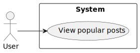
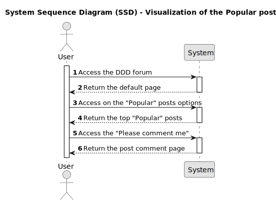

# US027 -  As a member, when I look at the popular posts, posts that have no comments should display a purple text stating “Please comment me”. This text should link to the comment posting page for that specific post. 

## 1. Requirements Engineering

### 1.1. User Story Description

As a member I wish to look at the popular posts and the posts that have no comments should display a purple text stating "Please comment me". The text should link to the comment posting page for that specific post.

### 1.2. Customer Specifications and Clarifications 

>* **Question:** What kind of additonal funtionalities would you like to have in the forum?

>* **Answer:**  I want to the DDD Forum Web Application to have a new functionality that when I look at the popular posts and they have no comments, it should display a purple text stating "Please comment me". The text should link to the comment posting page for that specific post.

 

>* **Question:** Do you want that functionality to be available to all users?

>* **Answer:** No, only the users that are logged in.

 

>* **Question:** Do you want that information to be displayed in already existant pages/fields and if so, which? or in a new page?

>* **Answer:**  I want the information to be display in the "Popular" web page.

 

>* **Questions:** If all posts have comments, should be display any message?
 
>* **Answer:** No, the "Popular" web page shouldn't have any changes.

 

>* **Question:** What requisits are mandatory for the new functionality to be approved and signed-off?

>* **Answer:** For approval, I will require the following:

>>* Specification of functional acceptance tests using **Gherkin** and implementation of End-2-End Testing using **Cucumber** **WebdriverIO**.

>>* Specification of non-functional tests using **JMeter**.

>>* **The provision of the all concerning documentation/reports of the tests performed as proof of "PASS" the above mentioned coverage.**

 

### 1.3. Acceptance Criteria

* **AC1:** On the popular posts, elements should be grouped as follows:

    &uarr; **"post title"** 
    0 
    &darr; 20 minutes ago | by [username]() | **"see: Note"** 

    **Note**: 
    - *For members*:
        - x comments - where x is the comments count (when x > 0)
        - [Please comment me]() - Link to the post comments page in purple - (when x == 0)
    - *For visitors* x comments - where x is the comments count

   
### 1.4. Found out Dependencies

Not applicable

 

### 1.5 Input and Output Data

**Input data:**
Not applicable

**Output data:**
* The list of most popular posts
    * Number of votes
    * Title
    * Creation moment
    * Username
    * Number of comments or Please comment me

 
### 1.6. System Sequence Diagram (SSD)

### 1.7 Other Relevant Remarks

### 1.8 Bugs

## 2. OO Analysis

### 2.1. Relevant Domain Model Excerpt 
*By default, an existing email account is required to create an account in the system* 

### 2.2. Other Remarks

*Use this section to capture some aditional notes/remarks that must be taken into consideration into the design activity. In some case, it might be usefull to add other analysis artifacts (e.g. activity or state diagrams).* 

## 3. Design - User Story Realization 

### 3.1. Rationale

**The rationale grounds on the SSD interactions and the identified input/output data.**

| Interaction ID | Question: Which class is responsible for... | Answer  | Justification (with patterns)  |
|:-------------  |:--------------------- |:------------|:---------------------------- |
| Step 1  		 |							 |             |                              |
| Step 2  		 |							 |             |                              |
| Step 3  		 |							 |             |                              |
| Step 4  		 |							 |             |                              |
| Step 5  		 |							 |             |                              |
| Step 6  		 |							 |             |                              |              
| Step 7  		 |							 |             |                              |
| Step 8  		 |							 |             |                              |
| Step 9  		 |							 |             |                              |
| Step 10  		 |							 |             |                              |  

### Systematization ##

According to the taken rationale, the conceptual classes promoted to software classes are: 

 * Class1
 * Class2
 * Class3

Other software classes (i.e. Pure Fabrication) identified: 
 * xxxxUI  
 * xxxxController

## 3.2. Sequence Diagram (SD)

*In this section, it is suggested to present an UML dynamic view stating the sequence of domain related software objects' interactions that allows to fulfill the requirement.* 

## 3.3. Class Diagram (CD)

*In this section, it is suggested to present an UML static view representing the main domain related software classes that are involved in fulfilling the requirement as well as and their relations, attributes and methods.*

# 4. Tests 
*In this section, it is suggested to systematize how the tests were designed to allow a correct measurement of requirements fulfilling.* 

**_DO NOT COPY ALL DEVELOPED TESTS HERE_**

**Test 1:** Check that it is not possible to create an instance of the Example class with null values. 

	@Test(expected = IllegalArgumentException.class)
		public void ensureNullIsNotAllowed() {
		Exemplo instance = new Exemplo(null, null);
	}

*It is also recommended to organize this content by subsections.* 

# 5. Construction (Implementation)

*In this section, it is suggested to provide, if necessary, some evidence that the construction/implementation is in accordance with the previously carried out design. Furthermore, it is recommeded to mention/describe the existence of other relevant (e.g. configuration) files and highlight relevant commits.*

*It is also recommended to organize this content by subsections.* 

# 6. Integration and Demo 

*In this section, it is suggested to describe the efforts made to integrate this functionality with the other features of the system.*

# 7. Observations

*In this section, it is suggested to present a critical perspective on the developed work, pointing, for example, to other alternatives and or future related work.*

