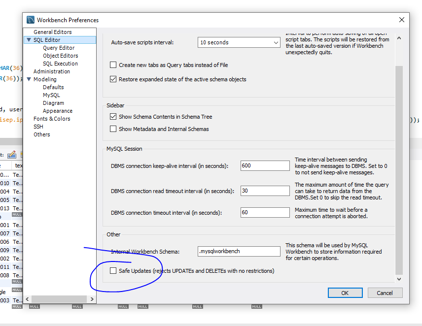
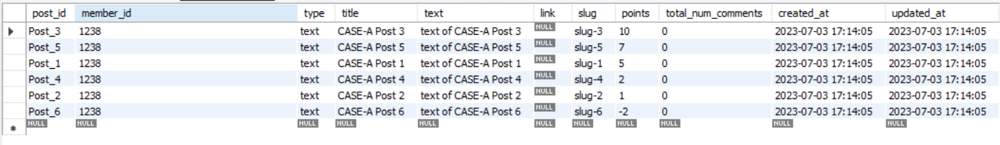
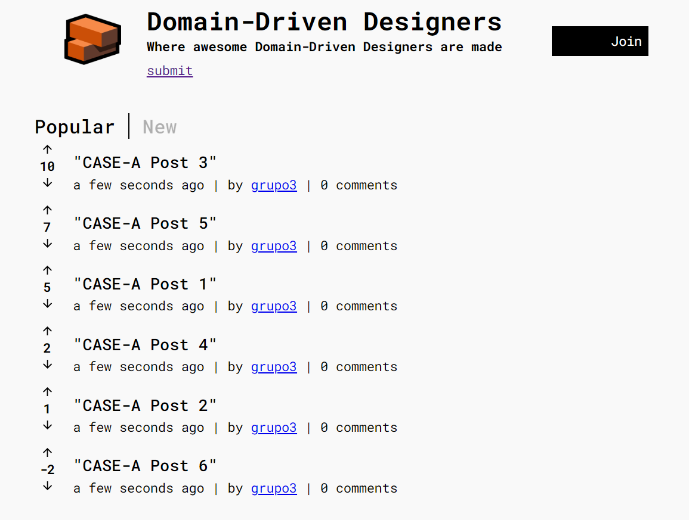
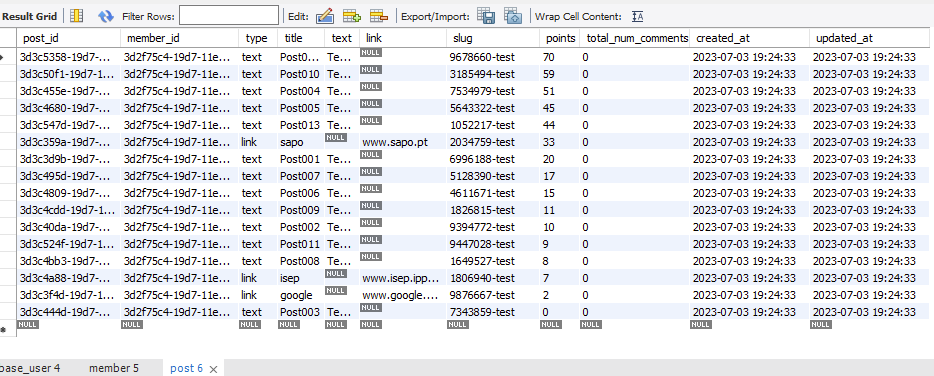
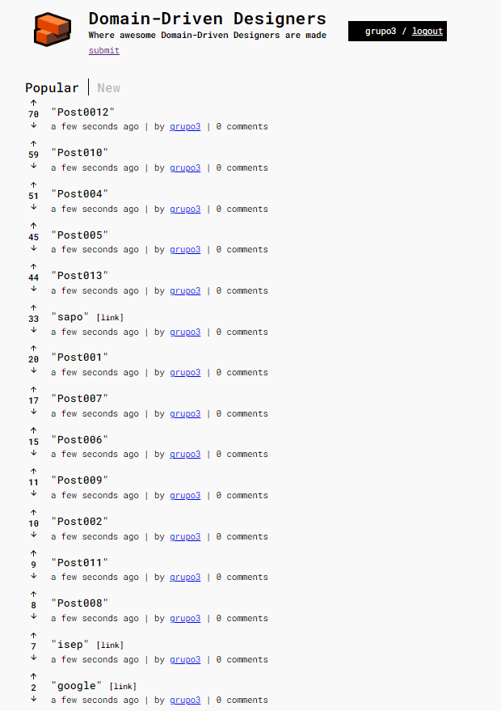
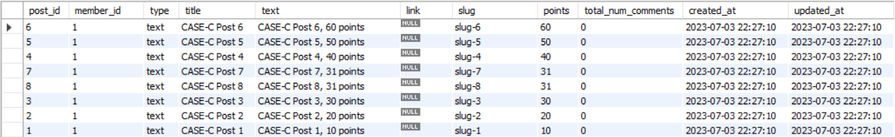
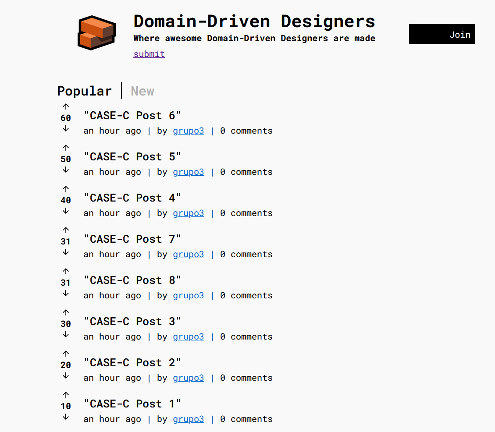

# GQSOFT1 - Functional Testing

<p align="center">
 
</p>
<h1 align="center">DDDForum.com</h1>

## A ) Scope of Work:
> * The target of this work, is to run a functional tests to the "DDD- Forum" Web App. Popular Posts View feature and to assertain if the sorting functionality is working as expected in accordance to the business rules. 
> * The tests wil be conducted manualy and in a controlled environment.
> * Diferent test cases will be considered for diferent use scenarios, through the insertion of static & valid parameters directly in the database-
> * The Web App "DDD- Forum" will be used in tandem with the data insertion in order to validate the results obtained.


## Relates to:

|                                                   |                                                                                            |
|---------------------------------------------------|--------------------------------------------------------------------------------------------|
| US004 (Visualization of Popular Posts List)       | [US004](../sprintA/US004/readme.md)                                                        |
| US005 (Create a Post)                             | [US005](../sprintA/US005/readme.md)                                                        |
|                                                |                                                                                        |


## Test Case Scenarios:

|                                                   |                                                                                            |
|---------------------------------------------------|--------------------------------------------------------------------------------------------|
| CASE - A                                          | (Test Popular Posts Sorting with Insertion of 6 Posts)                                     |
| CASE - B                                          | (Test Popular Posts visibility threshold in the Web App. with Insertion of 16 Posts)       |
| CASE - C                                          | (Test Popular Posts Sorting with Insertion of post with same number of votes)              |
|                                                   |                                                                                            |


## B ) System Set-Up :

### B.1 - Front-End & Back-End Start-up:

1. Copy the `.env` template file. Feel free to change passwords and app secrets. 
```bash
cp .env.template .env
```

2. Build and run the image to run the backend services.
```bash
docker-compose up
```

3. Open up an additional console and then run:

```bash	
npm run setup:dev
```

```bash	
npm run start:both
```

### B.2 - Test Pre-conditions :
Prior to running the test it is required to clean the database, for such, run the following commands in a sequencial manner:

```bash	
npm run db:delete:dev
```

```bash
npm run db:create:dev
```

```bash
npm run db:migrate:dev
```

## B.3 - Instructions for running the test:

### How to Admin the database
  
  - open browser use localhost:8080
  - use:
    - system: MySQL
    - server: mysql
    - username: tonysoprano
    - pass: 12345678
    - db name: data_dev
 
 ## 3.1 - Direct insertion of data in the database through SQL script:

  1. Connect to the database server using the following credentials
  
  **## How to Admin the database**
  
  - open browser use localhost:8080
  - use:
    - system: MySQL
    - server: mysql
    - username: tonysoprano
    - pass: 12345678
    - db name: data_dev
  
  2. With MySQL desktop, open the SQL script file for each respective test case. SQL files, can be found onn the project folder, under the following directory: 
  ```bash	
  src/func_test/DB_MySQL
  ```

  3. Further MySQL settings required to run the script:

  
  

  4. Run the script directy on MySQL desktop.
 
 ## B.4 - After Running the test:

 1. Stop the containers by running:

```bash	
docker-compose stop
```

2. Stop the backend by hitting Ctrl+C in the terminal where the backend is running.

<h1 align="center"></h1>

# C ) Functional Tests:

# 1 - CASE-A

## 1.1 - Test Case :
* According to the DDD-Forum Web Application, it is expected that the posts are ordered by popularity, where the popularity is defined by the number of votes. The posts with the highest number of votes should be displayed first.

* The test "CASE -A" has been defined in order to test the compliance with the application requirements and business rules :

  * The test aims to verify the correct order of the posts.

  * This will be a functional test conducted manually by the Tester.

  * The test will be condutcted in controlled fashion and orderly manner.

  * It required to require to run both the Front-End and Back-End services (Instructions available below).

  * It is required to clean the database prior to running the test (Instructions available below).

  * It is required to Admin the database in order to bypass the Front-End and insert the data directly in the DB (Instructions available above).

  * Parameters concerning 6 post with diferent Titles, Texts and Number of votes will be injected directly in the database through a "SQL" script file as follows:


##  1.2 - Input data :

| Insertion order:| Title                   | Text                       | Number of Votes :    |
|-----------------|-------------------------|----------------------------|----------------------|
| 1               |  CASE-A Post  1         | text of CASE-A Post 1      | 5                    |
| 2               |  CASE-A Post  2         | text of CASE-A Post 2      | 1                    |
| 3               |  CASE-A Post  3         | text of CASE-A Post 3      | 10                   |
| 4               |  CASE-A Post  4         | text of CASE-A Post 4      | 2                    |
| 5               |  CASE-A Post  5         | text of CASE-A Post 5      | 7                    |
| 6               |  CASE-A Post  6         | text of CASE-A Post 6      | -2                   |


  * The validation of the test case will be done by the "Tester" and by visual confirmation of the order of the posts on the app.

  * The test will be considered successful if the posts are ordered by popularity, where the popularity is defined by the number of votes. The posts with the highest number of votes should be displayed first as folows:
  

## 1.3 - Expected Posts order by Popularity :

| Expected order by Popularity: | Title                   | Text                       | Number of Votes :    |
|-----------------|-------------------------|----------------------------|----------------------|
| 1               |  CASE-A Post  3         | text of CASE-A Post 3      | 10                   |
| 2               |  CASE-A Post  5         | text of CASE-A Post 5      | 7                    |
| 3               |  CASE-A Post  1         | text of CASE-A Post 1      | 5                    |
| 4               |  CASE-A Post  4         | text of CASE-A Post 4      | 2                    |
| 5               |  CASE-A Post  2         | text of CASE-A Post 2      | 1                    |
| 6               |  CASE-A Post  6         | text of CASE-A Post 6      | -2                   |


## 1.4 - Test Results :

### **1.4.1 - MySQL Database Verification:**


### **1.4.2 - DDD-Forum Web Application Verification:**


### **1.4.3 - Test Report:**
  - As expected, the DDD-Forum is organized in descending order of popularity based on the number votes.
  - The App. displays it´s content in a way where the post with higher popularity (more votes) are displayed at the top and the less popular (less votes or with negative voting) are place at the bottom.
  - This test case was considered **SUCCESSFUL**.
  # TEST CASE: PASSED
    

<h1 align="center"></h1>

# 2 - CASE-B


## 2.1 - Test Case :
* According to DDD-Forum Web application, it is expected that the posts are ordered by popularity, where the popularity is defined by the number of votes. The posts with the highest number of votes should be displayed first.

* The test "CASE -A" has been defined in order to test the compliance with the application requirements and business rules :

  * The test aims to verify the correct order of the posts.

  * This will be a functional test conducted manually by the Tester.

  * The test will be condutcted in controlled fashion and orderly manner.

  * It is required to require to run both the Front-End and Back-End services (Instructions available below).

  * It is required to clean the database prior to running the test (Instructions available below).

  * It is required to Admin the database in order to bypass the Front-End and insert the data directly in the DB (Instructions available above).

  * Parameters concerning 16 post with diferent Titles, Texts and Number of votes will be injected directly in the database through a "SQL" script file as follows:


##  2.2 - Input data :
| Insertion order:| Title                   | Text                       | Number of Votes :    |
|-----------------|-------------------------|----------------------------|----------------------|
| 1               |  CASE-B Post  Sapo      | text of CASE-B sapo        | 33                   |
| 2               |  CASE-B Post  001       | text of CASE-B Post 1      | 20                   |
| 3               |  CASE-B Post  google    | text of CASE-B google      | 2                    |             
| 4               |  CASE-B Post  002       | text of CASE-B Post 2      | 10                   |
| 5               |  CASE-B Post  003       | text of CASE-B Post 3      | 0                    |
| 6               |  CASE-B Post  004       | text of CASE-B Post 4      | 51                   |
| 7               |  CASE-B Post  005       | text of CASE-B Post 5      | 45                   |
| 8               |  CASE-B Post  006       | text of CASE-B Post 6      | 15                   |
| 9               |  CASE-B Post  007       | text of CASE-B Post 7      | 17                   |
| 10              |  CASE-B Post  isep      | text of CASE-B Post isep   | 7                    |
| 11              |  CASE-B Post  008       | text of CASE-B Post 1      | 8                    |
| 12              |  CASE-B Post  009       | text of CASE-B Post 2      | 11                   |
| 13              |  CASE-B Post  010       | text of CASE-B Post 3      | 59                   |
| 14              |  CASE-B Post  011       | text of CASE-B Post 4      | 9                    |
| 15              |  CASE-B Post  012       | text of CASE-B Post 5      | 70                   |
| 16              |  CASE-B Post  013       | text of CASE-B Post 6      | 44                   |
  

  * The validation of the test case will be done by the "Tester" and by visual confirmation of the order of the posts on the app.

  * The test will be considered successful if the posts are ordered by popularity, where the popularity is defined by the number of votes. The application only shows us the first 15 posts even if we have more posts and the posts with the highest number of votes should be displayed first as folows:


## 2.3 - Expected Posts order by Popularity :
| Insertion order:| Title                   | Text                       | Number of Votes :    |
|-----------------|-------------------------|----------------------------|----------------------|
| 15              |  CASE-B Post  012       | text of CASE-B Post 5      | 70                   |
| 13              |  CASE-B Post  010       | text of CASE-B Post 3      | 59                   |
| 6               |  CASE-B Post  004       | text of CASE-B Post 4      | 51                   |
| 7               |  CASE-B Post  005       | text of CASE-B Post 5      | 45                   |
| 16              |  CASE-B Post  013       | text of CASE-B Post 6      | 44                   |
| 1               |  CASE-B Post  Sapo      | text of CASE-B sapo        | 33                   |
| 2               |  CASE-B Post  001       | text of CASE-B Post 1      | 20                   |
| 9               |  CASE-B Post  007       | text of CASE-B Post 7      | 17                   |
| 8               |  CASE-B Post  006       | text of CASE-B Post 6      | 15                   |
| 12              |  CASE-B Post  009       | text of CASE-B Post 2      | 11                   |
| 4               |  CASE-B Post  002       | text of CASE-B Post 2      | 10                   |
| 14              |  CASE-B Post  011       | text of CASE-B Post 4      | 9                    |
| 11              |  CASE-B Post  008       | text of CASE-B Post 1      | 8                    |
| 10              |  CASE-B Post  isep      | text of CASE-B Post isep   | 7                    |
| 3               |  CASE-B Post  google    | text of CASE-B google      | 2                    |             
| 5               |  CASE-B Post  003       | text of CASE-B Post 3      | 0                    |


## 2.4 - Test Results :

### **2.4.1 - MySQL Database Verification:**
 

### **2.4.2 - DDD-Forum Web Application Verification:**


### **2.4.3 - Test Report:**
  - The posts are organized in descending order of popularity based on the number of votes, ranging from the most  voted (first) to the least voted (last). 
  
  - As expected only the 15 highest voted posts are visible in the posts section, other posts ranked below 15th place are not displayed.   
  
  - Users can access the application  and navigate to the posts section where ranked posts are located. 
    
  - As expected order of the posts vary dynamically according to the total amount of votes on each post. 
  

<h1 align="center"></h1>

# 3 - CASE-C

## 3.1 - Test Case :

According to the DDD-Forum Web Application, it is expected that the posts are ordered by popularity, where the popularity is defined by the number of votes. The posts with the highest number of votes should be displayed first.

* The test "CASE - C" has been defined in order to test the compliance with the application requirements and business rules :

  * The test aims to verify the sorting of popular posts, where two or more posts have the same amount of votes.

  * This will be a functional test conducted manually by the Tester.

  * The test will be executed in controlled fashion and orderly manner.

  * It is required to run both the Front-End and Back-End services (Instructions available above).

  * It is required to clean the database prior to running the test (Instructions available above).

  * It is required to Admin the database in order to bypass the Front-End and insert the data directly in the DB (Instructions available above).

  * Parameters concerning 8 posts with diferent Titles, Texts and Number of votes (2 posts with the same number of votes) will be injected directly in the database through a "SQL" script file as follows:

##  3.2 - Input data :

| Post_ID         | Title                   | Text                         | Number of Votes      |
|-----------------|-------------------------|----------------------------  |----------------------|
| 1               |  CASE-C Post  1         | CASE-C Post 1, 10 points     | 10                   |
| 2               |  CASE-C Post  2         | CASE-C Post 2, 20 points     | 20                   |
| 3               |  CASE-C Post  3         | CASE-C Post 3, 30 points     | 30                   |
| 4               |  CASE-C Post  4         | CASE-C Post 4, 40 points     | 40                   |
| 5               |  CASE-C Post  5         | CASE-C Post 5, 50 points     | 50                   |
| 6               |  CASE-C Post  6         | CASE-C Post 6, 60 points     | 60                   |
| 7               |  CASE-C Post  7         | CASE-C Post 7, 31 points     | 31                   |
| 8               |  CASE-C Post  8         | CASE-C Post 8, 31 points     | 31                   |

* The validation of the test case will be done by the "Tester" and by visual confirmation of the order of the posts on the app.

* The test will be considered successful if the posts are ordered by popularity, where the popularity is defined by the number of votes. If two or more posts have the same number of votes they are ordered 
  by post_id value. The posts with the highest number of votes should be displayed first as folows:

## 3.3 - Expected Posts order by Popularity :

| Post_ID         | Title                   | Text                         | Number of Votes      |
|-----------------|-------------------------|----------------------------  |----------------------|
| 6               |  CASE-C Post  6         | CASE-C Post 6, 60 points     | 60                   |
| 5               |  CASE-C Post  5         | CASE-C Post 5, 50 points     | 50                   |
| 4               |  CASE-C Post  4         | CASE-C Post 4, 40 points     | 40                   |
| 7               |  CASE-C Post  7         | CASE-C Post 7, 31 points     | 31                   |
| 8               |  CASE-C Post  8         | CASE-C Post 8, 31 points     | 31                   |
| 3               |  CASE-C Post  3         | CASE-C Post 3, 30 points     | 30                   |
| 2               |  CASE-C Post  2         | CASE-C Post 2, 20 points     | 20                   |
| 1               |  CASE-C Post  1         | CASE-C Post 1, 31 points     | 10                   |
## 3.4 - Test Results :

### **3.4.1 - MySQL Database Verification:**



### **3.4.2 - DDD-Forum Web Application Verification:**



  - The data is organized in descending order of popularity based on votes, ranging from the highest to the lowest voted. 
  
  - Users can access the platform or website and navigate to the section where user-submitted content is located. 
  
  - The data is sorted where the most voted posts are shown first, and if there are posts with same number of votes these are sorted by post_id value. 
  
  - It's important to note that the sorting is dynamic since new votes are cast.
  