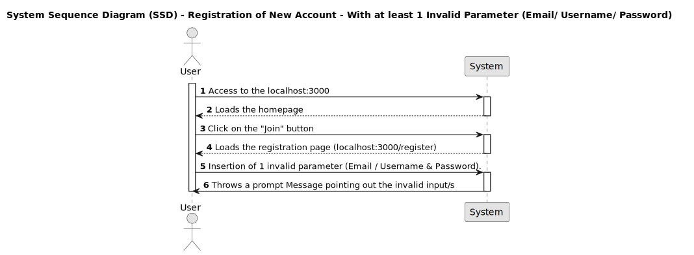
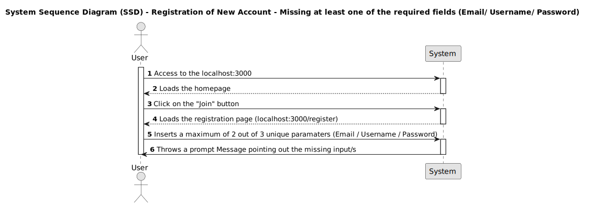
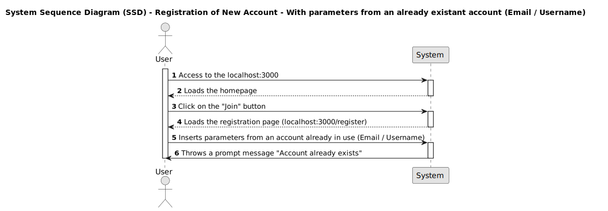

# US001 - Registration of a New Account

## 1. Requirements Engineering

### 1.1. User Story Description

As a Visitor, I want to create a new account and have additional access rights to the DDD forum.

### 1.2. Customer Specifications and Clarifications 

**From the specifications document:**

TBD

**From the client clarifications:**

>**Question:** What kind of additonal funtionalities would you like to have in the forum?

>**Answer:** I would like to have the possibility to create a new topic, comment on a topic, interact with other users comments, and vote on the topics and/ or comments.

>**Question:** Those functionalities will be available to all users?

>**Answer:** No, only to the registered users.

>**Question:** What kind of information should be required to create a new account?

>**Answer:** The user should be able to create an account based on the provision at the time of registration of a valid and unique email and a username and a valid password to uniquevoquely identify that account.

>**Question:** How should the validation of those inputs be conducted?

>**Answer:** The validation of this fields must be carried out by the system at the moment of registration.

>**Question:** What would be the validation criteria for the inputs provided by the user?

>**Answer:** All 3 fields must allow insertion of alphanumeric with special characters and case sensitive credentials, where the email should be valid and unique, the username should be unique and have at least 2 characters and a maximum of 15, and the password should have at least 6 characters.

>**Question:** What should be the behavior of the system in case of invalid data inserted?

>**Answer:** Upon a non validation of the data inserted by the user, the system needs to immediately notify the user which fields are non conforming so that the user may correct them.

>**Question:** What should be the behavior of the system in case of valid data inserted?

>**Answer:** Upon the validation of the data inserted by the user, the system doens't need to do anything, so it may be perceived by the user to proceed with the creation of the account.	

>**Question:** What response should the system give in case of successful account creation?

>**Answer:** The system should notify the user at the homepage that the account was successfully created and redirect the user to the login page.

 

### 1.3. Acceptance Criteria

* **AC1:** All 3 fields (Email / Username/ Password) must be filled with valid and unique inputs contemplating alphanumeric and/ or special and case sensitive characters, throwing a suitable promp message validatin the registration.

>* "You're all signed up! Logging you in."

 

* **AC2:** Missing any of the 3 fields (Email / Username/ Password) must throw a suitable prompt message rejecting the registration as follows:

>* "Yeahhhhh, you forgot your username."

>* "Yeahhhhh, Want to try that again with a valid email?"

>* "Yeahhhhh, your password should be at least 6 chars"

 

* **AC3:** Email must be in the format "Text" + @ + "Text" + . + "Text", otherwise must throw a message "Yeahhhhh, Want to try that again with a valid email?". 

 

* **AC4:** Username must have at least 2 characters and a maximum of 15, otherwise must throw a message "otherwise throws one of the followin prompt messages:

>* **(Username less than 2 characters)** "Yeahhhhh, TypeError: Cannot read property 'toString' of undefined"

>* **(Username Bigger than 15 characters)** "Yeahhhhh, Error: InvalidOperation: A failing result needs to contain an error message"

 

* **AC5:** Password must have a minimum of 6 characters, otherwise must throw a message "Yeahhhhh, your password should be at least 6 chars".

 

* **AC6:** None of 2 fields (Email / Username) should be already existant in the system, otherwise must throw a message "Yeahhhhh, The email xxxxxx associated for this account already exists".

 

### 1.4. Found out Dependencies

*There are no found dependencies in this US001*

 

### 1.5 Input and Output Data

***Input Data:**

* Typed data:
	* Email, 
	* Username, 
	* Password,
	
**Output Data:**

* (In)Success of the operation

 

### 1.6. System Sequence Diagram (SSD)

**Other alternatives might exist.**

#### Alternative A - Registration of New Account - With all valid parameters (Email + Username + Password)

 

#### Alternative B - Registration of New Account - With at least 1 invalid parameter (Email/ Username/ Password)

 

#### Alternative C - Registration of New Account - Missing at least one of the required parameter (Email/ Username/ Password)

 

#### Alternative D - Registration of New Account -  With parameters from an already existant account (Email / Username)

 

### 1.7 Other Relevant Remarks

*You must have by default already an existant and valid Email account.* 

