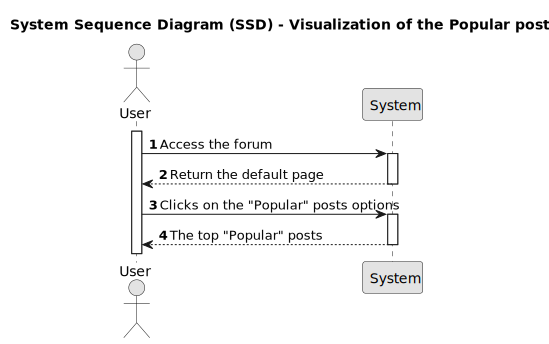

# US004 - Visualization of the Popular posts

## 1. Requirements Engineering

### 1.1. User Story Description

As a user I would like to see the most popular posts ordered descending by the number of votes.

### 1.2. Customer Specifications and Clarifications 

The post populary is given by the number of votes received by the forum users.
Voting is only allowed to members. A member can vote on much posts as he wants.
If wanted, the member can remove his vote on the post.

### 1.3. Acceptance Criteria

* **AC1:** A "Popular" option should appear on the top of the posts list
* **AC2:** When a user clicks on the "Popular" option, the posts list should show the most popular posts
* **AC3:** If no post have been submitted, a blank page should be displayed
* **AC4:** When posts exists the top 15 should be displayed ordered by the number of votes descending
* **AC5:** For each post we should see:
    - The number of votes
    - The title
    - The moment when it was created
    - The username that create the post
    - The number of comments
* **AC6:** The post elements should be grouped as follows:

    &uarr; **"post title"** 
    0 
    &darr; 20 minutes ago | by [username]() | 0 comments

* **AC7:** The number of votes are displayed as follow:

    &uarr; 
    0 
    &darr;

    **Note**: 
    - *For members*:
        - The up vote and down vote functionality will be available. (Implemented under US009)
    - *For visitors*, the following message should be display on mouse over:
        - Want to vote? You need to sign up [Here]()

* **AC8:** The title should be displayed in bold within double quotes: 
    **"Post title goes here!"**

    **Note**: When the user clicks on the post title he should be redirected to the post page. This feature will be implemented under US002.

* **AC9:** The post creation moment should display as follow: 
    1 minute ago

    55 days ago
* **AC10:** The username should be displayed as follows and the name should be an hyperlink to the member details page: 
    by [username]()

    **Note**: The redirect to the member information display will be implemented under US003.

* **AC11:** The number of comments should be display as: 
    0 comments

### 1.4. Found out Dependencies

* [US002 - View Individual Post](../../US002/01.requirements-engineering/readme.md)
* [US003 - View member info](../../US003/01.requirements-engineering/US003.md)
* [US009 - Vote on Post](../../US009/01.requirements-engineering/US009.md) 

### 1.5 Input and Output Data

**Input data:**
Not applicable

**Output data:**
* The list of most popular posts
    * Number of votes
    * Title
    * Creation moment
    * Username
    * Number of comments

### 1.6. System Sequence Diagram (SSD)

### 1.7 Other Relevant Remarks

For posts with the same number of votes there is, apparently, any secundary sort element.