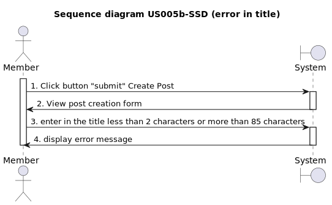

# US005 - Creation a Post

## 1. Requirements Engineering

### 1.1. User Story Description

*As a user, I want to have the ability to create a post in the system.*

### 1.2. Customer Specifications and Clarifications 


### 1.3. Acceptance Criteria

* **AC1:** The user must be logged in as a member to create a post and a "logged in" success message must be displayed.
* **AC1.1:** If the user does not have valid credentials, error messages should be displayed. Examples of error messages are: "There was a problem logging in. An unexpected error occurred" or "There was a problem logging in. The password does not match the error."
* **AC2:** There must be a "submit" button available to begin post creation.
* **AC3:** The post-creation form must include the following fields (Title, text or Link)
* **AC3.1:** The post must have a title with a minimum of 2 and a maximum of 85 characters, otherwise the following error message should be displayed "Yes, the title must have from 2 to 85 characters. Your it was"
* **AC3.2:** Post text must be between 20 and 10,000 characters. If it doesn't meet this requirement, display the error message: "Text posts must be 20 to 10,000 characters. Yours was."
* **AC3.3:** The post must have a Link between 8 and 500 characters.
* **AC3.4:** The post must have Link URLs using the three protocols (HTTP, HTTPS, FTP).
If it does not meet this requirement, display the error message: "Yeahhhhh, The link should be between ${PostUtil.minLinkLength} and ${PostUtil.maxLinkLength} characters long and must be a valid URL using one of the following protocols: ['http', 'https', 'ftp']. Yours was ${text. Length} characters."
* **AC3.3.1:** The link Text Box must be in the format "http//:" + "text".
* **AC4:** There must be a "submit" button available to complete sending the post.
* **AC5:** After sending the post, a confirmation message should be displayed "Done-zo!".

### 1.4. Found out Dependencies
To become a member, the user must have a created account and complete the login process US001 [Register New Account](../../US001/01.requirements-engineering/US001.md) *

### 1.5 Input and Output Data

#### Input Data:

* Post title;
* Post text;

#### Output data:

* Confirmation message validating the submission.*

### 1.6. System Sequence Diagram (SSD)

*Insert an SSD here describing the anticipated Actor-System interactions and how the data is inputted and sent to fulfill the requirement. Number all the interactions.*

<h6 align="center">





</h6>

### 1.7 Other Relevant Remarks

*Nothing relevant to add* 

### 1.8 Bugs

#### **A - Bug - Create a Post with a Link**

**A.1 - Description:**

* Misalignment of the boundary conditions for post creation (link) between Front-end and Back-end.

<br>

**A.2 - Detailed Description:**

For the Web App. DDD "Post Creation with a Link" functionality, both the title and the link must adhere to the boundary conditions set forth in the acceptance criteria **AC3.3** as per the business rules of the web application, which specifies for the **link**, a maximum length of 500 characters and a minimum length of 8 characters.* **AC3.4:** The post must have Link URLs using the three protocols (HTTP, HTTPS, FTP).


<br>

**Create Post (Link) Business Rule (Backend):**

````typescript
// Path: src/modules/forum/domain/postLink.ts

import { ValueObject } from "../../../shared/domain/ValueObject";
import { Result } from "../../../shared/core/Result";
import { Guard } from "../../../shared/core/Guard";
import { TextUtils } from "../../../shared/utils/TextUtils";

interface PostLinkProps {
  url: string;
}

export class PostLink extends ValueObject<PostLinkProps> {
  public static minLength: number = 8; 
  public static maxLength: number = 500;

  get url(): string {
    return this.props.url;
  }

  private constructor(props: PostLinkProps) {
    super(props);
  }

  public static create(props: PostLinkProps): Result<PostLink> {
    const nullGuard = Guard.againstNullOrUndefined(props.url, 'url');

    if (nullGuard.isFailure) {
      return Result.fail<PostLink>(nullGuard.getErrorValue());
    }

   //2nd iteration URL format validation using TextUtils.validateWebURL 
    const isValidURL = TextUtils.validateWebURL(props.url);
    if (!isValidURL) {
      return Result.fail<PostLink>('URL fornecido não é válido');
    }

    const minGuard = Guard.againstAtLeast(this.minLength, props.url);
    const maxGuard = Guard.againstAtMost(this.maxLength, props.url);

    if (minGuard.isFailure) {
      return Result.fail<PostLink>(minGuard.getErrorValue());
    }
    if (maxGuard.isFailure) {
      return Result.fail<PostLink>(maxGuard.getErrorValue());
    }
    return Result.ok<PostLink>(new PostLink(props));
  }
}

// Path: src/shared/utils/TextUtils.ts

import validator from "validator";
import { JSDOM } from "jsdom";
import DOMPurify from "dompurify";
const { window } = new JSDOM("<!DOCTYPE html>");
const domPurify = DOMPurify(window);

export class TextUtils {
  public static sanitize(unsafeText: string): string {
    return domPurify.sanitize(unsafeText);
  }

  public static validateWebURL(url: string): boolean { 
    return validator.isURL(url);// 1st change to isURL
  }

  public static validateEmailAddress(email: string) {
    var re =
      /^(([^<>()\[\]\\.,;:\s@"]+(\.[^<>()\[\]\\.,;:\s@"]+)*)|(".+"))@((\[[0-9]{1,3}\.[0-9]{1,3}\.[0-9]{1,3}\.[0-9]{1,3}\])|(([a-zA-Z\-0-9]+\.)+[a-zA-Z]{2,}))$/;
    return re.test(String(email).toLowerCase());
  }

  public static createRandomNumericString(numberDigits: number): string {
    const chars = "0123456789";
    let value = "";

    for (let i = numberDigits; i > 0; --i) {
      value += chars[Math.round(Math.random() * (chars.length - 1))];
    }

    return value;
  }
}

````
**Create Post (Link) Business Rule (FrontEnd):**

````typescript

// public/app/src/shared/utils/textUtil.tsx
import validator from 'validator';
import psl from 'psl';

export class TextUtil {
  
  public static validateEmail(email: string) {
    var re = /^(([^<>()\[\]\\.,;:\s@"]+(\.[^<>()\[\]\\.,;:\s@"]+)*)|(".+"))@((\[[0-9]{1,3}\.[0-9]{1,3}\.[0-9]{1,3}\.[0-9]{1,3}\])|(([a-zA-Z\-0-9]+\.)+[a-zA-Z]{2,}))$/;
    return re.test(String(email).toLowerCase());
  }

  public static atLeast (text: string, length: number): boolean {
    if (!!text === false || text.length >= length) return false;
    return true;
  }

  public static atMost (text: string, length: number): boolean {
    if (!!text === false || text.length <= length) return false;
    return true;
  }

  public static validateURL(url: string): boolean { // 1st change to isURL (validator)
      ) {
    return validator.isURL(url);
  }
  }
 //.......


 // public/app/src/modules/forum/components/comments/components/PostSubmission.tsx
  isFormValid(): boolean {
    const { title, text, link, postType } = this.state;

    const titlePresent = !!title === true;
    const textPresent = !!text === true;
    const linkPresent = !!link === true;

    if (
      !titlePresent ||
      TextUtil.atLeast(title, PostUtil.minTitleLength) ||
      TextUtil.atMost(title, PostUtil.maxTitleLength)
    ) {
      toast.error(
        `Yeahhhhh, title should be ${PostUtil.minTitleLength} to ${PostUtil.maxTitleLength} characters. Yours was ${title.length}. 🤠`,
        {
          autoClose: 3000
        }
      );
      return false;
    }

    if (postType === 'text') {
      if (
        !textPresent ||
        TextUtil.atLeast(text, PostUtil.minTextLength) ||
        TextUtil.atMost(text, PostUtil.maxTextLength)
      ) {
        toast.error(
          `Yeahhhhh ${PostUtil.minTextLength} to ${PostUtil.maxTextLength} characters. Yours was ${text.length}. 🤠`,
          {
            autoClose: 3000
          }
        );
        return false;
      }
    } else {
      if (
        !linkPresent ||
        TextUtil.atLeast(link, PostUtil.minLinkLength) ||
        TextUtil.atMost(link, PostUtil.maxLinkLength) ||
        !TextUtil.validateURL(link) // 1st change to isURL
      ) {
        toast.error(
          `Yeahhhhh, The link should be between ${PostUtil.minLinkLength} and ${PostUtil.maxLinkLength} characters long and must be a valid URL using one of the following protocols: ['http', 'https', 'ftp']. Yours was ${text.length} characters.🤠`,
          {
            autoClose: 3000
          }
        );
        return false;
      }
    }
    return true;
  }

````
<br>

* However, during the API unit tests conducted, it was observed that the system accepted a link with 2083 characters, violating the maximum length condition and resulting in an unexpected behavior.

<br>

**A.3 - Failed Acceptance Criterias:**

* [AC3.3](/docs/sprintA/US005/01.requirements-engineering/US005.md#13-acceptance-criteria)

<br>

**A.4 - Sequence Diagram**

<h6 align="center">


</h6>

<br>

**A.5 - Severity:**

* **Medium**

<br>
**A.6 - Current Behavior:**

* The system accepts links with fewer than 8 characters, resulting in a status code of 200 instead of the expected 500.
* The system accepts links with any type of string or numbers without checking the protocols a status code of 200 instead of the expected 500.
* Additionally, the system accepts links longer than 500 characters, also resulting in a status code of 200 instead of the expected 500.

<br>

**A.7 - Expected Behavior:**

* The web application must reject, both in the front-end and in the back-end, the creation of links that do not comply with the Business Rules and do not meet the pre-established limit conditions (minimum 8 characters and maximum 500 characters and control protocols [http, https, ftp] as defined in the validator library) and return a status code 500 in case of non-compliance.

<br>

**A.8 - Date and Time of Occurrence:**

* November 30, 2023, at 9 pm

<br>

**A.9 - Steps to Reproduce the Issue:**

>1. Access the API test creation area, specifically US005 (post creation).

>2. Perform a member login test to obtain the access token.

>3. Execute a creation test with the title "US005 - errolink7" and the link "www.b", with a status code of 500.

>4. Execute a creation test with the title "US005 – errolink" and the link "www.google.com/.... oogleerro2083inke84" (with 2083 characters), also with a status code of 500.

>5. After the command "npm run test:api:us005," the expected status code should be 500, but the received status code is 200.

>6. Verify if the maximum and minimum boundary conditions (maximum 500 characters and minimum 8 characters) are not being respected, just as on the front-end.

<br>

**A.10 - Status:**

* **Bug Resolved**
* <a href="https://github.com/Departamento-de-Engenharia-Informatica/switch-qa-23-project-switch-qa-23-3/commit/ae3d02cf83acde9cd326cc4de7fede410ca33401">GitHub Commit History - Bug Fix (12th of September 2023)</a>

<br>


**A.11 - API Unit Testing**

**A.11.1 - Unit Tests - Prior to Bug Fix**

**1 - Test Specs:**
 
    - Test File: us005.api.test.ts
    - Expected Result:
      - Link with 6 character up to 2082 characters: Status Code 200
      - Link up to 5 characters: Status Code 500
      - Link starting from 2083 characters: Status Code 500

<br>

**2 - Test File Source Code:**

>* <a href="https://github.com/Departamento-de-Engenharia-Informatica/switch-qa-23-project-switch-qa-23-3/commit/2d5fc32c782be0b2bdfc49b140e35d486f36e130">GitHub Commit History - Pre Bug Fix API unit tests (22nd of June 2023)</a>

<br>

```typescript
//From "us005.api.test.ts" test file

//parameters of create a post  title success and link success starting from 6 characters (lower boundary 8 characters)
it("US005 - Creates a post link - starting from 6 characters - Status Code: 200 (lower boundary 8 characters) ", async (): Promise<void> => {
    const response = await posts.postCreatePost(accessToken, "US005 - link6characters", "link", "", "www.bu");
    expect(response.status).toBe(200);
});

//parameters of create a post  title sucess and link success 2082 characters (upper boundary 500 characters)
it("US005- Creates a post link - up to 2082 characters - Status Code 200 (upper boundary 500 characters)", async (): Promise<void> => {
    const response = await posts.postCreatePost(accessToken, "US005 - link2082characters", "link", "", "www.google.com/googlegooglegooglegooglegooglegooglegooglegooglegooglegooglegooglegooglegooglegooglegooglegooglegooglegooglegooglegooglegooglegooglegooglegooglegooglegooglegooglegooglegooglegooglegooglegooglegooglegooglegooglegooglegooglegooglegooglegooglegooglegooglegooglegooglegooglegooglegooglegooglegooglegooglegooglegooglegooglegooglegooglegooglegooglegooglegooglegooglegooglegooglegooglegooglegooglegooglegooglegooglegooglegooglegooglegooglegooglegooglegooglegooglegooglegooglegooglegooglegoogle.google.com/googlegooglegooglegooglegooglegooglegooglegooglegooglegooglegooglegooglegooglegooglegooglegooglegooglegooglegooglegooglegooglegooglegooglegooglegooglegooglegooglegooglegooglegooglegooglegooglegooglegooglegooglegooglegooglegooglegooglegooglegooglegooglegooglegooglegooglegooglegooglegooglegooglegooglegooglegooglegooglegooglegooglegooglegooglegooglegooglegooglegooglegooglegooglegooglegooglegooglegooglegooglegooglegooglegooglegooglegooglegooglegooglegooglegooglegooglegooglegooglegooglegooglegooglegooglegooglegooglegooglegooglegooglegooglegooglegooglegooglegooglegooglegooglegooglegooglegooglegooglegooglegooglegooglegooglegooglegooglegooglegooglegooglegooglegooglegooglegooglegooglegooglegooglegooglegooglegooglegooglegooglegooglegooglegooglegooglegooglegooglegooglegooglegooglegooglegooglegooglegooglegooglegooglegooglegooglegooglegooglegooglegooglegooglegooglegooglegooglegooglegooglegooglegooglegooglegooglegooglegooglegooglegooglegooglegooglegooglegooglegooglegoogle.google.com/googlegooglegooglegooglegooglegooglegooglegooglegooglegooglegooglegooglegooglegooglegooglegooglegooglegooglegooglegooglegooglegooglegooglegooglegooglegooglegooglegooglegooglegooglegooglegooglegooglegooglegooglegooglegooglegooglegooglegooglegooglegooglegooglegooglegooglegooglegooglegooglegooglegooglegooglegooglegooglegooglegooglegooglegooglegooglegooglegooglegooglegooglegooglegooglegooglegooglegooglegooglegooglegooglegooglegooglegooglegooglegooglegooglegooglegooglegooglegooglegooglegoogle.com/googlegooglegooglegooglegooglegooglegooglegooglegoooglegoooglegooogelgoogleerro2083ink82");
    expect(response.status).toBe(200);
});

//parameters of create a post title success and link error up to 5 characters (lower boundary 8 characters)
it("US005 - Creates a post error link - up to 5 characters - Status Code: 500 (lower boundary 8 characters) ", async (): Promise<void> => {
    const response = await posts.postCreatePost(accessToken, "US005 - errorlink5characters", "link", "", "www.b");
    expect(response.status).toBe(500);
});

//parameters of create a post title sucess and link error starting from 2083 characters (upper boundary 500 characters)
it("US005 - Creates a post error link - starting from 2083 characters - Status Code: 500 (upper boundary 500 characters)", async (): Promise<void> => {
    const response = await posts.postCreatePost(accessToken, "US005 - errorlink2083characters", "link", "", "www.google.com/googlegooglegooglegooglegooglegooglegooglegooglegooglegooglegooglegooglegooglegooglegooglegooglegooglegooglegooglegooglegooglegooglegooglegooglegooglegooglegooglegooglegooglegooglegooglegooglegooglegooglegooglegooglegooglegooglegooglegooglegooglegooglegooglegooglegooglegooglegooglegooglegooglegooglegooglegooglegooglegooglegooglegooglegooglegooglegooglegooglegooglegooglegooglegooglegooglegooglegooglegooglegooglegooglegooglegooglegooglegooglegooglegooglegooglegooglegooglegooglegoogle.google.com/googlegooglegooglegooglegooglegooglegooglegooglegooglegooglegooglegooglegooglegooglegooglegooglegooglegooglegooglegooglegooglegooglegooglegooglegooglegooglegooglegooglegooglegooglegooglegooglegooglegooglegooglegooglegooglegooglegooglegooglegooglegooglegooglegooglegooglegooglegooglegooglegooglegooglegooglegooglegooglegooglegooglegooglegooglegooglegooglegooglegooglegooglegooglegooglegooglegooglegooglegooglegooglegooglegooglegooglegooglegooglegooglegooglegooglegooglegooglegooglegooglegooglegooglegooglegooglegooglegooglegooglegooglegooglegooglegooglegooglegooglegooglegooglegooglegooglegooglegooglegooglegooglegooglegooglegooglegooglegooglegooglegooglegooglegooglegooglegooglegooglegooglegooglegooglegooglegooglegooglegooglegooglegooglegooglegooglegooglegooglegooglegooglegooglegooglegooglegooglegooglegooglegooglegooglegooglegooglegooglegooglegooglegooglegooglegooglegooglegooglegooglegooglegooglegooglegooglegooglegooglegooglegooglegooglegooglegooglegooglegooglegoogle.google.com/googlegooglegooglegooglegooglegooglegooglegooglegooglegooglegooglegooglegooglegooglegooglegooglegooglegooglegooglegooglegooglegooglegooglegooglegooglegooglegooglegooglegooglegooglegooglegooglegooglegooglegooglegooglegooglegooglegooglegooglegooglegooglegooglegooglegooglegooglegooglegooglegooglegooglegooglegooglegooglegooglegooglegooglegooglegooglegooglegooglegooglegooglegooglegooglegooglegooglegooglegooglegooglegooglegooglegooglegooglegooglegooglegooglegooglegooglegooglegooglegooglegoogle.com/googlegooglegooglegooglegooglegooglegooglegooglegoooglegoooglegooogelgoogleerro2083inke83");
    expect(response.status).toBe(500);
});
```

<br>

**3 - Test Report:**

<h6 align="center">


</h6>

<br>


* **A.12.2 - Unit Tests - Post Source Code Changes for Bug Fix**

**1 - Test Specs:**
 
    - Test File: us005.bug.test.ts
    - Expected Result:
      - Creating a new user;
      - Creation verification (accesstoken);
      - User login;
      - //title

      - post creation (title and text) error 500 title - 200  caracter 1
      - post creation (title and text) successfully title - 200  caracter 2
      - post creation (title and text) successfully title - 200 - caracter 3
      - Post creation (title and text) successfully title - 200  caracter 40
      - Post creation (title and text) successfully title - 200 - caracter 84
      - Post creation (title and text) successfully title - 200 - caracter 85
      - Post creation (title and text) error 500 title - 200 - caracter 86

      -//text
      - post creation (title and text) error 500 text - 200 - caracter 19
      - Post creation (title and text) successfully text - 200  caracter 20
      - post creation (title and text) successfully text - 200 - caracter 21
      - Post creation (title and text) successfully text - 200 - caracter 5000
      - Post creation (title and text) successfully text - 200  caracter 9999
      - Post creation (title and text) successfully text - 200  caracter 10 000
      - Post creation (title and text) error 500 text - 200 - caracter 10 001

      - //link 
      - link size conditions from 8 to 500 characters
      - Post creation (title and link) error - 200 - caracter 7;
      - Post creation (title and link) successfully - 200 - caracter 8;
      - Post creation (title and link) successfully - 200 - caracter 9;
      - Post creation (title and link) successfully - 200 - caracter 250
      - Post creation (title and link) successfully - 200 - caracter 499
      - Post creation (title and link) successfully - 200 - caracter 500
      - Post creation (title and link) error 500 - caracter 501;

      - formatting conditions (validator), common protocols   ('http', 'https', 'ftp')
      - Post creation (title and link) http - 200 
      - Post creation (title and link) http - 500 
      - Post creation (title and link) https - 200
      - Post creation (title and link) https - 500
      - Post creation (title and link) ftp - 200 
      - Post creation (title and link) ftp - 500 
      - Post Creates a post error link ssh - 500 
      -Post creation (title and link) string - 500 
      - Post creation (title and link) number - 500 
      - Post creation (title and link) !#$%&/()=! - 500 


<br>

**2 - Test File Source Code:**

```typescript
 // testing on create a post sucess title (2 - 85 characters):
  it("US005 - Creates a post error title 1 characters", async (): Promise<void> => {
    //arrange and act
    const response = await posts.postCreatePost(
      accessToken,
      "U",
      "text",
      "text",
      ""
    );
    //assert
    expect(response.status).toBe(500);
  });
  it("US005 - Creates a post sucess title 2 characters", async (): Promise<void> => {
    //arrange and act
    const response = await posts.postCreatePost(
      accessToken,
      "US",
      "text",
      "text",
      ""
    );
    //assert
    expect(response.status).toBe(200);
  });
  it("US005 - Creates a post sucess title 3 characters", async (): Promise<void> => {
    //arrange and act
    const response = await posts.postCreatePost(
      accessToken,
      "US0",
      "text",
      "text",
      ""
    );
    //assert
    expect(response.status).toBe(200);
  });
  it("US005 - Creates a post sucess title 40 characters", async (): Promise<void> => {
    //arrange and act
    const response = await posts.postCreatePost(
      accessToken,
      "US005 - Creates a post sucess title 40 characters",
      "text",
      "text",
      ""
    );
    //assert
    expect(response.status).toBe(200);
  });
  it("US005 - Creates a post sucess title 84 characters", async (): Promise<void> => {
    //arrange and act
    const response = await posts.postCreatePost(
      accessToken,
      "US005 - Creates a post sucess title 84 characters",
      "text",
      "text",
      ""
    );
    //assert
    expect(response.status).toBe(200);
  });
  it("US005 - Creates a post sucess title 85 characters", async (): Promise<void> => {
    //arrange and act
    const response = await posts.postCreatePost(
      accessToken,
      "N".repeat(85),
      "text",
      "text",
      ""
    );
    //assert
    expect(response.status).toBe(200);
  });
  it("US005 - Creates a post error title 86 characters", async (): Promise<void> => {
    //arrange and act
    const response = await posts.postCreatePost(
      accessToken,
      "N".repeat(86),
      "text",
      "text",
      ""
    );
    //assert
    expect(response.status).toBe(500);
  });
  // testing on create a post sucess text (20 - 10000 characters):
  it("US005 - Creates a post error text 19 characters", async (): Promise<void> => {
    //arrange and act
    const response = await posts.postCreatePost(
      accessToken,
      "US005 - Creates a post error text 19 characters",
      "text",
      "N".repeat(19),
      ""
    );
    //assert
    expect(response.status).toBe(200);
  });
  it("US005 - Creates a post sucess text 20 characters", async (): Promise<void> => {
    //arrange and act
    const response = await posts.postCreatePost(
      accessToken,
      "US005 - Creates a post sucess text 20 characters",
      "text",
      "N".repeat(20),
      ""
    );
    //assert
    expect(response.status).toBe(200);
  });
  it("US005 - Creates a post sucess text 21 characters", async (): Promise<void> => {
    //arrange and act
    const response = await posts.postCreatePost(
      accessToken,
      "US005 - Creates a post sucess text 21 characters",
      "text",
      "N".repeat(21),
      ""
    );
    //assert
    expect(response.status).toBe(200);
  });
  it("US005 - Creates a post sucess text 5000 characters", async (): Promise<void> => {
    const response = await posts.postCreatePost(
      //arrange and act
      accessToken,
      "US005 - Creates a post sucess text 5000 characters",
      "text",
      "N".repeat(5000),
      ""
    );
    //assert
    expect(response.status).toBe(200);
  });
  it("US005 - Creates a post sucess text 9999 characters", async (): Promise<void> => {
    //arrange and act
    const response = await posts.postCreatePost(
      accessToken,
      "US005 - Creates a post sucess text 9999 characters",
      "text",
      "N".repeat(9999),
      ""
    );
    //assert
    expect(response.status).toBe(200);
  });
  it("US005 - Creates a post sucess text 10000 characters", async (): Promise<void> => {
    //arrange and act
    const response = await posts.postCreatePost(
      accessToken,
      "US005 - Creates a post sucess text 10000 characters",
      "text",
      "N".repeat(10000),
      ""
    );
    //assert
    expect(response.status).toBe(200);
  });
  it("US005 - Creates a post error text 10001 characters", async (): Promise<void> => {
    //arrange and act
    const response = await posts.postCreatePost(
      accessToken,
      "US005 - Creates a post error text 10001 characters",
      "text",
      "N".repeat(10001),
      ""
    );
    //assert	
    expect(response.status).toBe(500);
  });
  // testing on create a post sucess link (8 - 500 characters):
  it("US005 - Creates a post error link 7 characters", async (): Promise<void> => {
    //arrange and act
    const response = await posts.postCreatePost(
      accessToken,
      "US005 - Creates a post error link 7 characters",
      "link",
      "",
      "www.bcm"
    );
    //assert
    expect(response.status).toBe(500);
  });
  it("US005 - Creates a post sucess link 8 characters", async (): Promise<void> => {
    //arrange and act
    const response = await posts.postCreatePost(
      accessToken,
      "US005 - Creates a post sucess link 8 characters",
      "link",
      "",
      "www.bcom"
    );
    //assert
    expect(response.status).toBe(200);
  });
  it("US005 - Creates a post sucess link 9 characters", async (): Promise<void> => {
    //arrange and act
    const response = await posts.postCreatePost(
      accessToken,
      "US05 - Creates a post sucess link 9 characters",
      "link",
      "",
      "www.bcomm"
    );
    //assert
    expect(response.status).toBe(200);
  });
  it("US005 - Creates a post sucess link 250 characters", async (): Promise<void> => {
    //arrange and act
    const response = await posts.postCreatePost(
      accessToken,
      "US005 - Creates a post sucess link 250 characters",
      "link",
      "",
      "www.google.com/googlegooglegooglegooglegooglegooglegooglegooglegooglegooglegooglegooglegooglegooglegooglegooglegooglegooglegooglegooglegooglegooglegooglegooglegooglegooglegooglegooglegooglegooglegooglegooglegooglegooglegooglegooglegooglegooglegoog250"
    );
    //assert
    expect(response.status).toBe(200);
  });
  it("US005 - Creates a post sucess link 499 characters", async (): Promise<void> => {
    //arrange and act
    const response = await posts.postCreatePost(
      accessToken,
      "US05 - Creates a post sucess link 499 characters",
      "link",
      "",
      "www.google.com/googlegooglegooglegooglegooglegooglegooglegooglegoog250www.google.com/googlegooglegooglegooglegooglegooglegooglegooglegoo499e.com/googlegooglegooglegooglegooglegooglegooglegooglegoo499e.com/googlegooglegooglegooglegooglegooglegooglegooglegoo499e.com/googlegooglegooglegooglegooglegooglegooglegooglegoo499e.com/googlegooglegooglegooglegooglegooglegooglegooglegoo499e.com/googlegooglegooglegooglegooglegooglegooglegooglegoo499e.com/googlegooglegooglegooglegooglegooglegooglegooglegoo499"
    );
    //assert
    expect(response.status).toBe(200);
  });
  it("US005 - Creates a post sucess link 500 characters", async (): Promise<void> => {
    //arrange and act
    const response = await posts.postCreatePost(
      accessToken,
      "US005 - Creates a post sucess link 500 characters",
      "link",
      "",
      "www.google.com/googlegooglegooglegooglegooglegooglegooglegooglegooglegooglegooglegooglegooglegooglegooglegooglegooglegooglegooglegooglegooglegooglegooglegooglegooglegooglegooglegooglegooglegooglegooglegooglegooglegooglegooglegooglegooglegooglegoogwww.google.com/googlegooglegooglegooglegooglegooglegooglegooglegooglegooglegooglegooglegooglegooglegooglegooglegooglegooglegooglegooglegooglegooglegooglegooglegooglegooglegooglegooglegooglegooglegooglegooglegooglegooglegooglegooglegooglegooglegoog000500"
    );
    //assert
    expect(response.status).toBe(200);
  });
  it("US005 - Creates a post error link 501 characters", async (): Promise<void> => {
    //arrange and act
    const response = await posts.postCreatePost(
      accessToken,
      "US005 - Creates a post error link 501 characters",
      "link",
      "",
      "www.google.com/googlegooglegooglegooglegooglegooglegooglegooglegooglegooglegooglegooglegooglegooglegooglegooglegooglegooglegooglegooglegooglegooglegooglegooglegooglegooglegooglegooglegooglegooglegooglegooglegooglegooglegooglegooglegooglegooglegoogwww.google.com/googlegooglegooglegooglegooglegooglegooglegooglegooglegooglegooglegooglegooglegooglegooglegooglegooglegooglegooglegooglegooglegooglegooglegooglegooglegooglegooglegooglegooglegooglegooglegooglegooglegooglegooglegooglegooglegooglegoog0000501"
    );
    //assert
    expect(response.status).toBe(500);
  });
  // formatting conditions (validator),common protocols (HTTP ,HTTPS , FTP, SSH,Telnet,File)
  it("US005 - Creates a post sucess link http", async (): Promise<void> => {
    //arrange and act
    const response = await posts.postCreatePost(
      accessToken,
      "US005 - Creates a post sucess link http",
      "link",
      "",
      "http://www.google.com"
    );
    //assert
    expect(response.status).toBe(200);
  });
  it("US005 - Creates a post error link http", async (): Promise<void> => {
    //arrange and act
    const response = await posts.postCreatePost(
      accessToken,
      "US005 - Creates a post error link http",
      "link",
      "",
      "http:/www.google.com"
    );
    //assert
    expect(response.status).toBe(500);
  });
  it("US005 - Creates a post sucess link https", async (): Promise<void> => {
    //arrange and act
    const response = await posts.postCreatePost(
      accessToken,
      "US005 - Creates a post sucess link https",
      "link",
      "",
      "https://www.google.com"
    );
    //assert
    expect(response.status).toBe(200);
  });
  it("US005 - Creates a post error link https", async (): Promise<void> => {
    //arrange and act
    const response = await posts.postCreatePost(
      accessToken,
      "US005 - Creates a post error link https",
      "link",
      "",
      "https:/www.google.com"
    );
    //assert
    expect(response.status).toBe(500);
  });
  it("US005 - Creates a post sucess link ftp", async (): Promise<void> => {
    //arrange and act
    const response = await posts.postCreatePost(
      accessToken,
      "US005 - Creates a post sucess link ftp",
      "link",
      "",
      "ftp://www.google.com"
    );
    //assert
    expect(response.status).toBe(200);
  });
  it("US005 - Creates a post error link ftp", async (): Promise<void> => {
    //arrange and act
    const response = await posts.postCreatePost(
      accessToken,
      "US005 - Creates a post error link ftp",
      "link",
      "",
      "ftp:/www.google.com"
    );
    //assert
    expect(response.status).toBe(500);
  });
  it("US005 - Creates a post error link ssh", async (): Promise<void> => {
    //arrange and act
    const response = await posts.postCreatePost(
      accessToken,
      "US005 - Creates a post sucess link ssh",
      "link",
      "",
      "ssh://www.google.com"
    );
    //assert
    expect(response.status).toBe(500);
  });

  it("US005 - Creates a post error link string", async (): Promise<void> => {
    //arrange and act
    const response = await posts.postCreatePost(
      accessToken,
      "string",
      "link",
      "",
      "string"
    );
    //assert
    expect(response.status).toBe(500);
  });
  it("US005 - Creates a post error link number", async (): Promise<void> => {
    //arrange and act
    const response = await posts.postCreatePost(
      accessToken,
      "number",
      "link",
      "",
      "123456789"
    );
    //assert
    expect(response.status).toBe(500);
  });
  it("US005 - Creates a post error link !#$%&/()=!", async (): Promise<void> => {
    //arrange and act
    const response = await posts.postCreatePost(
      accessToken,
      "!#$%&/()=!",
      "link",
      "",
      "!#$%&/()=!"
    );
    //assert
    expect(response.status).toBe(500);
  });
});
  export default {};

```

<br>

**3 - Test Report:**

<h6 align="center">


</h6>

<br>

# 4. Construction (Implementation)

*In this section, it is suggested to provide, if necessary, some evidence that the construction/implementation is in accordance with the previously carried out design. Furthermore, it is recommeded to mention/describe the existence of other relevant (e.g. configuration) files and highlight relevant commits.*

*It is also recommended to organize this content by subsections.* 

# 5. Integration and Demo 

*In this section, it is suggested to describe the efforts made to integrate this functionality with the other features of the system.*

# 6. Observations

*In this section, it is suggested to present a critical perspective on the developed work, pointing, for example, to other alternatives and or future related work.*


