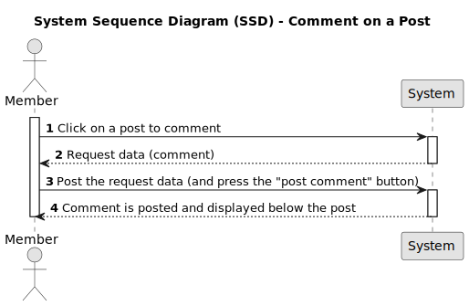

# US007 - Comment a post

## 1. Requirements Engineering


### 1.1. User Story Description

*As a Member, I want to comment a post.*

### 1.2. Customer Specifications and Clarifications 

* Members can comment any post*
* Visitors can only view posts and not comment*
* Post comments must have a minimum of 20 and a maximum of 10000 characters*
* Post comments can contain: text, images or code

*From the client clarifications:**

Question: Can posts be deleted by anyone?
Answer: No one can delete posts.

Question: Can comment on posts be deleted by anyone?
Answer: No one can delete comment on posts.

Question: Who can comment a post?
Answer: Only members can comment on posts.

Question: Who can view the comments?
Answer: Everybody (members and visitors).

Question: What is the minimum and maximum comment lenght?
Answer: Post comments must have a minimum of 20 and a maximum of 10000 characters

Question: What will happen if the minimum and the maximum comment lenght are not applied?
Answer: It will trigger a validation message on the top right corner


### 1.3. Acceptance Criteria

* **AC1:** Only members can submit comments
* **AC2:** Comments must have between 20 to 10000 characters. If not, a validation message will be displayed: "Yeahhhhh, comments should be 20 to 10000 characters. Yours was "number""
* **AC3:** When comments are submit with sucess, a validation message will be displayed: "Done-zo"
* **AC4:** A new comment is created with 0 votes
* 
### 1.4. Found out Dependencies

* For members: depends on US001* [Register New Account](../../US001/01.requirements-engineering/US001.md)  
  
### 1.5 Input and Output Data

***Input Data:**

* Typed Data:
	* Comments (text, image or code)

**Output Data:**

* Display the comment on the page
* Error message: "Yeahhhhh, comments should be 20 to 10000 characters. Yours was "number""
* Validation message: "Done-zo" 

### 1.6. System Sequence Diagram (SSD)



### 1.7 Other Relevant Remarks

*When a comment is displayed below the Post, the vote counter initialized in one* 

### 1.8 Bugs

#### **A - Bug Comment to post created with 1 vote**

**A.1 - Description:**

* When creating the comment, it is automatically assigned 1 up vote.

**A.2 - Detailed Description:**

* Every time a new comment is created it already has 1 positive vote related to it instead of 0 votes, the expected behavior would be to have the comment created with 0 votes.

 **A.3 - Failed Acceptance Criterias:**

* [AC4](/docs/sprintA/US007/01.requirements-engineering/US007.md#13-acceptance-criteria)


**A.4 - Sequence Diagram**


**A.5 - Severity:**

* **Medium**

**A.6 - Current Behaviour:**

* when the comment is posted, the vote start at 1

**A.7 - Expected Behaviour:**

*  when the comment is posted, the vote should start at zero


**A.8 - Date and Time of Occurrence:**

* September 21, 2023, at 9:00 PM 

**A.9 - Steps to Reproduce the Issue:**

The steps to produce the bug are:

>1. Access the application

>2. Select a post

>3. Type a comment in the comments text box.


**A.10 - Status:**

* **Bug Resolved**


**A.11 - Code Modification in "comment":**


  * These modifications were implemented to ensure that
 the comment is created with zero votes. Now comments are created correctly with zero votes according to the established conditions*

  ```typescript

export class Comment extends Entity<CommentProps> {
// ... (code)
public static create(props: CommentProps, id?: UniqueEntityID): Result<Comment> {
 // ... (code)
  const defaultCommentProps: CommentProps = {
    ...props,
    points: 0, // Setting points initially to 0
    votes: CommentVotes.create([]) // Creating a new empty vote set
    const comment = new Comment(defaultCommentProps, id);

      return Result.ok<Comment>(comment);
    }
  }
}  
```
**A.12 - API Unit Testing**

**A.12.1 - Unit Tests - Prior to Bug Fix**

**1 - Test Specs:**

    - Test File: us007.api.test.ts
    - Expected Result:
      - Comment between 20 and 10000 characters with a user logged in: Status Code 200
      -  Comment with 20 characters: Status Code 200
      -  Comment with 10000 characters: Status Code 200
      -  Comment a Post without a user logged in : Status Code 403
      -  Comment with 19 characters: Status Code 403
      -  Comment with 10001 characters: Status Code 403

<br>

**2 - Test File Source Code:**

  ```typescript
 /**
       * US 007 - Comment a Post
       * Test 01 - Testing sucess comments - Must be logged in and comment must have between 20 and 10000 characters
       */

      it("US007 - Test 01: Testing sucess comments - Must be logged in and comment must have between 20 and 10000 characters", async (): Promise<void> => {
        log.debug("slug " + slug);
        log.debug("Access token: " + accessToken);

        const response = await comments.replyPost(accessToken, slug, "<p>Comentário de Sucesso</p>");

        expect(response.status).toBe(200);

      });

      /**
       * US 007 - Comment a Post
       * Test 02 - Testing the Numbers of Characters (20) in the Comment - Must have between 20 and 10000 characters
       */

      it("US007 - Test 02: Testing the Numbers of Characters (20) in the Comment - Must have between 20 and 10000 characters", async (): Promise<void> => {
        log.debug("slug " + slug);
        log.debug("Access token: " + accessToken);

        const response = await comments.replyPost(accessToken, slug, "<p>1234567891234</p>");

        expect(response.status).toBe(200);
      });

      /**
         * US 007 - Comment a Post
         * Test 03 - Testing the Numbers of Characters (10000) in the Comment - Must have between 20 and 10000 characters
         */

      it("US007 - Test 03: Testing the Numbers of Characters (10000) in the Comment - Must have between 20 and 10000 characters", async (): Promise<void> => {
        log.debug("slug " + slug);
        log.debug("Access token: " + accessToken);

        const response = await comments.replyPost(accessToken, slug, "S".repeat(10000));

        expect(response.status).toBe(200);
      });

      /**
       * US 007 - Comment a Post
       * Test 04 - Testing the Comment of a Post without a user logged in
       */

      it("US007 - Test 04: Testing the Comment of a Post without a user logged in", async (): Promise<void> => {
        log.debug("slug " + slug);
        log.debug("Access token: " + accessToken);

        const response = await comments.replyPost("", slug, "<p> Comentário sem Login </p>");

        expect(response.status).toBe(403);

      });
      /**
      * US 007 - Comment a Post
      * Test 05 - Testing the Numbers of Characters (19) in the Comment
      */

      it("US007 - Test 05: Testing the Numbers of Characters (19) in the Comment", async (): Promise<void> => {
        log.debug("slug " + slug);
        log.debug("Access token: " + accessToken);

        const response = await comments.replyPost("", slug, "A".repeat(19));

        expect(response.status).toBe(403);

      });

      /**
           * US 007 - Comment a Post
           * Test 06 - Testing the Numbers of Characters (10001) in the Comment
           */

      it("US007 - Test 06: Testing the Numbers of Characters (10001) in the Comment", async (): Promise<void> => {
        log.debug("slug " + slug);
        log.debug("Access token: " + accessToken);

        const response = await comments.replyPost(accessToken, slug, "D".repeat(10001));
        expect(response.status).toBe(500);

      });
  ```

**3 - Test Report:**

* **A.12.2 - Unit Tests - Post Source Code Changes for Bug Fix**

**1 - Test Specs:**

    - Test File: us007.bug.test.ts
    - Expected Result:
      - Comment between 20 and 10000 characters with a user logged in: Status Code 200
      - Comment a post with zero votes: Status Code 200

<br>


**2 - Test File Source Code:**
 ```typescript
       /**
       * US 007 - Comment a Post
       * Test 01 - Testing sucess comments - Must be logged in and comment must have between 20 and 10000 characters
       */

      it(" US007-bug - Test 01: Testing sucess comments - Must be logged in and comment must have between 20 and 10000 characters", async (): Promise<void> => {
        log.debug("slug " + slug);
        log.debug("Access token: " + accessToken);
        const response = await comments.replyPost(accessToken, slug, "<p>Comentário de Sucesso</p>");
        expect(response.status).toBe(200);
      });
         //zero votes verification test when creating a comment
         it("US007-bug get comment2 points(ok 0 vote)", async (): Promise<void> => {
          const response = await comments.getComment2(slug, "<p>Comentário de Sucesso</p>", 0);
          expect(response.status).toBe(200);
    });
 ```


**3 - Test Report:**


## 2. OO Analysis

### 2.1. Relevant Domain Model Excerpt 
*In this section, it is suggested to present an excerpt of the domain model that is seen as relevant to fulfill this requirement.* 


### 2.2. Other Remarks

*Use this section to capture some aditional notes/remarks that must be taken into consideration into the design activity. In some case, it might be usefull to add other analysis artifacts (e.g. activity or state diagrams).* 

## 3. Design - User Story Realization 

### 3.1. Rationale

**The rationale grounds on the SSD interactions and the identified input/output data.**

| Interaction ID | Question: Which class is responsible for... | Answer  | Justification (with patterns)  |
|:-------------  |:--------------------- |:------------|:---------------------------- |
| Step 1  		 |							 |             |                              |
| Step 2  		 |							 |             |                              |
| Step 3  		 |							 |             |                              |
| Step 4  		 |							 |             |                              |
| Step 5  		 |							 |             |                              |
| Step 6  		 |							 |             |                              |              
| Step 7  		 |							 |             |                              |
| Step 8  		 |							 |             |                              |
| Step 9  		 |							 |             |                              |
| Step 10  		 |							 |             |                              |  


### Systematization ##

According to the taken rationale, the conceptual classes promoted to software classes are: 

 * Class1
 * Class2
 * Class3

Other software classes (i.e. Pure Fabrication) identified: 
 * xxxxUI  
 * xxxxController

## 3.2. Sequence Diagram (SD)

*In this section, it is suggested to present an UML dynamic view stating the sequence of domain related software objects' interactions that allows to fulfill the requirement.* 


## 3.3. Class Diagram (CD)

*In this section, it is suggested to present an UML static view representing the main domain related software classes that are involved in fulfilling the requirement as well as and their relations, attributes and methods.*


# 4. Tests 
*In this section, it is suggested to systematize how the tests were designed to allow a correct measurement of requirements fulfilling.* 

**_DO NOT COPY ALL DEVELOPED TESTS HERE_**

**Test 1:** Check that it is not possible to create an instance of the Example class with null values. 

	@Test(expected = IllegalArgumentException.class)
		public void ensureNullIsNotAllowed() {
		Exemplo instance = new Exemplo(null, null);
	}

*It is also recommended to organize this content by subsections.* 

# 5. Construction (Implementation)

*In this section, it is suggested to provide, if necessary, some evidence that the construction/implementation is in accordance with the previously carried out design. Furthermore, it is recommeded to mention/describe the existence of other relevant (e.g. configuration) files and highlight relevant commits.*

*It is also recommended to organize this content by subsections.* 

# 6. Integration and Demo 

*In this section, it is suggested to describe the efforts made to integrate this functionality with the other features of the system.*

# 7. Observations

*In this section, it is suggested to present a critical perspective on the developed work, pointing, for example, to other alternatives and or future related work.*


