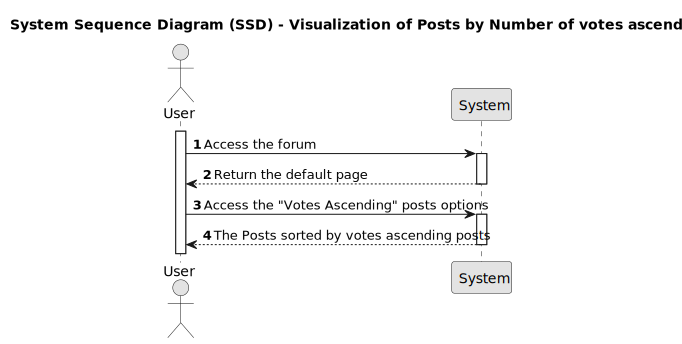
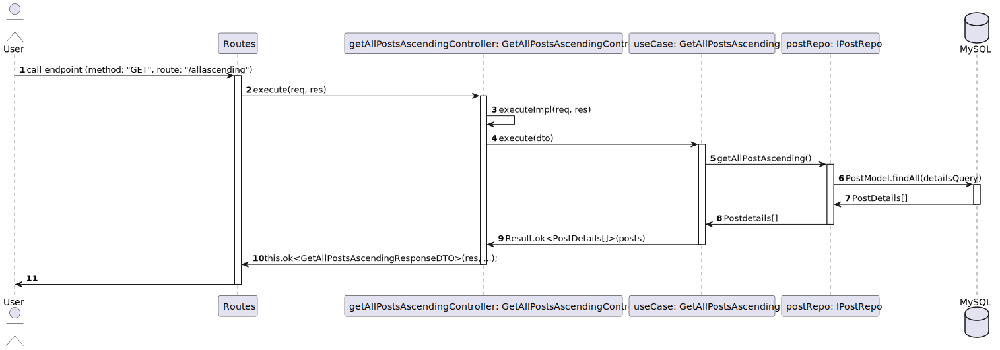

# US011 - Visualization of Posts by number of votes ascending

## 1. Requirements Engineering

### 1.1. User Story Description

As a user I would like to see the posts ordered number of votes ascending.

### 1.2. Customer Specifications and Clarifications 

The post are given by the number of votes received by the forum users in ascending order. 
If the posts have the same number of posts they should be order by the created moment ascending.

### 1.3. Acceptance Criteria

* **AC1:** An "Ascending" option should appear on the top of the posts list.
* **AC2:** When a user clicks on the "Ascending" option, the posts list should show the posts order by number of votes ascending.
* **AC3:** If no post have been submitted, a blank page should be displayed.
* **AC4:** When posts exists they should be displayed ordered by the number of votes ascending.
* **AC5:** When more than one post has the same amount of votes, they should by sorted by creation date ascending.
* **AC6:** For each post we should see:
    - The number of votes
    - The title
    - The moment when it was created
    - The username that create the post
    - The number of comments
* **AC7:** The post elements should be grouped as follows:

    &uarr; **"post title"** 
    0 
    &darr; 20 minutes ago | by [username]() | 0 comments

* **AC8:** The number of votes are displayed as follow:

    &uarr; 
    0 
    &darr;

    **Note**: 
    - *For members*:
        - The up vote and down vote functionality will be available. (Implemented under US009)
    - *For visitors*, the following message should be display on mouse over:
        - Want to vote? You need to sign up [Here]()

* **AC9:** The title should be displayed in bold within double quotes: s
    **"Post title goes here!"**

    **Note**: When the user clicks on the post title he should be redirected to the post page. This feature will be implemented under US002.

* **AC10:** The post creation moment should display as follow: 
    1 minute ago

    55 days ago
* **AC11:** The username should be displayed as follows and the name should be an hyperlink to the member details page: 
    by [username]()

    **Note**: The redirect to the member information display will be implemented under US003.

* **AC12:** The number of comments should be display as: 
    0 comments
   
### 1.4. Found out Dependencies

* [US002 - View Individual Post](../../US002/01.requirements-engineering/readme.md)
* [US003 - View member info](../../US003/01.requirements-engineering/US003.md)
* [US009 - Vote on Post](../../US009/01.requirements-engineering/US009.md) 

### 1.5 Input and Output Data

**Input data:**
Not applicable

**Output data:**
* The list of posts order by number of votes ascending
    * Number of votes
    * Title
    * Creation moment
    * Username
    * Number of comments

### 1.6. System Sequence Diagram (SSD)

### 1.7 Other Relevant Remarks

For posts with the same number of votes they should be order by the creation date ascending.

### 1.8 Bugs

## 2. OO Analysis

### 2.1. Relevant Domain Model Excerpt 
*By default, an existing email account is required to create an account in the system* 

### 2.2. Other Remarks

*Use this section to capture some aditional notes/remarks that must be taken into consideration into the design activity. In some case, it might be usefull to add other analysis artifacts (e.g. activity or state diagrams).* 

## 3. Design - User Story Realization 

### 3.1. Rationale

**The rationale grounds on the SSD interactions and the identified input/output data.**

| Interaction ID | Question: Which class is responsible for... | Answer  | Justification (with patterns)  |
|:-------------  |:--------------------- |:------------|:---------------------------- |
| Step 1  		 |							 |             |                              |
| Step 2  		 |							 |             |                              |
| Step 3  		 |							 |             |                              |
| Step 4  		 |							 |             |                              |
| Step 5  		 |							 |             |                              |
| Step 6  		 |							 |             |                              |              
| Step 7  		 |							 |             |                              |
| Step 8  		 |							 |             |                              |
| Step 9  		 |							 |             |                              |
| Step 10  		 |							 |             |                              |  

### Systematization ##

According to the taken rationale, the conceptual classes promoted to software classes are: 

 * Class1
 * Class2
 * Class3

Other software classes (i.e. Pure Fabrication) identified: 
 * xxxxUI  
 * xxxxController

## 3.2. Sequence Diagram (SD)

*In this section, it is suggested to present an UML dynamic view stating the sequence of domain related software objects' interactions that allows to fulfill the requirement.* 

## 3.3. Class Diagram (CD)

*In this section, it is suggested to present an UML static view representing the main domain related software classes that are involved in fulfilling the requirement as well as and their relations, attributes and methods.*

# 4. Tests 
*In this section, it is suggested to systematize how the tests were designed to allow a correct measurement of requirements fulfilling.* 

**_DO NOT COPY ALL DEVELOPED TESTS HERE_**

**Test 1:** Check that it is not possible to create an instance of the Example class with null values. 

	@Test(expected = IllegalArgumentException.class)
		public void ensureNullIsNotAllowed() {
		Exemplo instance = new Exemplo(null, null);
	}

*It is also recommended to organize this content by subsections.* 

# 5. Construction (Implementation)

*In this section, it is suggested to provide, if necessary, some evidence that the construction/implementation is in accordance with the previously carried out design. Furthermore, it is recommeded to mention/describe the existence of other relevant (e.g. configuration) files and highlight relevant commits.*

*It is also recommended to organize this content by subsections.* 

# 6. Integration and Demo 

*In this section, it is suggested to describe the efforts made to integrate this functionality with the other features of the system.*

# 7. Observations

*In this section, it is suggested to present a critical perspective on the developed work, pointing, for example, to other alternatives and or future related work.*

