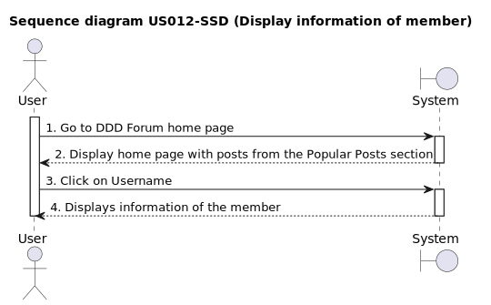
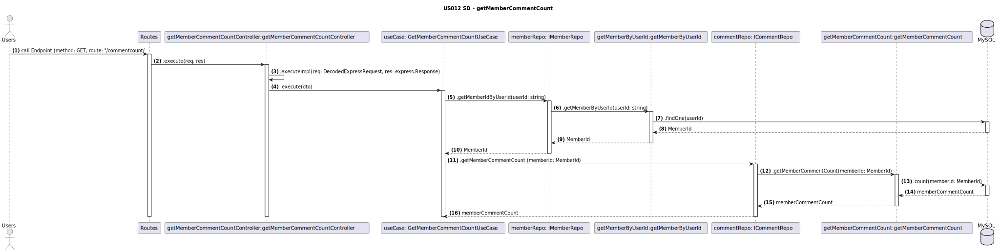
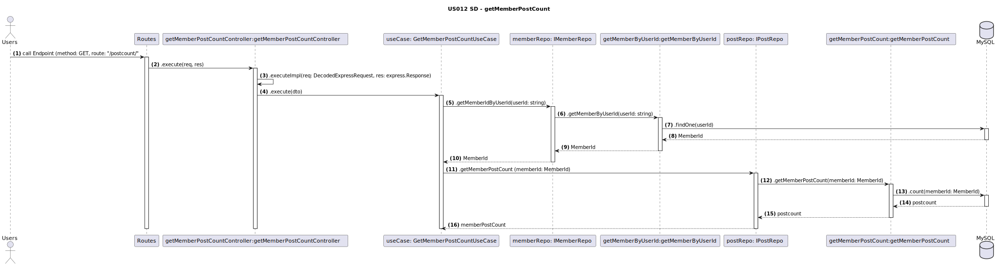

### 1.1. User Story Description

As a user I want to see the detailed information of any member by clicking on the member's username, so that I can see the information of the member.

### 1.2. Customer Specifications and Clarifications 

* Users and members can see the information of members
* Users and members can see the information of themselves

**From the client clarifications:**

>**Question:** Who can see the information of members?
>**Answer:**  Everyone can see the information of members (logged in or not)

>**Question:** What information can be seen?
>**Answer:** Username, number of posts of the current user, number of comments of the current user, username with the greatest number of comments and its number of comments

>**Question:**

### 1.3. Acceptance Criteria

* **AC1:** Member must define the username and email when creating an account, this information will be displayed in the member's information page
* **AC2:** Users can see the information of themselves and of other members
* **AC3:** The information to be displayed is: Username, number of posts of the current user, number of comments of the current user, username with the greatest number of comments and its number of comments

### 1.4. Found out Dependencies

*To become a member, the user must have a created account and complete the login process US001 [Register New Account](../../US001/01.requirements-engineering/US001.md) *

*As a Member, I want to create a post US005 [Creation a Post](../../US005/01.requirements-engineering/US005.md)*

*As a Member, I want to comment a post US007 [Comment a Post](../../US007/01.requirements-engineering/US007.md)*

### 1.5 Input and Output Data

***Input Data:**

- Click on the member's username

**Output Data:**

* Member Information Page with the following details:
*  Username,
*  Number of posts of the current user, 
*  Number of comments of the current user,
*  Username with the greatest number of comments and its number of comments

### 1.6. System Sequence Diagram (SSD)

	_Insert an SSD here describing the anticipated Actor-System interactions and how the data is inputted and sent to fulfill the requirement. Number all the interactions._

*Nothing relevant to add* 

**A.4 - Sequence Diagram**

<h6 align="center">

 

 