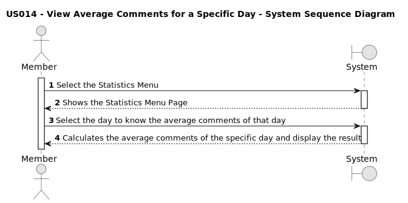
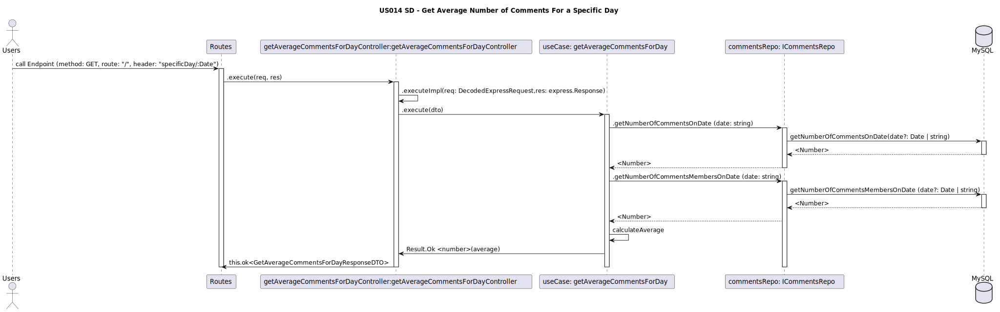

# US014 - Average number of comments for a specific day

## 1. Requirements Engineering
* As a Member, I wish to know the average number of comments for a specific day.*

### 1.1. User Story Description

### 1.2. Customer Specifications and Clarifications
* As a Member I want to easily access and view the average number of comments for a specific day. This could be helpful to gauge the level of engagement or activity on a particular day.

**From the client clarifications:**

>* **Question:** Where is the information displayed?
>* **Answer:** In the new statistics page section.

 

>* **Question:** Where is the statistics page located?
>* **Answer:** To access the statistics page the button is located in the top right corner near Logout button.

 

>* **Question:** Who can access the statistics page?
>* **Answer:** Only Members that are logged in.

 

>* **Question:** If there is no comments created on a specific day, what should be displayed?
>* **Answer:** It should be displayed the value 0

 

>* **Question:** How do you want to display the average of comments?
>* **Answer:** It should have a calendar where the user can choose the date and the average of comments should be displayed in a label. It should have a button, named "refresh", to update the average of comments.

 

### 1.3. Acceptance Criteria

- **AC1:** The user should be able to select a specific day for which they want to know the average of comments;

- **AC2:** The refresh button is only enabled after the user selects a valid day for which they want to know the average of comments;
- 
- **AC3:** The average of comments should be updated in real-time or at regular intervals to reflect any new comments made on the specified day;

- **AC4:** The "average number of comments for a Specific Day" will be the first metric displayed in the "Statistics Page" 

- **AC5:** When the refresh button is pressed, the average number of comments for a specific day will be updated. The information will be displayed in a label below the button.

### 1.4. Found out Dependencies

*For members: depends on US001* [Register New Account](../../US001/01.requirements-engineering/US001.md)*

*To become a member, the user must have a created account and complete the login process US001 [Register New Account](../../US001/01.requirements-engineering/US001.md) *

*As a Member, I want to post US005 [Creation a Post](../../US005/01.requirements-engineering/US005.md) *

*As a Member, I want to comment a post US007 [Creation Comment a Post](../../US007/01.requirements-engineering/US007.md)*

### 1.5 Input and Output Data

#### Input Data:

- The user selects a specific date for which they want to know the average number of comments

#### Output data:

- The system calculates and outputs the average number of comments made on the specified day.

### 1.6. System Sequence Diagram (SSD)

_Insert an SSD here describing the anticipated Actor-System interactions and how the data is inputted and sent to fulfill the requirement. Number all the interactions._

<h6 align="center">

</h6>

### 1.7 Other Relevant Remarks

_Nothing relevant to add_

###

### **1.8 Sequence Diagram**

 

## 2. OO Analysis

### 2.1. Relevant Domain Model Excerpt

_By default, an existing email account is required to create an account in the system_

### 2.2. Other Remarks

_Use this section to capture some aditional notes/remarks that must be taken into consideration into the design activity. In some case, it might be usefull to add other analysis artifacts (e.g. activity or state diagrams)._

## 3. Design - User Story Realization

### 3.1. Rationale

**The rationale grounds on the SSD interactions and the identified input/output data.**

| Interaction ID | Question: Which class is responsible for... | Answer | Justification (with patterns) |
| :------------- | :------------------------------------------ | :----- | :---------------------------- |
| Step 1         |                                             |        |                               |
| Step 2         |                                             |        |                               |
| Step 3         |                                             |        |                               |
| Step 4         |                                             |        |                               |
| Step 5         |                                             |        |                               |
| Step 6         |                                             |        |                               |
| Step 7         |                                             |        |                               |
| Step 8         |                                             |        |                               |
| Step 9         |                                             |        |                               |
| Step 10        |                                             |        |                               |

### Systematization

According to the taken rationale, the conceptual classes promoted to software classes are:

- Class1
- Class2
- Class3

Other software classes (i.e. Pure Fabrication) identified:

- xxxxUI
- xxxxController

## 3.2. Sequence Diagram (SD)

_In this section, it is suggested to present an UML dynamic view stating the sequence of domain related software objects' interactions that allows to fulfill the requirement._

## 3.3. Class Diagram (CD)

_In this section, it is suggested to present an UML static view representing the main domain related software classes that are involved in fulfilling the requirement as well as and their relations, attributes and methods._

# 4. Tests

_In this section, it is suggested to systematize how the tests were designed to allow a correct measurement of requirements fulfilling._

**_DO NOT COPY ALL DEVELOPED TESTS HERE_**

**Test 1:** Check that it is not possible to create an instance of the Example class with null values.

    @Test(expected = IllegalArgumentException.class)
    	public void ensureNullIsNotAllowed() {
    	Exemplo instance = new Exemplo(null, null);
    }

_It is also recommended to organize this content by subsections._

# 5. Construction (Implementation)

_In this section, it is suggested to provide, if necessary, some evidence that the construction/implementation is in accordance with the previously carried out design. Furthermore, it is recommeded to mention/describe the existence of other relevant (e.g. configuration) files and highlight relevant commits._

_It is also recommended to organize this content by subsections._

# 6. Integration and Demo

_In this section, it is suggested to describe the efforts made to integrate this functionality with the other features of the system._

# 7. Observations

_In this section, it is suggested to present a critical perspective on the developed work, pointing, for example, to other alternatives and or future related work._
