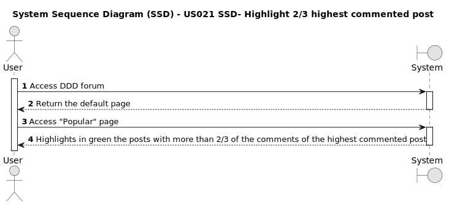

# US021 - Highlight 2/3 highest commented

## 1. Requirements Engineering
* As a Member, when I look at the popular posts, I want posts that have more than 2/3 of the comments from the post with the highest comments on the webpage to be highlighted with a green background.*

### 1.1. User Story Description

### 1.2. Customer Specifications and Clarifications
* Identify the highest commented post, and highlight it with a green background. Then, identify the posts with more than 2/3 of the comments from the highest commented post, and highlight them with a green background.

**From the client clarifications:**

>* **Question:** Should the most commented post also be highlighted in green?
>* **Answer:** Yes, because it has the most comments

 

>* **Question:** All posts must be considered?
>* **Answer:** Only the posts visible on the Popular Posts area must be considered.

 

### 1.3. Acceptance Criteria

- **AC1:** If there are posts on the popular posts page, then the 2/3 highest commented posts must be highlighted in green.
    
- **AC2** The highlighting updates dynamically as users interact with the page, reflecting changes in the highest comment count and adjusting the green background accordingly.

- **Teste Cases:**
  
   

     @CT-001
    - **Scenario:** I have posts with no comments in the popular posts section
    - Given I am on the login page
    - And I login with <username> and <password>
    - When I have posts with no comments in the popular posts section
    - Then I should not see any posts highlighted with a green background

    @Ct-002
    - **Scenario:** I have single  post in the popular posts section
    - Given I am on the login page
   	- And I login with <username> and <password>
    - When I have only one posts in the popular posts section
    - Then I should not see any posts highlighted with a green background

    @Ct-003
    - **Scenario:** Highlight highest commented posts in the popular posts section
    - Given I am on the login page
    - And I login with <username> and <password>
    - When I have posts with two third or more of the total comments
    - Then I should see the posts with two third or more of the total comments highlighted with a green background
  

### 1.4. Found out Dependencies

*For members: depends on US001* [Register New Account](../../US001/01.requirements-engineering/US001.md)*

*To become a member, the user must have a created account and complete the login process US001 [Register New Account](../../US001/01.requirements-engineering/US001.md) *

*As a Member, I want to post US005 [Creation a Post](../../US005/01.requirements-engineering/US005.md) *

*As a Member, I want to comment a post US007 [Creation Comment a Post](../../US007/01.requirements-engineering/US007.md)*

### 1.5 Input and Output Data

#### Input Data:

- Several posts with comments

#### Output data:

- Post with 2/3 of comments from the highest comment a post will be highlighted in green

### 1.6. System Sequence Diagram (SSD)

_Insert an SSD here describing the anticipated Actor-System interactions and how the data is inputted and sent to fulfill the requirement. Number all the interactions._

<h6 align="center">

</h6>

### 1.7 Other Relevant Remarks

_Nothing relevant to add_

###

### **1.8 Sequence Diagram**

 

## 2. OO Analysis

### 2.1. Relevant Domain Model Excerpt

_By default, an existing email account is required to create an account in the system_

### 2.2. Other Remarks

_Use this section to capture some aditional notes/remarks that must be taken into consideration into the design activity. In some case, it might be usefull to add other analysis artifacts (e.g. activity or state diagrams)._

## 3. Design - User Story Realization

### 3.1. Rationale

**The rationale grounds on the SSD interactions and the identified input/output data.**

| Interaction ID | Question: Which class is responsible for... | Answer | Justification (with patterns) |
| :------------- | :------------------------------------------ | :----- | :---------------------------- |
| Step 1         |                                             |        |                               |
| Step 2         |                                             |        |                               |
| Step 3         |                                             |        |                               |
| Step 4         |                                             |        |                               |
| Step 5         |                                             |        |                               |
| Step 6         |                                             |        |                               |
| Step 7         |                                             |        |                               |
| Step 8         |                                             |        |                               |
| Step 9         |                                             |        |                               |
| Step 10        |                                             |        |                               |

### Systematization

According to the taken rationale, the conceptual classes promoted to software classes are:

- Class1
- Class2
- Class3

Other software classes (i.e. Pure Fabrication) identified:

- xxxxUI
- xxxxController

## 3.2. Sequence Diagram (SD)

_In this section, it is suggested to present an UML dynamic view stating the sequence of domain related software objects' interactions that allows to fulfill the requirement._

## 3.3. Class Diagram (CD)

_In this section, it is suggested to present an UML static view representing the main domain related software classes that are involved in fulfilling the requirement as well as and their relations, attributes and methods._

# 4. Tests

_In this section, it is suggested to systematize how the tests were designed to allow a correct measurement of requirements fulfilling._

**_DO NOT COPY ALL DEVELOPED TESTS HERE_**

**Test 1:** Check that it is not possible to create an instance of the Example class with null values.

    @Test(expected = IllegalArgumentException.class)
    	public void ensureNullIsNotAllowed() {
    	Exemplo instance = new Exemplo(null, null);
    }

_It is also recommended to organize this content by subsections._

# 5. Construction (Implementation)

_In this section, it is suggested to provide, if necessary, some evidence that the construction/implementation is in accordance with the previously carried out design. Furthermore, it is recommeded to mention/describe the existence of other relevant (e.g. configuration) files and highlight relevant commits._

_It is also recommended to organize this content by subsections._

# 6. Integration and Demo

_In this section, it is suggested to describe the efforts made to integrate this functionality with the other features of the system._

# 7. Observations

_In this section, it is suggested to present a critical perspective on the developed work, pointing, for example, to other alternatives and or future related work._
