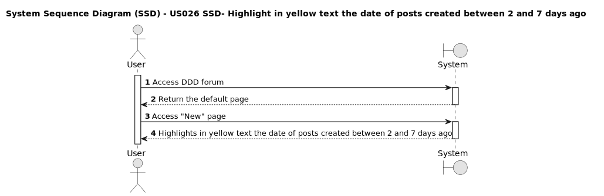

# US026 - Member view Recent posts, and the posts created between 2 and 7 days ago the reference of the date should appear in yellow text.

## 1. Requirements Engineering

### 1.1. User Story Description

* As a Member when the filter recent posts is selected, i want to see the posts created between 2 and 7 days ago with the date written with yellow text.

 

### 1.2. Customer Specifications and Clarifications 

**From the specifications document:**

>* TBD

 

**From the client clarifications:**

<!--Only Binary Questions Yes/No-->

>* **Question:** 

>* **Answer:**  

 

 
### 1.3. Acceptance Criteria

* **AC.1:** The user must be a registered member of the DDD Forum Web Application.

* **AC.2** The user must be logged in as a member.

* **AC.3:** The user must be able to see the posts created between 2 and 7 days ago with the date written with yellow text.

 

### 1.4. Found out Dependencies

* As a member i must a registered account and complete the login process US001 [Register New Account](../../US001/01.requirements-engineering/US001.md) *

 

### 1.5 Input and Output Data

#### Input Data:

* Typed data:
	* Not applicable

#### Output data:

* Text data:
  	* Not applicable

 

### 1.6. System Sequence Diagram (SSD)

<h6 align="center">

</h6>

 

### 1.7 Other Relevant Remarks

*Nothing relevant to add* 

 

### 1.8 Bugs

*Nothing relevant to add*

 

