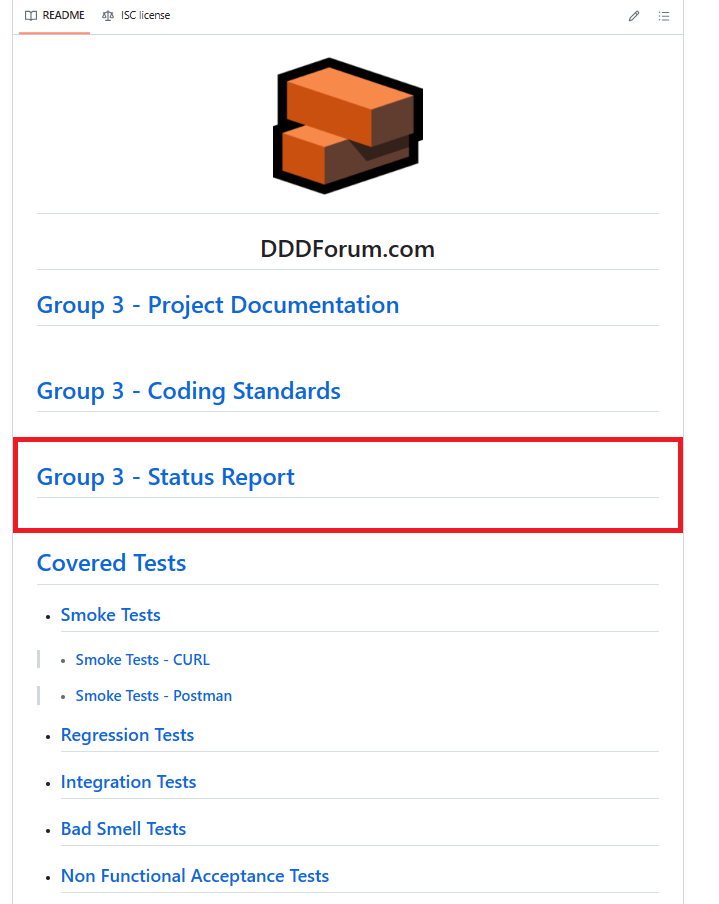

<h1 align="center">Sprint G - Sprint Goals</h1>

<h4 align="center">


</h4>

<br>
<hr>

# Sprint Goals

## 1. State of the Project

* **Fix any upstanding issues from the previous sprints and generate a report with status of the project.**

### [**Group 3 - Status Report (20-12-2023)**](../../04-status-report/status-report.md)

<h4 align="center">



</h4>

<br>
<hr>

## 2. Functional Requirements:

**New USs for the Final Version:**

* US028 - The member profile should include the avatar of the member as well as his/her nickname. The avatar can be a pre-defined icon or an image selected/loaded by the member.

* US029 - The main page should include a new tab to show the posts of the member (My Posts)

* [**US030 - The main page should include a new tab to show the posts that have comments made by the member (My Comments)**](./sprint-goals.md#us030---the-main-page-should-include-a-new-tab-to-show-the-posts-that-have-comments-made-by-the-member-my-comments)

* US031 - The header of the (main) page should include a section to display the avatars of all the members that have active 
sessions. By clicking the avatar the page with the public profile of the member should be displayed.

* US032 - Comments and posts should include the avatar and nick name of the author

<br>
<hr>

## 3. Non Functional Requirements:

[**Code Smell Tests & Test Smell Tests**](./sprint-goals.md#code-smell-tests--test-smell-tests)

* Each team must ensure that its code does not exceed a certain level of complexity, in terms of cyclomatic complexity. To this, the ESLint tool must be used.

* Each team should check the existence of code smell and test smells in their code, and report it. If a tool is used, it is chosen by the team.

<br>

**Project Review of the other Teams**

### [Project Review - Group 1 / Group 2 / Group 4 / Group 5](/docs/06-final-report/final-report.md)

<h4 align="right">

[**Go Back**](../index.md)

</h4>

<br>
<hr>
<br>
<br>
<br>
<br>
<br>
<br>
<br>
<br>
<br>
<br>
<br>
<br>
<br>
<br>
<br>
<br>
<br>
<br>
<br>
<br>
<br>
<br>
<br>
<br>
<br>
<br>
<br>
<br>
<br>
<br>
<br>
<br>
<br>
<br>
<br>
<br>
<br>
<br>
<br>
<br>
<br>
<br>
<br>
<br>
<br>
<br>
<br>
<br>
<br>
<hr>

## **US030 - The main page should include a new tab to show the posts that have comments made by the member (My Comments)**

### 1. Documentation:

>* <code>file path: docs\sprintA\US030\readme.md</code>

<br>

### 2. Back-End Dev.:

````typescript
/**
 * Enables the GET to "/myComments" route to return the posts that have the comments made by the member.
 */

postRouter.get("/mycomments", middleware.ensureAuthenticated(), (req, res) =>
  getPostsWithMyCommentsController.execute(req, res)
);
````

<br>

### 3. Integration Tests:

>* <code>file path: src\api_test\US030api.test.ts</code>

````bash
 PASS  src/api_test/US030api.test.ts (9.874s)
  Commented posts by member
    √ Pre-requisites.01 - Create User 1 (599ms)
    √ Pre-requisites.02 - Login User 1 (430ms)
    √ Pre-requisites.03 - Create the User 2 (436ms)
    √ Pre-requisites.04 - Login the User 2 (419ms)
    √ Pre-requisites.05 - Create the User 3 (470ms)
    √ Pre-requisites.06 - Login the User3 (418ms)
    √ Pre-requisites.07 - Create Post ap001 with user1 (256ms)
    √ Pre-requisites.08 - Get ap001 slug (220ms)
    √ Pre-requisites.09 - Create Post ap002 with user1 (249ms)
    √ Pre-requisites.10 - Get ap002 slug (223ms)
    √ TC001.01 - Check that no posts exists - user 1 (240ms)
    √ TC001.02 - Check that no posts exists - user 2 (237ms)
    √ TC001.03 - Check that no posts exists - user 3 (239ms)
    √ TC002.01 - After creating a comment on post ap001 user 1 should get it from the my comments - Create a comment (278ms)
    √ TC002.02 - Check that user 1 commented posts have 1 (238ms)
    √ TC002.03 - Check that user 2 commented posts have 0 (233ms)
    √ TC002.03 - Check that user 3 commented posts have 0 (227ms)
    √ TC003.01 - User 1 and 3 comments Post ap002 - User 1 should get 2 commented posts and User 3 should get 1 commented post - Create a comment User 1 (270ms)  
    √ TC003.02 - Create a comment User 3 (279ms)
    √ TC003.03 - Check that user 1 commented posts have 2 (234ms)
    √ TC003.04 - Check that user 2 commented posts have 0 (241ms)
    √ TC003.05 - Check that user 3 commented posts have 1 (241ms)

---------------------|----------|----------|----------|----------|-------------------|
File                 |  % Stmts | % Branch |  % Funcs |  % Lines | Uncovered Line #s |
---------------------|----------|----------|----------|----------|-------------------|
All files            |     66.1 |    66.67 |    41.51 |    66.67 |                   |
 config              |    84.21 |    83.33 |      100 |    84.21 |                   |
  configHandler.ts   |    84.21 |    83.33 |      100 |    84.21 |          44,55,61 |
 endpoints           |     37.5 |      100 |    26.47 |     37.5 |                   |
  Comments.ts        |    36.36 |      100 |    22.22 |    36.36 |... 51,61,72,82,92 |
  Posts.ts           |    31.58 |      100 |    23.53 |    31.58 |... 19,137,156,166 |
  Users.ts           |       50 |      100 |     37.5 |       50 |   37,44,75,85,105 |
 endpoints/abstracts |    92.31 |       50 |       50 |    92.31 |                   |
  AEndpoint.ts       |    92.31 |       50 |       50 |    92.31 |                38 |
 restClient          |    76.09 |    63.64 |    58.33 |    77.78 |                   |
  RestClient.ts      |    76.09 |    63.64 |    58.33 |    77.78 |... 65,183,200,225 |
---------------------|----------|----------|----------|----------|-------------------|
Test Suites: 1 passed, 1 total
Tests:       22 passed, 22 total
Snapshots:   0 total
Time:        10.839s, estimated 13s
Ran all test suites matching /api_test\\us030/i.
````

<h4 align="right">

[**Go Back**](./sprint-goals.md#2-functional-requirements)

</h4>
<hr>

## **Code Smell Tests & Test Smell Tests**

### 1. Installation of tslint (package.json)

```json	
{
  "devDependencies": {
    "@babel/plugin-proposal-private-property-in-object": "^7.21.11",
    "concurrently": "^5.0.0",
    "dotenv-cli": "^5.1.0",
    "husky": "^8.0.0",
    "jest-html-reporter": "^3.0.0",
    "lint-staged": "^12.0.0",
    "newman": "^6.0.0",
    "prettier": "^2.6.0",
    "tslint": "^6.1.3",
    "typedoc": "^0.21.10"
  }
}
```

<br>

### 2. tslint configuration file

<code>file path: tslint.json</code>


```json	
{
    "defaultSeverity": "error",
    "extends": [
        "tslint:recommended"
    ],
    "compilerOptions": {
        "target": "es6",
        "module": "commonjs",
        "esModuleInterop": true,
        "skipLibCheck": true,
        "forceConsistentCasingInFileNames": true,
        "outDir": "./dist",
        "rootDir": "./src",
        "strict": true
      },
      "files": [
        "src/**/*.ts",
        "src/**/*.js",
        "src/**/*.tsx"
      ],
    // Rules for identifying and repporting code smells
      "rules": {
        "no-console": false,
        "class-name": false, 
        "interface-name": [true, "never-prefix"],
        "member-access": [true, "check-format"],
        "no-var-keyword": true, 
        "prefer-const": true, 
        "no-duplicate-imports": true, 
        "no-constant-condition": true,     
        "no-unused-variable": true, 
        "no-conditional-assignment": true, 
        "no-consecutive-blank-lines": [true, 2], 
        "triple-equals": [true, "allow-null-check"],
        "cyclomatic-complexity": [true, 10],
        "max-func-body-length": [true, 30],
        "max-classes-per-file": [true, 3],
        "no-unused-expression": true,
        "no-relative-imports": true,
        "no-identical-functions": true,
        "variable-name": [true, "ban-keywords", "check-format"],
        "function-name": [true, "ban-keywords", "check-format"]
      },
      "linterOptions": {
        "include": ["src/**/*.ts", "tests/**/*.ts"],
        "exclude": ["node_modules/**", "dist/**"]
    }
 
} 
```

<br>

### 3. Code Smell & Test Smell Tests

````bash
c:/00_pessoal/a02_my_repo/switch-qa-23-project-switch-qa-23-3/src/shared/infra/database/sequelize/models/commentvote.ts:1:28
ERROR: 1:28     variable-name                    variable name must be in lowerCamelCase or UPPER_CASE
ERROR: 2:9      variable-name                    variable name must be in lowerCamelCase or UPPER_CASE

c:/00_pessoal/a02_my_repo/switch-qa-23-project-switch-qa-23-3/src/shared/infra/http/utils/middleware.ts:3:19
ERROR: 3:19     no-var-requires                  require statement not part of an import statement
ERROR: 18:33    no-string-literal                object access via string literals is disallowed
ERROR: 47:33    no-string-literal                object access via string literals is disallowed

c:/00_pessoal/a02_my_repo/switch-qa-23-project-switch-qa-23-3/src/shared/infra/mapper.ts:1:18
ERROR: 1:18     no-empty-interface               An empty interface is equivalent to `{}`.

c:/00_pessoal/a02_my_repo/switch-qa-23-project-switch-qa-23-3/src/shared/utils/textutils.ts:17:5
ERROR: 17:5     no-var-keyword                   Forbidden 'var' keyword, use 'let' or 'const' instead
ERROR: 17:9     prefer-const                     Identifier 're' is never reassigned; use 'const' instead of 'var'.

c:/00_pessoal/a02_my_repo/switch-qa-23-project-switch-qa-23-3/src/smoke_test/dddforum.postman_collection.js:11:5
ERROR: 11:5     no-console                       Calls to 'console.log' are not allowed.

c:/00_pessoal/a02_my_repo/switch-qa-23-project-switch-qa-23-3/src/smoke_test/smoke-test.js:8:5
ERROR: 8:5      no-console                       Calls to 'console.error' are not allowed.
ERROR: 12:3     no-console                       Calls to 'console.log' are not allowed.
ERROR: 13:3     no-console                       Calls to 'console.log' are not allowed.
````

<h4 align="right">

[**Go Back**](../index.md)

</h4>