<h1 align="center">GROUP 4 - FINAL REPORT</h1>

<h4 align="center">


</h4>

<!-- ___________   Cabeçalho   _____________-->
# GROUP 4 - FINAL REPORT

| **Reviewers:** | Name              |
|----------------|-------------------|
|                | Camilla Souza          |
|                | Sandra Silva           |

<br>

**NO RELEASE VERSION ON GITHUB**

    NORMAL REPO:
        * DATE: 23/12/2023: 00:11
        * Github Commit SHA (Secure Hash Algorithm): a44b7825477b73c1603a835862c49bde3c09a598

    ACCEPTANCE REPO:
        * DATE: 23/12/2023: 00:11
        * Github Commit SHA (Secure Hash Algorithm): 2784cc58b55fa76d90f04bacb8d6c388126565f6

**Github Repositories:**

* <a href="https://github.com/Departamento-de-Engenharia-Informatica/switch-qa-23-project-switch-qa-23-4">Link: Group 4  Normal Repo</a>

* <a href="https://github.com/Departamento-de-Engenharia-Informatica/switch-qa-23-project-acceptancetests-switch-qa-23-4">Link: Group 4 Acceptance Repo</a>

<br>

<!-- ___________   Tópico 1 - Funcionalidades   _____________-->
## **1. Functionalities:**

### **A) Missing:**
* There isn't the funcionality As a member, when I look at the unpopular posts, post that have more than 1/3 and less than 2/3 of the comments from the post with the highest comments on the webpage to be highlighted with a yellow background

### **B) Needs Fixing:**
* NOTHING TO COMMENT

### **C) Fails:**
* NOTHING TO COMMENT

<br>

<hr>

<!-- ___________   Tópico 2 - Testes de Integração   _____________-->
## **2. Integration Testing:**

    file path: \src\api_test\globalApiTest.api.test.ts

### Followed test steps:

1. **Pre-conditions:** The database should be empty.

2. Command runned in the Terminal:

```bash
 npm rum test -t 'globalApiTest.api' --runlnBand
```

### **A) Missing:**

* **postVotes-test:**
<br>
Test not found.

### **B) Needs Fixing:**

* **createPosts-test > Create a text post with hyperlink text formatting** 
<br>
Link HTTP protocol is not validated. Validation must be included to ensure valid link is provided.


### **C) Fails:**

1. [Test Report GlobalAPITest- 2 Failed Tests](./pdf/globalApiTest.pdf)
<h4 align="center">
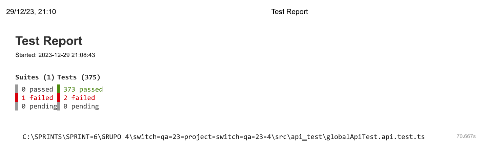
</h4>

> Failed 1 - US015 - API Endpoint Tests
> - Test 5 - Test to assert that user is authenticated and selects the current with posts.
<h4 align="center">
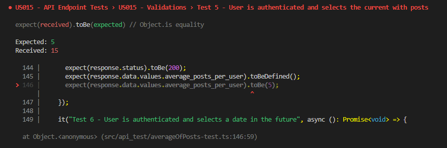
</h4>

> Failed 2 - Posts Endpoint - Create a Post (Link Posts)
> - Test to assert that endpoint create a link with 67 characters.
<h4 align="center">
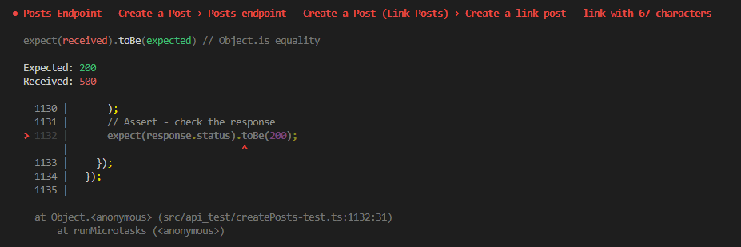
</h4>
<br>


2. [Test Report delete-user- 5 Failed Tests](./pdf/delete-user.pdf)
<h4 align="center">
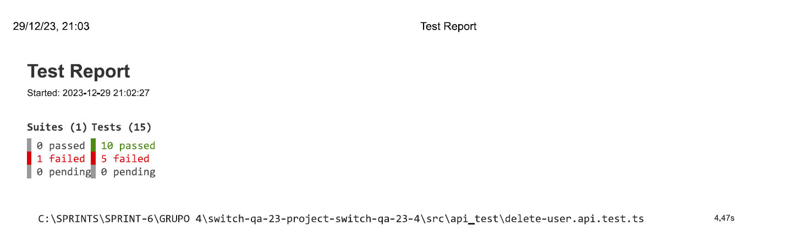
</h4>

> Failed 1 - Delete Endpoint - Get User id
> - Test to get user id 1.
<h4 align="center">

</h4>

> Failed 2 - Delete Endpoint - Get User id2
> - Test to get user id 2.
<h4 align="center">
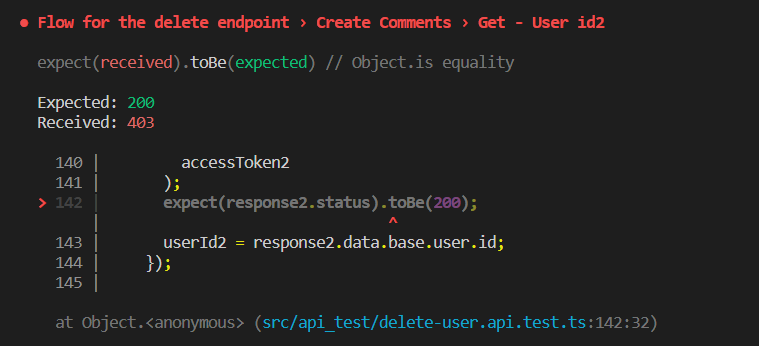
</h4>
<br>

> Failed 3 - Delete Endpoint - Delete - User with valid acess token and valid user id
> - Test to assert that user has valid id and acess token before delete comment.
<h4 align="center">
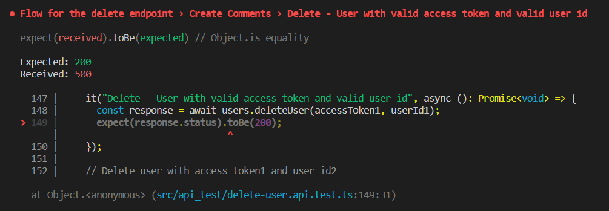
</h4>
<br>

> Failed 4 - Delete Endpoint - Delete - User with access token1 and user id2
> - Test to assert that user2 has valid id and acess token before delete comment.
<h4 align="center">
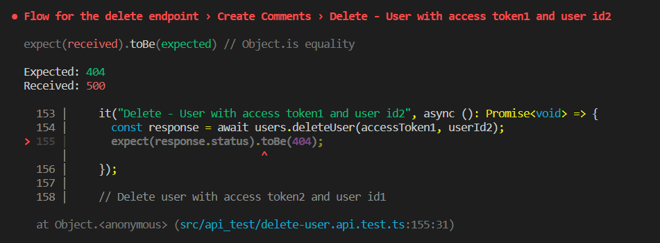
</h4>
<br>

> Failed 5 - Delete Endpoint - Delete - User with access token2 and user id1
> - Test to assert that user1 has valid id and acess token before delete comment.
<h4 align="center">
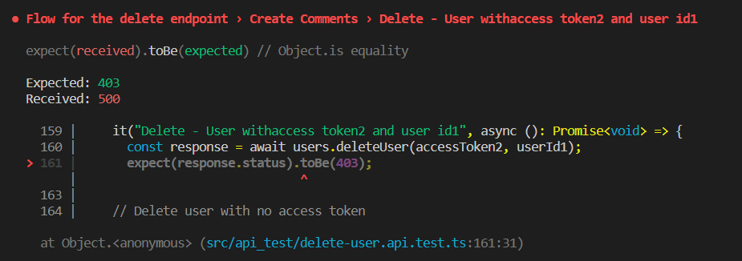
</h4>
<br>


3. [Test Report getTop3CommentersByDate - 2 Failed Tests](./pdf/getTop3CommentersByDate.pdf)
<h4 align="center">
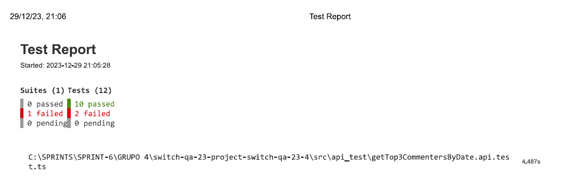
</h4>

> Failed 1 - Top 3 commenters by date 
> - Test 3 - Get top 3 commenters by date - 2 members
<h4 align="center">
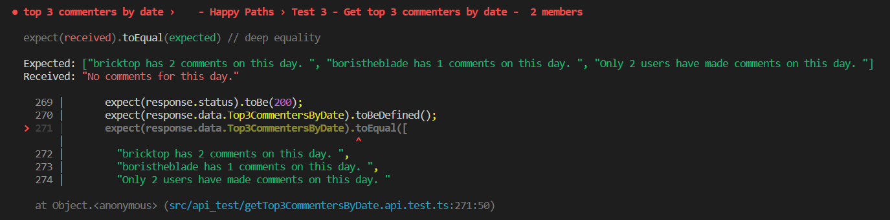
</h4>

> Failed 2 - Top 3 commenters by date 
> - Test 4 - Get top 3 commenters by date - 1 members
<h4 align="center">
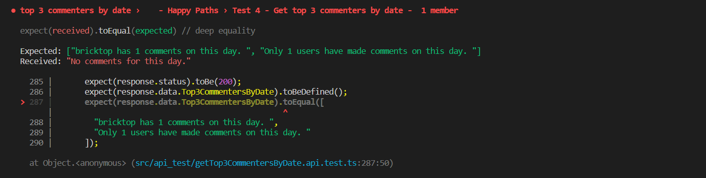
</h4>
<br>


<hr>

<!-- ___________   Tópico 3 - Testes de Regressão   _____________-->
## **3. Regression Testing:**

    file path: \src\api_test\globalApiTest.api.test.ts

### Followed test steps:

1. **Pre-conditions:** The database should be empty.

2. Command runned in the Terminal:

```bash
 npm rum test -t 'globalApiTest.api' --runlnBand
```

### **A) Missing:**

* **postVotes-test:**
<br>
Test not found.

### **B) Needs Fixing:**

* **createPosts-test > Create a text post with hyperlink text formatting** 
<br>
Link HTTP protocol is not validated. Validation must be included to ensure valid link is provided.


### **C) Fails:**

1. [Test Report GlobalAPITest- 2 Failed Tests](./pdf/globalApiTest.pdf)
<h4 align="center">

</h4>

> Failed 1 - US015 - API Endpoint Tests
> - Test 5 - Test to assert that user is authenticated and selects the current with posts.
<!-- <h4 align="center">

</h4> -->

> Failed 2 - Posts Endpoint - Create a Post (Link Posts)
> - Test to assert that endpoint create a link with 67 characters.
<!-- <h4 align="center">

</h4> -->
<br>


2. [Test Report delete-user- 5 Failed Tests](./pdf/delete-user.pdf)
<h4 align="center">

</h4>


> Failed 1 - Delete Endpoint - Get User id
> - Test to get user id 1.
<!-- <h4 align="center">

</h4> -->

> Failed 2 - Delete Endpoint - Get User id2
> - Test to get user id 2.
<!-- <h4 align="center">

</h4>
<br> -->

> Failed 3 - Delete Endpoint - Delete - User with valid acess token and valid user id
> - Test to assert that user has valid id and acess token before delete comment.
<!-- <h4 align="center">

</h4> -->
<!-- <br> -->

> Failed 4 - Delete Endpoint - Delete - User with access token1 and user id2
> - Test to assert that user2 has valid id and acess token before delete comment.
<!-- <h4 align="center">

</h4> -->
<!-- <br> -->

> Failed 5 - Delete Endpoint - Delete - User with access token2 and user id1
> - Test to assert that user1 has valid id and acess token before delete comment.
<!-- <h4 align="center">

</h4> -->
<br>


3. [Test Report getTop3CommentersByDate - 2 Failed Tests](./pdf/getTop3CommentersByDate.pdf)
<h4 align="center">

</h4>

> Failed 1 - Top 3 commenters by date 
> - Test 3 - Get top 3 commenters by date - 2 members
<!-- <h4 align="center">

</h4> -->

> Failed 2 - Top 3 commenters by date 
> - Test 4 - Get top 3 commenters by date - 1 members
<!-- <h4 align="center">

</h4> -->
<br>


<!-- ___________   Tópico 4 - Testes de Aceitação Funcionais   _____________-->
## **4. Functional Acceptance Testing:**

1. **Pre-conditions:** The database should be empty

2. Injection of data into the database through the file   <code>features\database\db.sql</code> for Test Enviroment Set-up.

3. Command runned in the Terminal:

```bash
npm run wdio
```
### **A) Missing:**

* NOTHING TO COMMENT

### **B) Needs Fixing:**

* NOTHING TO COMMENT

### **C) Fails:**

* 7 Tests failed , skipped 14 Tests.


<h4 align="center">

</h4>


<br>
<hr>


<!-- ___________  Tópico 5 - Testes de Aceitação Não-Funcionais  _____________-->
## **5. Non Functional Testing:**

### **A) Missing:**

*Automation of Non Functional Tests:*

<br>


### **B) Needs Fixing:**
**Test Case Scenraios Automation:**
<br>
Non Functional Acceptance Test Scenarios 10/ 50 / 100 & 200 Users are splited um different files that are not automatically run.

### **C) Fails:**
These Test Scenarios have 100% fail rates:
* Login
* Average Of Comments
* Average Of Posts
* Post With More Comments
* Top 3 Commented By Date
* Members Without Activity By Date
* Percentage of Posts Without Comments By Date

<h4 align="center">
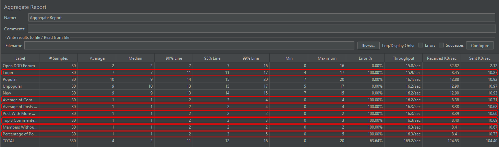
</h4>

<br>
<hr>

<!-- ___________   Tópico 6 - Smoke Testes   _____________-->
## *6. Smoke Testing:**
    file path: `smoke-test.sh`

* smoke test only tests access to the home page, it does not test any other basic features, it lacks: Create post, create comment, vote post, vote comment, Popular post, Unpopular post, New Posts, Statistics and other features


### **A) Missing**
* Limited range of coverage to only to 2 tests, that test the main page loading.

* It would be nice to have further coverage of additional core functionalities, **preferable but not compulsory**.
<br>

### **B) Needs Fixing**
* NOTHING TO COMMENT
<br>

### **C) Fails**
*  NOTHING TO COMMENT
<br>

<hr>

<!-- ___________   Tópico 7 - Continuous Integration Pipeline   _____________-->
## **7. CI - Pipeline**
**Workflows:**

    
    file path: .github\workflows\main.yml

### **A) Missing**

* NOTHING TO COMMENT


### **B) Needs Fixing**

#### **main.yml:** missing API and Regression tests
    file path: .github\workflows\main.yml


>* Required to add the missing API & integration or regression tests in the "main.yml" CI Pipeline.


### **C) Fails**
* NOTHING TO COMMENT

<br>
<hr>

