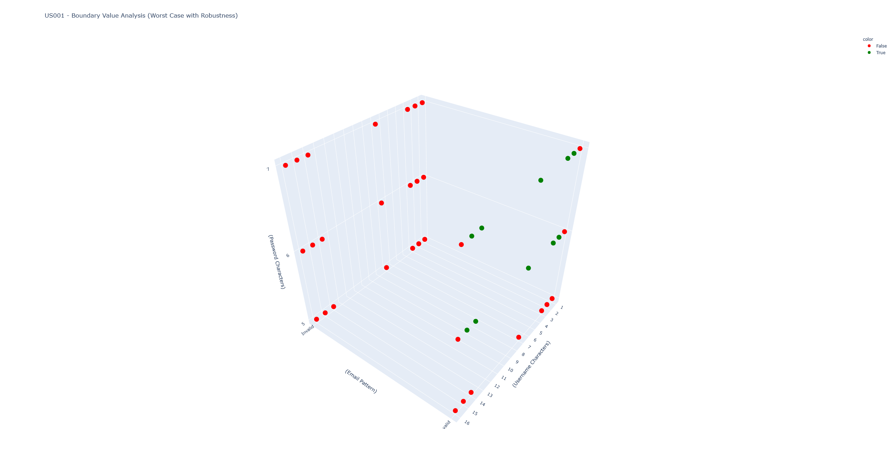

# Black Box Testing / Functional Testing

## 1. Boundary Values - Worst Case with Robustness:

### **Covered AC´s:** AC1 / AC2 / AC3 / AC4 / AC5 / AC6

 

<h1 align="center">45 Test Cases</h1>

 

## Test Scenarios:

* Simultaneuos test of inputs fiels (username, email & password) with an alternation of test cases as per the test scenarios (1, 2, 3) specifications presented below.

 

### **Scenario 1 - Username:**

* **Description:** Test for usernames with a number of characters value below the lower bound, at the lower bound, above lower bound, nominal, below upper bound,  at the upper bound, and above the upper bound.

 

* **Test Cases (min- , min , min+ , nom , max- , max , max+):**
  
  * **TC-US001/1** - Username with 1 Character

  * **TC-US001/2** - Username with 2 Characters

  * **TC-US001/3** - Username with 3 Characters

  * **TC-US001/4** - Username with 7 Characters

  * **TC-US001/5** - Username with 14 Characters

  * **TC-US001/6** - Username with 15 Characters

  * **TC-US001/7** - Username with 16 Characters

 

### **Scenario 2 - Email:**

* **Description:** Test for emails with a valid pattern and an invalid pattern.

 

* **Test Cases (Valid Email , Unvalid Email'):**
  
  * **TC-US001/8** - Email compliant with pattern 'text' + '@' + 'test'+ '.' + 'text' 

  * **TC-US001/9** - Email not compliant with pattenr 'text' + '@' + 'test'+ '.' + 'text'

 

### **Scenario 3 - Password:**

* **Description:** Test for passwords with a number of characters value below the nominal, at the nominal value, and above the nominal value.

 

* **Test Cases (nom- , nom , nom+):**
  
  * **TC-US001/10** - Password with 5 Characters

  * **TC-US001/11** - Password with 6 Characters

  * **TC-US001/12** - Password with 7 Characters

 

### **Scenario 4 - Missing Inputs:**

* **Description:** Missing at least one of the inputs (username, email & password).

 

* **Test Cases:**
  
  * **TC-US001/13** - Missing Username

  * **TC-US001/14** - Missing Email

  * **TC-US001/15** - Missing Password

 

## 2. Decision Tables

### **Conditions:**

* C1 - Username			
* C2 - Email			
* C3 - Password			

### **Rules:**

* R1 - Username characters <2 && Email in format 'text' + '@' + 'text' + '.' + 'text'	&& Password characters >=6

* R2 - Username characters >15 && Email in format 'text' + '@' + 'text' + '.' + 'text'	&& Password characters >=6

* R3 - Username characters >=2 & <=15 && Email in format 'text' + '@' + 'text' + '.' + 'text'	&& Password characters >=6

* R4 - Username characters <2 && Email NOT in format 'text' + '@' + 'text' + '.' + 'text'	&& Password characters >=6

* R5 - Username characters >15 && Email NOT in format 'text' + '@' + 'text' + '.' + 'text'	&& Password characters >=6

* R6 - Username characters >=2 & <=15 && Email NOT in format 'text' + '@' + 'text' + '.' + 'text'	&& Password characters >=6

* R7 - Username characters <2 && Email in format 'text' + '@' + 'text' + '.' + 'text'	&& Password characters <6

* R8 - Username characters >15 && Email in format 'text' + '@' + 'text' + '.' + 'text'	&& Password characters <6

* R9 - Username characters >=2 & <=15 && Email in format 'text' + '@' + 'text' + '.' + 'text'	&& Password characters <6

* R10 - Username characters <2 && Email NOT in format 'text' + '@' + 'text' + '.' + 'text'	&& Password characters <6

* R11 - Username characters >15 && Email NOT in format 'text' + '@' + 'text' + '.' + 'text'	&& Password characters <6

* R12 - Username characters >=2 & <=15 && Email NOT in format 'text' + '@' + 'text' + '.' + 'text'	&& Password characters <6

 

### **Actions:**

* A1 - "You're all signed up! Logging you in."
* A2 - "Yeahhhhh, Want to try that again with a valid email?"
* A3 - "Yeahhhhh, TypeError: Cannot read property 'toString' of undefined"
* A4 - "Yeahhhhh, Error: InvalidOperation: A failing result needs to contain an error 
* A5 - "Yeahhhhh, your password should be at least 6 chars"

 

## **EEDTS - Extended Entry Decision Table Specification**

|  | R1 | R2 | R3 | R4 | R5 | R6 | R7 | R8 | R9 | R10 | R11 | R12 |
|--|----|----|----|----|----|----|----|----|----|-----|-----|-----|
| C1 | 0 | 0 | 0 | 1 | 1 | 1 | 2 | 2 | 2 | 0 | 0 | 0 | 
| C2 | T | T | F | F | T | T | F | F | T | T | F | F |
| C3 | T | F | T | F | T | F | T | F | T | F | T | F |
| A1 |   |   | X |   |   |   |   |   |   |   |   |   | 
| A2 |   |   |   |   |   | X |   |   |   |   |   | X |
| A3 | X |   |   | X |   |   | X |   |   | X |   |   |
| A4 |   | X |   |   | X |   |   | X |   |   | X |   |
| A5 |   |   |   |   |   |   |   |   | X |   |   |   |
|    |   |   |   |   |   |   |   |   |   |   |   |   |

 

|  | R1 / R10 | R2 | R3 | R4 | R5 | R6 | R7 | R8 | R9 | R10 | R11 |
|--|----|----|----|----|----|----|----|----|----|-----|-----|
| C1 | 0 | 0 | 0 | 1 | 1 | 1 | 2 | 2 | 2 | 0 | 0 | 
| C2 | T | T | F | F | T | T | F | F | T | T | F |
| C3 | - | F | T | F | T | F | T | F | T | F | T |
| A1 |   |   | X |   |   |   |   |   |   |   |   |
| A2 |   |   |   |   |   | X |   |   |   |   | X |
| A3 | X |   |   | X |   |   | X |   |   |   |   |
| A4 |   | X |   |   | X |   |   | X |   | X |   |
| A5 |   |   |   |   |   |   |   |   | X |   |   |
| **COUNT:** | **2** | **1** | **1** | **1** | **1** | **1** | **1** | **1** | **1** | **1** | **1** |

 

<h1 align="center">12 Test Cases</h1>

## 3. Classes of Equivalence

### Username:

* Class 1: Values less than 0 (Invalid)

* Class 2: Values between 0 and 15 (Valid)

* Class 3: Values greater than 15 (Invalid)

|C1                |C2                    |C3                 |
|------------------|----------------------|-------------------|
|   Invalid (<0)   |      Valid (0-15)    |   Invalid (>15)   |

 

### Email:

* Class 1: Invalid email format (e.g., missing '@' or '.')

 * Class 2: Valid email format

 

|C1                |C2                    |
|------------------|----------------------|
|   Invalid Format |   Valid Format       |

 

### Password:

* Class 1: Values less than 6 characters (Invalid)

* Class 3: Values equal or greater than 6 characters (Valid)

|C1                |C2                    |
|------------------|----------------------|
| Invalid (<6)     |      Valid (>=6)     |

