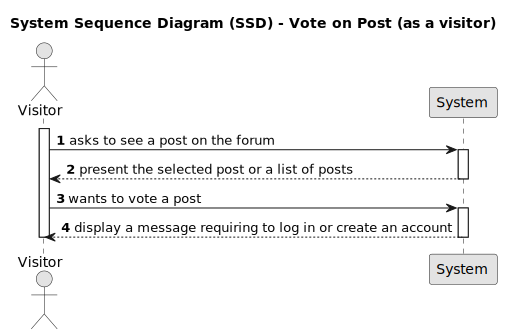
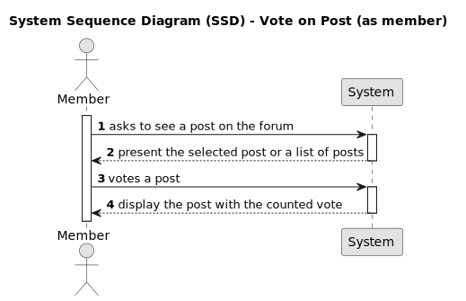
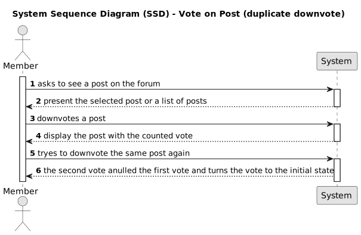

# US009 - Vote on Post

## 1. Requirements Engineering

It is requested to be possible to upvote or downvote on the existing posts.

### 1.1. User Story Description

As a visitor or a member, i want to vote a post.

### 1.2. Customer Specifications and Clarifications 

Visitors should be able to see the posts on the screen. The posts should have the up and down votes displayed adjacent to the post. If the visitor is not a member, it should be displayed a message redirecting to create an account to be able to vote on posts. If the visitor is a member, it should be able to vote on the posts.

### 1.3. Acceptance Criteria

* **AC1:** Should be able to see the posts on the screen.
* **AC2:** Display the up and down votes on the screen adjacent to the posts.
* **AC3:** As a visitor it should be able to see a message redirecting to create an account to be able to vote on posts
* **AC4:** With a member role it should be able to vote on the posts

### 1.4. Found out Dependencies

To be a member, the visitor must have a created account and logged in. US001 [Register New Account](../../US001/01.requirements-engineering/US001.md)  

**Input Data:**

* Typed data:
	* votes that allready exist on the post
	* vote up or down

**Output Data:**

* Must display the votes on the screen adjacent to the post.
* Must display a message redirecting to create an account to be able to vote on posts if not authenticated with a member role.

### 1.6. System Sequence Diagram (SSD)

### 1.7 Other Relevant Remarks

To be defined.

### 1.8 Bugs
#### **A - Bug #1**

**A.1 - Description:**

* To insert the use case description and the test condition where the the code breaks.

**A.2 - FailedAcceptance Criterias:**

* [AC3.3](/docs/sprintA/US005/01.requirements-engineering/US005.md#13-acceptance-criteria)

[**A.3 - Sequence Diagram**]()

#### **B - Bug #2**

## 2. OO Analysis

### 2.1. Relevant Domain Model Excerpt 
*In this section, it is suggested to present an excerpt of the domain model that is seen as relevant to fulfill this requirement.* 

### 2.2. Other Remarks

*Use this section to capture some aditional notes/remarks that must be taken into consideration into the design activity. In some case, it might be usefull to add other analysis artifacts (e.g. activity or state diagrams).* 

## 3. Design - User Story Realization 

### 3.1. Rationale

**The rationale grounds on the SSD interactions and the identified input/output data.**

| Interaction ID | Question: Which class is responsible for... | Answer  | Justification (with patterns)  |
|:-------------  |:--------------------- |:------------|:---------------------------- |
| Step 1  		 |							 |             |                              |
| Step 2  		 |							 |             |                              |
| Step 3  		 |							 |             |                              |
| Step 4  		 |							 |             |                              |
| Step 5  		 |							 |             |                              |
| Step 6  		 |							 |             |                              |              
| Step 7  		 |							 |             |                              |
| Step 8  		 |							 |             |                              |
| Step 9  		 |							 |             |                              |
| Step 10  		 |							 |             |                              |  

### Systematization ##

According to the taken rationale, the conceptual classes promoted to software classes are: 

 * Class1
 * Class2
 * Class3

Other software classes (i.e. Pure Fabrication) identified: 
 * xxxxUI  
 * xxxxController

## 3.2. Sequence Diagram (SD)

*In this section, it is suggested to present an UML dynamic view stating the sequence of domain related software objects' interactions that allows to fulfill the requirement.* 

## 3.3. Class Diagram (CD)

*In this section, it is suggested to present an UML static view representing the main domain related software classes that are involved in fulfilling the requirement as well as and their relations, attributes and methods.*

# 4. Tests 
*In this section, it is suggested to systematize how the tests were designed to allow a correct measurement of requirements fulfilling.* 

**_DO NOT COPY ALL DEVELOPED TESTS HERE_**

**Test 1:** Check that it is not possible to create an instance of the Example class with null values. 

	@Test(expected = IllegalArgumentException.class)
		public void ensureNullIsNotAllowed() {
		Exemplo instance = new Exemplo(null, null);
	}

*It is also recommended to organize this content by subsections.* 

# 5. Construction (Implementation)

*In this section, it is suggested to provide, if necessary, some evidence that the construction/implementation is in accordance with the previously carried out design. Furthermore, it is recommeded to mention/describe the existence of other relevant (e.g. configuration) files and highlight relevant commits.*

*It is also recommended to organize this content by subsections.* 

# 6. Integration and Demo 

*In this section, it is suggested to describe the efforts made to integrate this functionality with the other features of the system.*

# 7. Observations

*In this section, it is suggested to present a critical perspective on the developed work, pointing, for example, to other alternatives and or future related work.*

