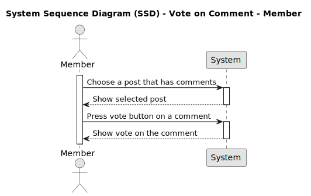
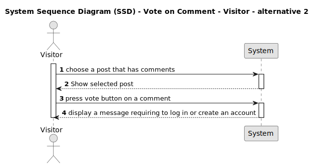
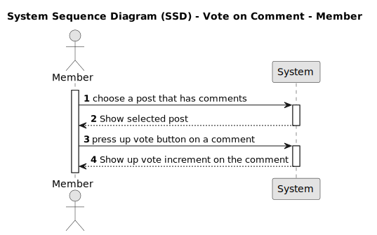
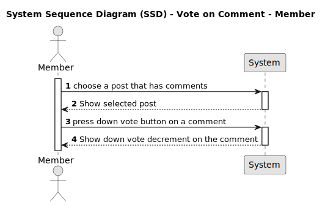

# US010 - Vote on Comment - Member

## 1. Requirements Engineering

### 1.1. User Story Description

*As Member, I want to to be able to vote comments on a post in the forum.*

### 1.2. Customer Specifications and Clarifications 

*In order to show which comment is more interesting for the user it is necessary for them to be able to vote on the comments, therefore the aaplication must have the vote option.*

From the client clarifications:

Question: Who can vote?
Answer: Only members.

Question: How does members vote?
Answer: Members will vote through arrows.

Question: What do the arrows mean?
Answer: Will have two arrows: one up (positive vote) and one down (negative vote).

Question: How many times is it possible to vote?
Answer: Only one.

### 1.3. Acceptance Criteria

* **AC1:** Must have an account.
* **AC2:** Must be logged in with member account.
* **AC3:** Given that a comment is selected to be voted, when the member press the vote button, then the votes amount must increase or decrease in one value. 

### 1.4. Found out Dependencies

*There are dependencies in this US001 and US007*

### 1.5 Input and Output Data

***Input Data:**

* Input:
	* Press Vote button on a comment (US007)
	
**Output Data:**

* Display vote result.

### 1.6. System Sequence Diagram (SSD)

### 1.7 Other Relevant Remarks

### 1.8 Bugs

#### **A - Bug #1**

**A.1 - Description:**

* Its not possible to make an upvote on new comment.

**A.2 - Detailed Description:**

* Everytime a new comment is created it already presents 1 upvote related to it instead of 0 votes, the expected behavior would be to have the comment created with 0 upvotes. Due to the comment presenting 1 upvote upon its creation its not possible for the user to make a new upvote to the comment. Therefore the user cannot assign upvotes to this newly created comment, only downvotes. 
When the bug is fixed, the comment starts with zero votes, and this situation is resolved.

 

**A.3 - Failed Acceptance Criterias:**

* [AC3](/docs/sprintA/US010/01.requirements-engineering/US010.md#13-acceptance-criteria)

**A.4 - Sequence Diagram**

**A.5 - Severity:**

* Low

**A.6 - Current Behaviour:**

* when the comment is posted, the vote start at 1, and doesn´t allowed upvote.

**A.7 - Expected Behaviour:**

* The upvote function should not consider the vote already existent in the comment as a vote from the user and should allow the user to make 1 upvote.

**A.8 - Date and Time of Occurrence:**

* September 21, 2023, at 9:00 PM

**A.9 - Steps to Reproduce the Issue:**
The steps to produce the bug were:

>1. Access the application

>2. Select a post

>3. Typed a comment on the comment text box.

>4. Click on "Post comment"

>5. Click on upvote of the new comment.

>6. Verify that the comment votes do not increase.

* **A.10 - Status:**

* Bug Front-End

## 2. OO Analysis

### 2.1. Relevant Domain Model Excerpt 
*In this section, it is suggested to present an excerpt of the domain model that is seen as relevant to fulfill this requirement.* 

### 2.2. Other Remarks

*Use this section to capture some aditional notes/remarks that must be taken into consideration into the design activity. In some case, it might be usefull to add other analysis artifacts (e.g. activity or state diagrams).* 

## 3. Design - User Story Realization 

### 3.1. Rationale

**The rationale grounds on the SSD interactions and the identified input/output data.**

| Interaction ID | Question: Which class is responsible for... | Answer  | Justification (with patterns)  |
|:-------------  |:--------------------- |:------------|:---------------------------- |
| Step 1  		 |							 |             |                              |
| Step 2  		 |							 |             |                              |
| Step 3  		 |							 |             |                              |
| Step 4  		 |							 |             |                              |
| Step 5  		 |							 |             |                              |
| Step 6  		 |							 |             |                              |              
| Step 7  		 |							 |             |                              |
| Step 8  		 |							 |             |                              |
| Step 9  		 |							 |             |                              |
| Step 10  		 |							 |             |                              |  

### Systematization ##

According to the taken rationale, the conceptual classes promoted to software classes are: 

 * Class1
 * Class2
 * Class3

Other software classes (i.e. Pure Fabrication) identified: 
 * xxxxUI  
 * xxxxController

## 3.2. Sequence Diagram (SD)

*In this section, it is suggested to present an UML dynamic view stating the sequence of domain related software objects' interactions that allows to fulfill the requirement.* 

## 3.3. Class Diagram (CD)

*In this section, it is suggested to present an UML static view representing the main domain related software classes that are involved in fulfilling the requirement as well as and their relations, attributes and methods.*

# 4. Tests 
*In this section, it is suggested to systematize how the tests were designed to allow a correct measurement of requirements fulfilling.* 

**_DO NOT COPY ALL DEVELOPED TESTS HERE_**

**Test 1:** Check that it is not possible to create an instance of the Example class with null values. 

	@Test(expected = IllegalArgumentException.class)
		public void ensureNullIsNotAllowed() {
		Exemplo instance = new Exemplo(null, null);
	}

*It is also recommended to organize this content by subsections.* 

# 5. Construction (Implementation)

*In this section, it is suggested to provide, if necessary, some evidence that the construction/implementation is in accordance with the previously carried out design. Furthermore, it is recommeded to mention/describe the existence of other relevant (e.g. configuration) files and highlight relevant commits.*

*It is also recommended to organize this content by subsections.* 

# 6. Integration and Demo 

*In this section, it is suggested to describe the efforts made to integrate this functionality with the other features of the system.*

# 7. Observations

*In this section, it is suggested to present a critical perspective on the developed work, pointing, for example, to other alternatives and or future related work.*

