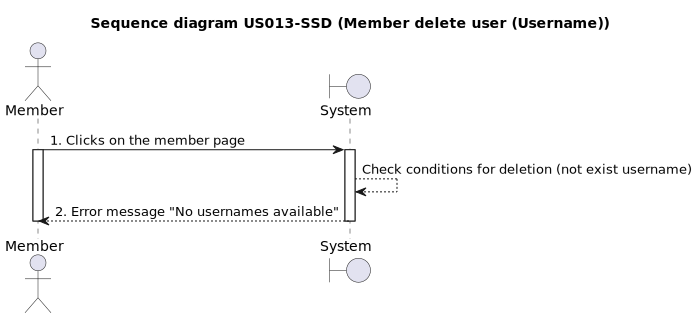
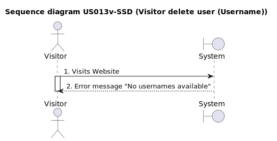
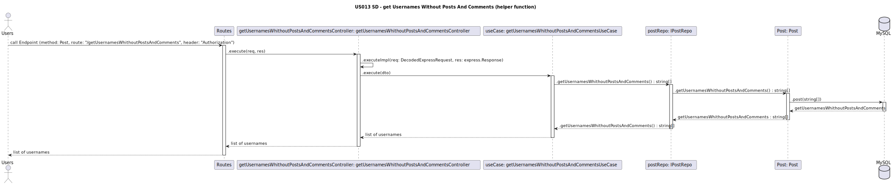

# US013 - Delete User

## 1. Requirements Engineering
* As a member, I want to have a delete button on the the Member Details area, so that I can delete a user.*

### 1.1. User Story Description

### 1.2. Customer Specifications and Clarifications
Currently it is not possible to delete user, so once a user is created it cannot be removed from the application. In order to allow for better members management its necessary to create a user delete feature that enables users or admins to delete a user profile.

**From the client clarifications:**

>**Question:** Who can delete a user?
>**Answer:**  Only members or Admins can delete profiles.

>**Question:** Which information is necessary to delete a user?
>**Answer:** Only the member Username is required.

>**Question:** How can a user be deleted?
>**Answer:** A Delete button must be available on the Member Details area.

>**Question:** What if the username doesn´t exist?
>**Answer:** A message must be returned saying the profile is non-existent.

>**Question:** When can a user be deleted?
>**Answer:** Anytime a logged user acess the Member Details area the delete button must be available.

### 1.3. Acceptance Criteria

- **AC1:** Create a member account.
- **AC2:** Have an active login.
- **AC3:** Be on the members' page.
- **AC4:** Activate the deletion button (which should disappear automatically under certain conditions).
- **AC4.1:** Conditions to display the deletion button: not being deleted, having no posts, or comments.
- **AC4.2:** If there are no users under the deletion conditions, display the message "No users available."

### 1.4. Found out Dependencies

* To become a member, the user must have a created account and complete the login process US001  [Register New Account](../../US001/01.requirements-engineering/US001.md) *
* View Member Info US003 [View Member Info](../../US003/01.requirements-engineering/US003.md) *

* As a Member, I want to post US005  [Creation a Post](../../US005/01.requirements-engineering/US005.md) *

* As a Member, I want to comment a post US007  [Creation Comment a Post](../../US007/01.requirements-engineering/US007.md)*

* As a Member, I want to comment a comment US008  [Creation Comment a Comment](../../US008/01.requirements-engineering/US008.md)*

* View Member Details US012  [View Member Details](../../US012/01.requirements-engineering/US012.md)*

* As a member I want to see the "display information Member" page [Display Information Member](../../US013/01.requirements-engineering/US013.md)*

### 1.5 Input and Output Data

#### Input Data:

- Username
- Password
- Click botton delete

#### Output data:

- User disappears automatically.*

### 1.6. System Sequence Diagram (SSD)

_Insert an SSD here describing the anticipated Actor-System interactions and how the data is inputted and sent to fulfill the requirement. Number all the interactions._

<h6 align="center">

</h6>

### 1.7 Other Relevant Remarks

 - The user deletion feature, in conjunction with deleteUser, removes members based on their usernames.
 - Backend operations involve a separate function creating a list of usernames meeting deletion criteria: not marked as is_deleted and lacking posts or comments.
 - Frontend interaction presents a deletion button upon detecting an eligible username, marking the profile as is_deleted.
 - Profiles marked as deleted are barred from system access, prompting an error message advising the creation of a new account.
- Backend separation ensures organized user management, while frontend interaction is streamlined for a superior user experience.

###

### **1.8 Sequence Diagram**

 

## 2. OO Analysis

### 2.1. Relevant Domain Model Excerpt

_By default, an existing email account is required to create an account in the system_

### 2.2. Other Remarks

_Use this section to capture some aditional notes/remarks that must be taken into consideration into the design activity. In some case, it might be usefull to add other analysis artifacts (e.g. activity or state diagrams)._

## 3. Design - User Story Realization

### 3.1. Rationale

**The rationale grounds on the SSD interactions and the identified input/output data.**

| Interaction ID | Question: Which class is responsible for... | Answer | Justification (with patterns) |
| :------------- | :------------------------------------------ | :----- | :---------------------------- |
| Step 1         |                                             |        |                               |
| Step 2         |                                             |        |                               |
| Step 3         |                                             |        |                               |
| Step 4         |                                             |        |                               |
| Step 5         |                                             |        |                               |
| Step 6         |                                             |        |                               |
| Step 7         |                                             |        |                               |
| Step 8         |                                             |        |                               |
| Step 9         |                                             |        |                               |
| Step 10        |                                             |        |                               |

### Systematization

According to the taken rationale, the conceptual classes promoted to software classes are:

- Class1
- Class2
- Class3

Other software classes (i.e. Pure Fabrication) identified:

- xxxxUI
- xxxxController

## 3.2. Sequence Diagram (SD)

_In this section, it is suggested to present an UML dynamic view stating the sequence of domain related software objects' interactions that allows to fulfill the requirement._

## 3.3. Class Diagram (CD)

_In this section, it is suggested to present an UML static view representing the main domain related software classes that are involved in fulfilling the requirement as well as and their relations, attributes and methods._

# 4. Tests

_In this section, it is suggested to systematize how the tests were designed to allow a correct measurement of requirements fulfilling._

**_DO NOT COPY ALL DEVELOPED TESTS HERE_**

**Test 1:** Check that it is not possible to create an instance of the Example class with null values.

    @Test(expected = IllegalArgumentException.class)
    	public void ensureNullIsNotAllowed() {
    	Exemplo instance = new Exemplo(null, null);
    }

_It is also recommended to organize this content by subsections._

# 5. Construction (Implementation)

_In this section, it is suggested to provide, if necessary, some evidence that the construction/implementation is in accordance with the previously carried out design. Furthermore, it is recommeded to mention/describe the existence of other relevant (e.g. configuration) files and highlight relevant commits._

_It is also recommended to organize this content by subsections._

# 6. Integration and Demo

_In this section, it is suggested to describe the efforts made to integrate this functionality with the other features of the system._

# 7. Observations

_In this section, it is suggested to present a critical perspective on the developed work, pointing, for example, to other alternatives and or future related work._
