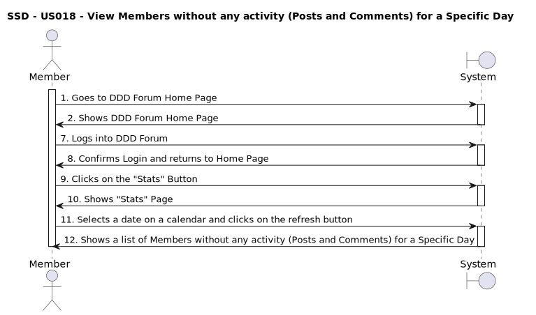
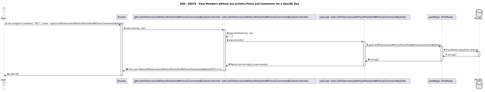

# US018 - Member view Members without any activity (Posts and Comments) for a Specific Day

## 1. Requirements Engineering

### 1.1. User Story Description

* As a Member i want do have access to a brand new page in the Web. Application that integrates the functionality of displaying statistics about the members without any activity (posts and comments) for a specific day.

 

### 1.2. Customer Specifications and Clarifications 

**From the specifications document:**

>* TBD

 

**From the client clarifications:**

<!--Only Binary Questions Yes/No-->

>* **Question:** What kind of additonal funtionalities would you like to have in the forum?

>* **Answer:**  I want do the DDD Forum Web APplication to have a new functionality to display statistics about the members without any activity (posts and comments) for a specific day.

 

>* **Question:** Do you want that functionality to be available to all users?

>* **Answer:** No, only to the registered users, and only if they are logged in.

 

>* **Question:** Do you want that information to be displayed in already existant pages/fields and if so, which? or in a new page?

>* **Answer:**  I want the "Statistics" web page to be a brand new page in the Web. Application.

 

>* **Question** Where do you want the access of the brand new "Statistics Web Page" to be located? 

>* **Answer:** I want the access to the "Statistics" web page to be made available through the main page.

 

>* **Question:** On the main page, where do you want the "Statistics" access field to be placed? at the header? In the footer? In the body? on a sidebar? In the menu? or any Other?

>* **Answer:** The access should be placed at the header? at the same level/ next to the Login/Register buttons.

 

>* **Question:** How would you like to access the new page? Through a button? Through a link? Through a menu? Through a combo box or any Other?

>* **Answer:** I want to access the new page through a "Stats" button.

 

>* **Questions:** In terms of UI layout of the field concerning "view Members without any activity (Posts and Comments) for a Specific Day" in the "Statistic" web page, do you want it´s position in the page to follow the same sequence as the sequence presented initialy for all additional functionalities to be implemented in the "Statistics" web page? Or do you have another preference?
 
>* **Answer:** It can follow the same sequence as stated in the list of additional statistic functionalities stated by me initialy.

 

>* **Question:** How do you want the infomation of the metrics concerning the members without any activity (posts and comments) for a specific day to be displayed in the "Statistics Web Page"? Numerical / Textual / Graphical / Other?

>* **Answer:** I want the data to be displayed as a list in a "textual" fashion, discriminating the username of the members with no activity (posts and comments) for a given day all.

 

>* **Question:** Do you want the search timeline be limited to a specific period of time? If so, what period of time would you like to be the default?

>* **Answer:** I want the search criteria to be flexible to backward looking activities, meaning that the user can search for the members without any activity (posts and comments) for a specific day, for any day in the past, all the way up to present day and time as the default.

 

>* **Question:** How would you like to select the date for which you want to see the metrics in the web page? Through a calendar? Through a text field? Combo box or any Other?

>* **Answer:** I want to insert the date in a text field or a calendar and have with a "refresh button" incorporated to retrieve the corresponding data.

 

>* **Question:** What date format do you want to be able to insert? yyyy-mm--dd, dd-mm-yyyy, dd/mm/yyyy, mm/dd/yyyy, yyyy/mm//dd or day Month Year?

>* **Answer:** I want to be able to insert the date in the following date format: YYYY-mm-dd, and in the case of a text box, it must show a "placeholder text message of the date format acceptible" on the text box as a reminder.

 

>* **Question:** What requisits are compultionary for the new functionality to be approved and signed-off?

>* **Answer:** For functionality approval, i will require the following:

>>* Execution of Back-end API Unit Testing using **Jest** with a coverage of 80% or more.

>>* Execution of Back-end API Integration Testing using **Jest** with a coverage of 80% or more.

>>* Specification of functional acceptance tests using **Gherkin** and implementation of End-2-End Testing using **Cucumber** **WebdriverIO**.

>>* **The provision of the all concerning documentation/ Reports of the tests performed as proof of "PASS" the above mentioned coverage.**

 

 
### 1.3. Acceptance Criteria

* **AC.1:** The user must be a registered member of the DDD Forum Web Application.

* **AC.2:** There must be a "Stats" button in the header of the main page next to the Login/Register buttons to access the "Statistics Web Page".

* **AC.3:** The "Stats" button must only be available/visible to the user if he is logged in as a member to access the "Statistics Web Page".

* **AC.4** Upon Click on the "Stats" button, the user must be redirected to the "Statistics Web Page".

* **AC.5:** The "Statistics Web Page" must have a "Members without any activity (Posts and Comments) for a Specific Day" field.

* **AC.6:** The field concerning the "Members without any activity (Posts and Comments) for a Specific Day" metrics, must occupy the fith position in the "Statistics Web Page" in regards to the other statistic functionalities presented in the web page

* **AC.7:** The concerning statistical field must have a calendar to select the date for which the user wants to see the metrics.

* **AC.8:** The Calendar must show upon selection a date in the format **yyyy-mm-dd**.

* **AC.9:** The concerning Statistical field must have a "refresh" button incorporated to retrieve the corresponding data.

* **AC.10:** Upon Click on the "refresh" button, the web page must return in that same field a text data, where the member will be able to see a list with the usernames of the members without any activity (posts and comments) for a specific day.

* **AC.11** In the case of inactive users found for the inserted date, a list with the usernames must be returned

* **AC.12** Case no users found inactive for the inserted date, a return message must be displayed in the concerning field stating "No users found for the requested date.".

* **AC.13:** In the case of insertion of a date after the current date as search criteria, a return message must be displayed in the concerning field stating "The date supplied is not valid.".

* **AC.14:** Execution of Back-end API Unit Testing using **Jest** with a coverage of 80% or more.

* **AC.15:** Execution of Back-end API Integration Testing using **Jest** with a coverage of 80% or more.

* **AC.16:** Specification of functional acceptance tests using **Gherkin** and implementation of End-2-End Testing using **Cucumber** **WebdriverIO**.

* **AC.17:** The provision of the all concerning documentation/ Reports of the tests performed as proof of "PASS" the above mentioned coverage.

 

### 1.4. Found out Dependencies

* As a member i must a registered account and complete the login process US001 [Register New Account](../../US001/01.requirements-engineering/US001.md) *

 

### 1.5 Input and Output Data

#### Input Data:

* Typed data:
	* Username 
	* Password
  * Date

#### Output data:

* Text data:
  * Return username of the members without any activity (posts and comments) for a specific day.

 

### 1.6. System Sequence Diagram (SSD)

<h6 align="center">

</h6>

 

### 1.7 - Sequence Diagram

<h6 align="center">

</h6>

### 1.8 Other Relevant Remarks

*Nothing relevant to add* 

 

### 1.9 Bugs

*Nothing relevant to add*

