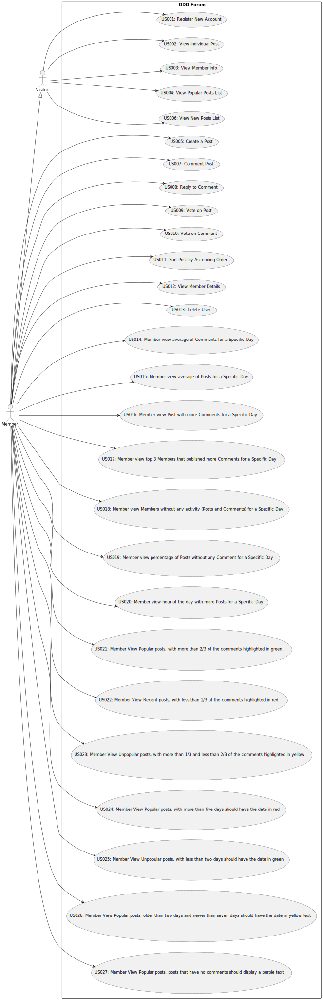

# Use Case Diagram (UCD)

**In the scope of this project, there is a direct relationship of _1 to 1_ between Use Cases (UC) and User Stories (US).**

However, be aware, this is a pedagogical simplification. On further projects and curricular units might also exist _1 to
N **and/or** N to 1 relationship between US and UC.

**Insert below the Use Case Diagram in a SVG format**

**For each UC/US, it must be provided evidences of applying main activities of the software development process (
requirements, analysis, design, tests and code). Gather those evidences on a separate file for each UC/US and set up a
link as suggested below.**

# Use Cases / User Stories

| UC/US  | Description                                                                                                                                                                    |
|:-------|:-------------------------------------------------------------------------------------------------------------------------------------------------------------------------------|
| US001 | [Register New Account](../../US001/01.requirements-engineering/US001.md)                                                                                                        |
| US002 | [View Individual Post](../../US002/01.requirements-engineering/readme.md)                                                                                                       |
| US003 | [View Member Info](../../US003/01.requirements-engineering/US003.md)                                                                                                            |
| US004 | [View Popular Posts List](../../US004/01.requirements-engineering/readme.md)                                                                                                    |
| US005 | [Create a Post](../../US005/01.requirements-engineering/US005.md)                                                                                                               |
| US006 | [View New Posts List](../../US006/01.requirements-engineering/US006.md)                                                                                                         |
| US007 | [Comment Post](../../US007/01.requirements-engineering/US007.md)                                                                                                                |
| US008 | [Reply to Comments](../../US008/01.requirements-engineering/US008.md)                                                                                                           |
| US009 | [Vote on Post](../../US009/01.requirements-engineering/US009.md)                                                                                                                |
| US010 | [Vote on Comment](../../US010/01.requirements-engineering/US010.md)                                                                                                             |
| US011 | [Sort Post by Ascending Order](../../US011/01.requirements-engineering/US011.md)                                                                                                |
| US012 | [View Member Details](../../US012/01.requirements-engineering/US012.md)                                                                                                         |
| US013 | [Delete User](../../US013/01.requirements-engineering/US013.md)                                                                                                                 |
| US014 | [Member view average of Comments for a Specific Day](../../US014/01.requirements-engineering/US014.md)                                                                          |
| US015 | [Member view average of Posts for a Specific Day](../../US015/01.requirements-engineering/US015.md)                                                                             |
| US016 | [Member view Post with more Comments for a Specific Day](../../US016/01.requirements-engineering/US016.md)                                                                      |
| US017 | [Member view top 3 Members that published more Comments for a Specific Day](../../US017/01.requirements-engineering/US017.md)                                                   |
| US018 | [Member view Members without any activity (Posts and Comments) for a Specific Day](../../US018/01.requirements-engineering/US018.md)                                            |
| US019 | [Member view percentage of Posts without any Comment for a Specific Day](../../US019/01.requirements-engineering/US019.md)                                                      |
| US020 | [Member view hour of the day with more Posts for a Specific Day](../../US020/01.requirements-engineering/US020.md)                                                              |
| US021 | [Member View Popular posts, with more than 2/3 of the comments highlighted in green.](../../US021/01.requirements-engineering/US021.md)                                         |
| US022 | [Member View Recent posts, with less than 1/3 of the comments highlighted in red.](../../US022/01.requirements-engineering/US022.md)                                            |
| US023 | [Member View Unpopular posts, with more than 1/3 and less than 2/3 of the comments highlighted in yellow](../../US023/01.requirements-engineering/US023.md)                     |
| US024 | [Member View Popular posts, with more than five days should have the date in red ](../../US023/01.requirements-engineering/US024.md)                                            |
| US025 | [Member View Unpopular posts, with less than two days should have the date in green](../../US025/01.requirements-engineering/US025.md)                                          |
| US026 | [Member View Popular posts, older than two days and newer than seven days should have the date in yellow text](../../US026/01.requirements-engineering/US026.md)                |
| US027 | [Member View Popular posts, posts that have no comments should display a purple text](../../US027/01.requirements-engineering/US027.md)                                         |
| ...    | ...                                          |

